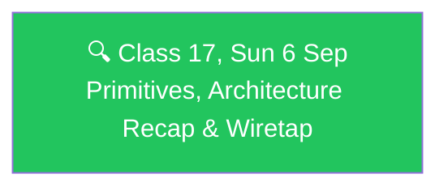

# 🗓️ Weekend 10 — 5-6 Sep — MCP Primitives, Architecture & the Wiretap

**Agentic AI 3.0 Specialization · Live Class 2026 · Mentor: Mayank Aggarwal**

The MCP module continues: finishing the three primitives with real code, then a from-scratch tool for watching the actual wire protocol live.

## 📖 This Weekend's Classes

| Class | Topic | Full write-up | Code |
|---|---|---|---|
| 17 | MCP Primitives, Architecture Recap & the Wiretap | [classes_summary →](<../classes_summary/17 - 6 Sep - MCP Primitives, Architecture & Wiretap.md>) | [`06 Sep - MCP Primitives & Architecture/`](<06 Sep - MCP Primitives & Architecture/>) |

Class 17 finishes what Class 16 deferred — real, running code for resources and prompts on top of the Class 16 warm-up server — then builds a universal MCP wiretap that relays and pretty-prints the real JSON-RPC conversation between Claude Desktop and any server, working around a June 2026 Claude Desktop change that stopped writing full message bodies to its own log files.

🔗 Companion web tools shared this session: [MCP Lifecycle — Conversation Simulator](https://mcp-lifecycle-simulator.netlify.app) · [MCP Lifecycle — Complete Guide](https://mcp-lifecycle.netlify.app)

## 🔁 Weekend Navigation

⬅️ [Weekend 09 — 22-23 Aug](<../Weekend 09 - 22-23 Aug/README.md>) · ⬆️ [Course index](<../README.md>) · ➡️ [Weekend 11 — 12-13 Sep](<../Weekend 11 - 12-13 Sep/README.md>)
