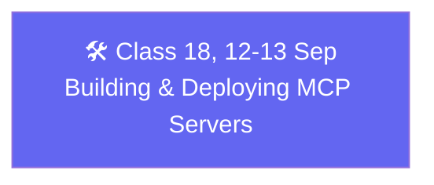

# 🗓️ Weekend 11 — 12-13 Sep — Building & Deploying Real MCP Servers

**Agentic AI 3.0 Specialization · Live Class 2026 · Mentor: Mayank Aggarwal**

Two full days turning MCP theory into shippable code: two ways to build the same server, real auth, and a real multi-interface app with a deployment story.

## 📖 This Weekend's Classes

| Class | Topic | Full write-up | Code |
|---|---|---|---|
| 18 | Building & Deploying Real MCP Servers | [classes_summary →](<../classes_summary/18 - 12-13 Sep - Building & Deploying MCP Servers.md>) | [`12-13 Sep - Building & Deploying MCP Servers/`](<12-13 Sep - Building & Deploying MCP Servers/>) |

Class 18 rebuilds RecipeBox against both the raw official SDK and FastMCP side by side, extends it live with a resource and prompts, adds real role-scoped authentication to the warm-up server, and closes with TimeTrack — a genuine timesheet app where a browser UI and an MCP client share one database — including a real deployment path to Prefect Horizon (formerly FastMCP Cloud).

## 🔁 Weekend Navigation

⬅️ [Weekend 10 — 5-6 Sep](<../Weekend 10 - 5-6 Sep/README.md>) · ⬆️ [Course index](<../README.md>)

> New weekends land as new `Weekend NN - Date(s)/` folders — this is the most recent as of this course's current progress.
