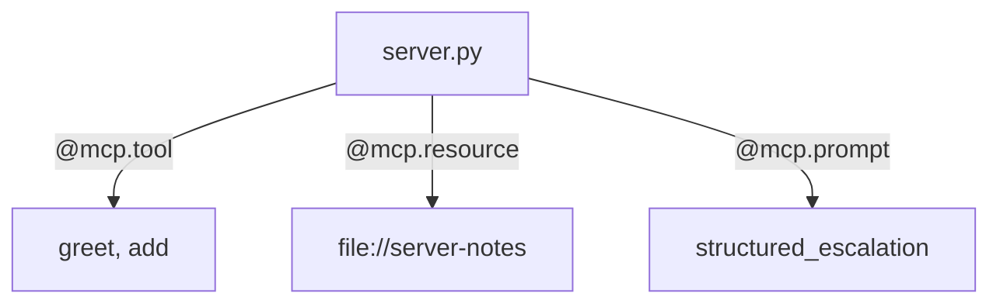
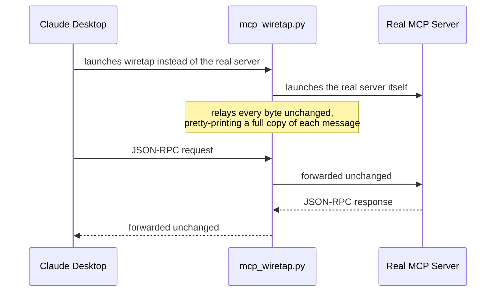

# 🔍 Class 17 — MCP Primitives, Architecture Recap & the Wiretap

### Agentic AI 3.0 Specialization | Live Class 2026

**🎙️ Mentor:** Mayank Aggarwal · **📅 Date:** 6 September 2026

> 📂 **Code for this class:** [`Weekend 10 - 5-6 Sep/06 Sep - MCP Primitives & Architecture/`](<../Weekend%2010%20-%205-6%20Sep/06%20Sep%20-%20MCP%20Primitives%20%26%20Architecture/>) — `v4a_primitives_notebook.ipynb`, `mcp_wiretap.py`, `mcp_wiretap_no_color.py`, `claude_desktop_config.example.json`

> ℹ️ **A note on this write-up:** unlike most `classes_summary/` entries, this one is reconstructed from the actual notebooks, scripts, and reference PDFs shared for the class rather than a class recording/transcript — so it's real, code-grounded content, but it doesn't include a live Q&A section the way earlier classes do.

---

Class 16 ended with two open threads: "full working code for resources and prompts... planned follow-up" and a promise to eventually see the *raw* JSON-RPC wire protocol, not just the architecture diagram of it. This class delivers both.

## 🧩 The Three Primitives, Finished

`p2_MCP_Architecture.ipynb` from Class 16 already covered tools. `v4a_primitives_notebook.ipynb` finishes the set with real, running code for all three:

| Primitive | One-line definition | Protocol operations | Real-world example used |
|---|---|---|---|
| **Tools** | Actions the AI asks the server to perform | `tools/list`, `tools/call` | GitHub's `create_issue` |
| **Resources** | Structured, read-only data the AI (or the *application*) can read | `resources/list`, `resources/read` | Google Drive's shared style guide |
| **Prompts** | Ready-made templates that shape how a request gets phrased | `prompts/list`, `prompts/get` | The `structured_escalation` template |

The notebook's central point: going from a tools-only server to one offering all three primitives is **two decorators** — `@mcp.resource(...)` and `@mcp.prompt` — added to the same warm-up `server.py` from Class 16. Most MCP tutorials stop at tools because they're the easiest to demo; resources and prompts are just as little code.

One distinction worth keeping straight: a **tool** call is initiated by the AI model itself mid-conversation. A **resource** read is typically initiated by the *host application*, not the model, to inject context up front. A **prompt** is offered to the user/host to select before the conversation even starts.

## 🕵️ The Wiretap: Seeing the Actual Wire Protocol

`mcp_wiretap.py` (and a `--no-color` variant for piping to a log file) solves a real problem documented in the script's own header: as of a Claude Desktop update on 26 June 2026, its own `mcp.log` / `mcp-server-*.log` files stopped writing the full JSON body of each message — only a terse one-line summary (method, id, whether params/result are present). There's no way to recover full JSON from Claude Desktop's logs after the fact anymore.

The wiretap works differently — it doesn't read logs after the conversation, it sits *inside* the conversation as it happens:

Wiring it in is a one-line change to `claude_desktop_config.json` — instead of pointing `command`/`args` at the real server, point them at `mcp_wiretap.py -- <the real command and args>`. Claude Desktop never knows the difference; everything after `--` is the real command that used to sit directly in the config. See `claude_desktop_config.example.json` in this folder for the pattern (paths genericized — the original, with Mayank's real machine paths, isn't something to copy verbatim).

## 🔗 Other Resources Shared This Session

- [MCP Lifecycle — Conversation Simulator](https://mcp-lifecycle-simulator.netlify.app) and [MCP Lifecycle — Complete Guide](https://mcp-lifecycle.netlify.app) — two companion web tools for walking through a full MCP session step by step
- `Link.txt` in this folder — a real-world reference server: [`theposch/gmail-mcp`](https://github.com/theposch/gmail-mcp)
- `MCP-Lifecycle.pdf`, `MCP-Primitives.pdf`, `AI-Updater-Project.pdf` — the class handout PDFs for this session

## ✅ Action Items

- [ ] Work through `v4a_primitives_notebook.ipynb`: add a resource and a prompt to the Class 16 warm-up server, confirm both show up in Inspector
- [ ] Try the wiretap on a real server you already have configured — watch the full handshake, capability discovery, and a tool call go by in plain JSON-RPC
- [ ] Read `claude_desktop_config.example.json` before touching your own `claude_desktop_config.json` — genericize any path you copy from it

---
*Part of the [Live-Class-2026](../README.md) class summary index · ⬆️ [Weekend 10 overview](<../Weekend%2010%20-%205-6%20Sep/README.md>) · ⬅️ [Class 16](<16%20-%2023%20Aug%20-%20MCP%20Introduction.md>)*
