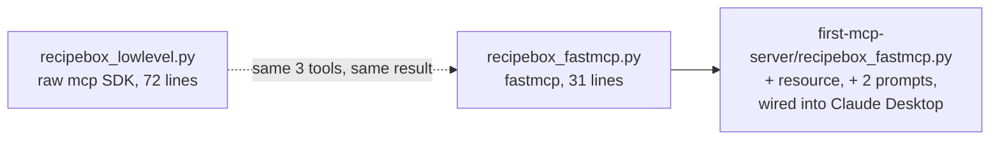
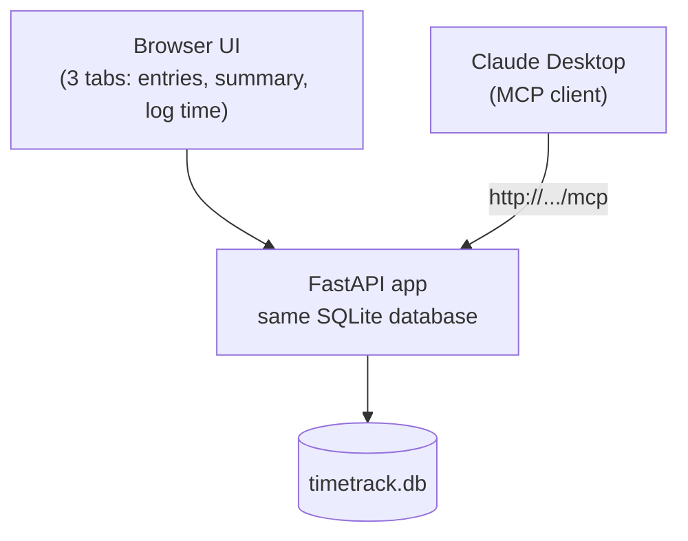

# 🛠️ Class 18 — Building & Deploying Real MCP Servers

### Agentic AI 3.0 Specialization | Live Class 2026

**🎙️ Mentor:** Mayank Aggarwal · **📅 Date:** 12–13 September 2026

> 📂 **Code for this class:** [`Weekend 11 - 12-13 Sep/12-13 Sep - Building & Deploying MCP Servers/`](<../Weekend%2011%20-%2012-13%20Sep/12-13%20Sep%20-%20Building%20%26%20Deploying%20MCP%20Servers/>) — `MCP-Precoded/`, `first-mcp-server/`, `mcp-warmup-primitives/`, `TimeTrackProject/`

> ℹ️ **A note on this write-up:** reconstructed from the actual project code and its own in-repo READMEs (which are unusually thorough this session), not a class transcript — so, like Class 17, no fabricated live Q&A here.

---

Two full days moving from "one server, two ways" to a real, deployable, authenticated MCP application — the arc Class 16 flagged as "next-class territory."

## 🍳 RecipeBox, Two Ways: Same Server, Official SDK vs. FastMCP

`MCP-Precoded/` is the instructor-provided starting point: the identical three-tool RecipeBox server (`list_recipes`, `get_recipe`, `search_recipes`), built twice — once against the raw official `mcp` SDK, once with the standalone `fastmcp` package — to make the abstraction cost visible, not just claimed:

| | `recipebox_lowlevel.py` | `recipebox_fastmcp.py` |
|---|---|---|
| Lines of real code (no comments/blanks) | 72 | 31 |
| JSON Schema | Hand-written | Generated from type hints |
| Tool dispatch | Manual if/elif chain | Generated from function names |
| Transport wiring | Explicit `stdio_server()` context manager | Hidden inside `mcp.run()` |

`first-mcp-server/` is where that FastMCP version actually got built out live, past the precoded starting point — adding a `recipe://tags` **resource** and two **prompts** (`search_for_quick_recipes`, `send_email`) on top of the original three tools, then registering the result with Claude Desktop directly via `uv run fastmcp install claude-desktop recipebox_fastmcp.py`.

## 🔐 Auth Enters the Picture

`mcp-warmup-primitives/` picks the Class 16/17 warm-up server back up and adds what those classes explicitly deferred: real authentication. `server_with_auth.py` wires in `StaticTokenVerifier` with three role-scoped tokens (`user-token`, `analyst-token`, `admin-token`), and gates each tool with `@mcp.tool(auth=require_scopes("user"))` — the same `greet`/`add` tools from Class 16, now behind role checks. It's marked **development only** in its own comments — static tokens are for learning the scope-gating pattern, not a production auth story.

## ⏱️ TimeTrack: A Real Multi-Interface App

`TimeTrackProject/timetrack/` is the session's capstone-style build — a genuine timesheet tool where a browser UI and an AI assistant both read and write the *same* SQLite data, mounted as one FastAPI app that serves a website on one path and an MCP server on another:

| Primitive | Name | What it does |
|---|---|---|
| Tool | `log_time` | Logs a new time entry — appears on the website immediately |
| Tool | `get_timesheet` | One employee's entries, optionally filtered by date range |
| Tool | `get_project_summary` | Total hours per project, broken down by employee (real `GROUP BY`) |
| Tool | `list_projects` | Every project with at least one logged entry |
| Resource | `timesheet://projects` | The current set of known project names |
| Prompt | `generate_weekly_report` | Structures a weekly hours report request |

Two specific gotchas the project's own README calls out (verified against official FastMCP docs, not just assumed):

1. `mcp.http_app(path="/")`, not `"/mcp"` — since `app.mount("/mcp", mcp_app)` already adds that prefix; setting both doubles it to `/mcp/mcp`.
2. `FastAPI(lifespan=mcp_app.lifespan)` must be passed at construction time, not set afterward, or the MCP session manager silently never initializes.

**Going live:** the README documents deploying to **Prefect Horizon** (formerly FastMCP Cloud) — push to GitHub, connect the repo, dependencies auto-detected from `pyproject.toml`, live at `https://your-project-name.fastmcp.app/mcp`. Flagged as worth double-checking directly: whether the website's static routes deploy along with the MCP piece, since Horizon is purpose-built for MCP specifically — a general host like Railway is the documented fallback if not.

## ✅ Action Items

- [ ] Build and run both `recipebox_lowlevel.py` and `recipebox_fastmcp.py` from `MCP-Precoded/`, and actually count the lines yourself
- [ ] Add one more scoped tool to `server_with_auth.py`, test it with each of the three static tokens
- [ ] Run `TimeTrackProject/timetrack` locally, log a time entry from the website, then read it back through `get_timesheet` from an MCP client — same data, two interfaces
- [ ] Read the two FastMCP + FastAPI mounting gotchas above *before* wiring your own app — they fail silently, not loudly

---
*Part of the [Live-Class-2026](../README.md) class summary index · ⬆️ [Weekend 11 overview](<../Weekend%2011%20-%2012-13%20Sep/README.md>) · ⬅️ [Class 17](<17%20-%206%20Sep%20-%20MCP%20Primitives%2C%20Architecture%20%26%20Wiretap.md>)*
