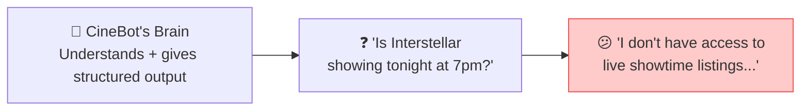
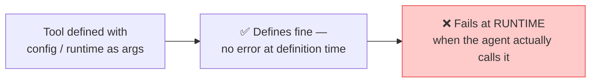
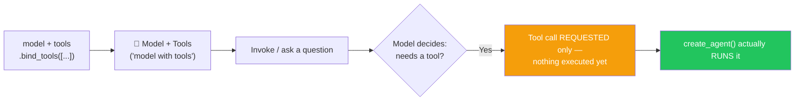
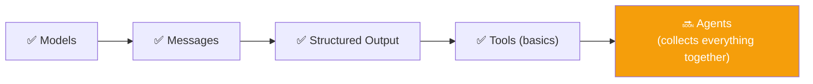
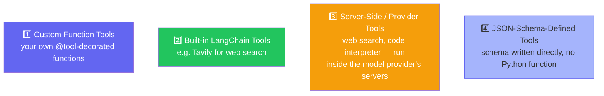
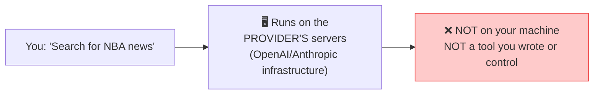
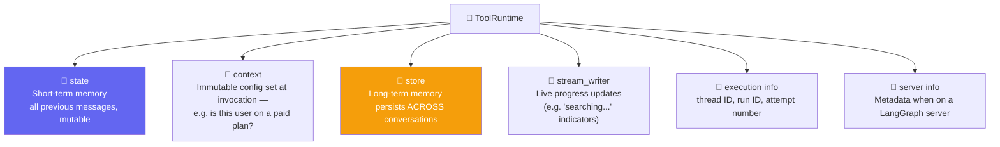
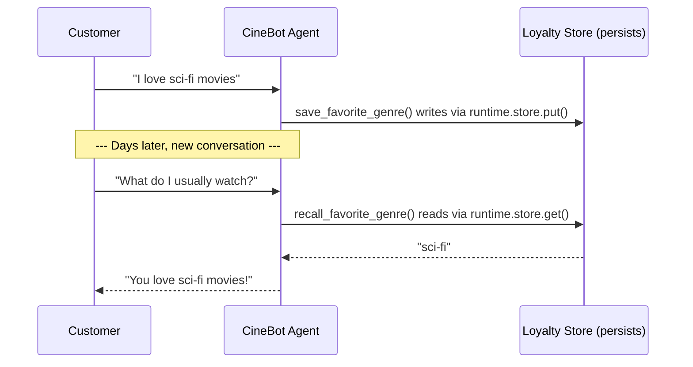

# 🛠️ Class 10: Tools Deep Dive — Giving CineBot Hands
### 📋 Agentic AI 3.0 Specialization | Krish Naik Academy

**🎙️ Mentor:** Mayank Aggarwal
**⏱️ Duration:** ~5+ hours | **📅 Session:** Day 10 (26 July 2026)

---

## 📰 Quick Updates

- 📝 A practical **assignment** tied directly to this class's material was promised for release later the same day.
- 🎯 **Today's announced scope:** Tools and Agents in depth — though as the class unfolded, it became an extended, advanced deep-dive on **Tools** (with Agents formally continuing next class).

---

## ✋ A Brain Without Hands

Imagine you've built an AI movie-booking assistant — call it **CineBot**. It has a solid brain: it understands natural language, and thanks to structured output, it always replies in a clean, predictable format instead of free-flowing text.

Now ask it something simple: *"Is Interstellar showing tonight at 7pm?"*



CineBot honestly admits it has no idea — it has no access to live showtime data. And that's the real lesson here: **a model, no matter how smart, is still just a brain.** It can reason, format, and hold a conversation, but it cannot *act* in the world. It can't look anything up, book anything, or change anything outside of the conversation itself.

That's the gap **tools** exist to close.

---

## 🛠️ Writing Your First Tool

A tool, at its core, is nothing more than a regular Python function — wrapped so that an AI agent can discover it, understand what it does, and call it.

```python
from langchain_core.tools import tool

@tool
def check_showtimes(movie_title: str) -> str:
    """Get available showtimes for a given movie."""
    # ...implementation...
    return "Interstellar: 7:00 PM, 9:30 PM"
```

The `@tool` decorator does the wrapping. Two things about the function become especially important the moment you add it:

- The **function name** becomes the tool's name.
- The **docstring** becomes the tool's description — and this is what actually gets sent to the AI, so it knows what the tool does and when to reach for it.

There's a simple mental model worth holding onto here: **tools are just glorified API calls, or functions.** If you can't write a clean, well-structured Python function, you won't be able to write a good tool either — because that's genuinely all a tool is. If you can write code that connects to a database, calls an external API, or performs some action, you can turn it into a tool. There's no extra magic layered on top.

---

## 🎨 Customizing a Tool's Name & Description

Sometimes the function you're wrapping doesn't already have a great name for AI consumption — maybe it's called `reserve()` because that name made sense elsewhere in your codebase. `@tool` lets you override both the name and the description without touching the function itself:

```python
@tool("book_seats", description="Book or reserve a seat. Use whenever a customer wants to book.")
def reserve(movie: str, seats: int) -> str:
    """A short internal docstring."""
    return f"Reserved {seats} seat(s) for {movie}"
```

By default, the function name becomes the tool name and the docstring becomes the description — but overriding both is common when you're reusing an existing function, or when someone else already wrote it and named it for a different purpose. You still get a tool with a clear, AI-facing name and description, without having to rewrite the underlying logic.

---

## 🔍 Tools You Don't Have to Write Yourself

Not every tool needs to be built from scratch. LangChain ships pre-built tools for common jobs — web search being the most obvious example, through a library called Tavily:

```python
from langchain_tavily import TavilySearch

search_tool = TavilySearch()  # a pre-built LangChain tool for web search
```

Install it, set an API key, and it's ready to bind to any agent — no custom function required. This is the first taste of what turns out to be one of several categories of tools, which we'll come back to shortly.

---

## 📐 Argument Schemas: Why `Field()` Beats Plain Type Hints

A tool with plain type hints works, but it doesn't tell the model much. Compare a bare function signature against a proper Pydantic schema:

```python
from pydantic import BaseModel, Field
from typing import Literal

class SeatBookingInput(BaseModel):
    movie_title: str = Field(description="Exact movie title")
    seat_count: int = Field(gt=0, description="Number of seats")
    preferred_row: Literal["front", "middle", "back"] = Field(default="middle")

@tool(args_schema=SeatBookingInput)
def book_seats(movie_title: str, seat_count: int, preferred_row: str) -> str:
    """Book seats for a movie."""
    return f"Booked {seat_count} seat(s) for {movie_title} in the {preferred_row} row"
```

Try printing `book_seats.args` on a tool defined *without* an `args_schema`, and you'll get almost nothing useful back. Add a proper Pydantic schema, and suddenly `.args` reveals the complete picture — field descriptions, constraints like "must be greater than zero," defaults, everything the model needs to fill in arguments correctly on the first try.

This raises an obvious question: doesn't a richer schema cost more tokens? Yes, slightly — but that's the wrong thing to optimize for first. **The priority is getting the right answer, in as few total round-trips as possible.** If skipping a detailed schema means the model sends malformed input and you have to catch the error and retry, you've spent far more tokens (and time) than the 20–30 extra tokens the schema would have cost upfront. Sending a little more information so the model gets it right the first time is almost always the better trade.

You *can* create a tool without the `@tool` decorator at all — LangChain will still accept a plain function. But you lose all of this rich argument metadata, and the model's chance of sending malformed input goes up accordingly.

---

## 🚫 Two Names You Can Never Use: `config` and `runtime`

Here's a trap worth knowing about before you hit it yourself. Suppose you're building a tool for booking seats, and you want to pass along some configuration — say, whether the show is 2D or 3D:

```python
@tool
def get_weather(location: str, config: str) -> str:
    """Get weather for a location."""
    ...
```

This defines just fine. No error, nothing looks wrong. The trouble starts the moment an agent actually tries to *call* the tool — that's when it fails, with a runtime error.



The reason: **`config` and `runtime` are reserved parameter names in LangChain.** They're never available for you to use as ordinary tool arguments — the framework uses them internally for its own purposes (more on that shortly). Using either name will cause a runtime error, even though tool *definition* itself succeeds silently, which is exactly what makes this trap so easy to fall into unnoticed.

It's fair to ask why this isn't caught immediately as a syntax error, the moment the tool is defined. The answer comes down to portability: LangChain doesn't know, at definition time, how a given function will ultimately be used. The exact same function might get reused in a completely different framework where `config` and `runtime` aren't reserved words at all — a function can even be handed to an agent directly, without the `@tool` decorator, and LangChain will still accept it. Rather than blocking tool definition outright, LangChain waits until the tool is actually executed inside a LangChain agent — the point where it *knows* the conflict is real — before raising the error.

The takeaway is simple: if you want to use configuration or runtime-style data inside a tool, just give it a different name.

---

## 🔗 Binding a Tool vs. Actually Running It

This next distinction is one of the most commonly misunderstood parts of working with tools — and it's worth slowing down for.

Binding a tool to a model looks like this:

```python
tools = [check_showtimes, book_seats]
model_with_tools = model.bind_tools(tools)

response = model_with_tools.invoke("Is Interstellar showing tonight, can you book two seats?")
```

Here's the question to sit with: once a tool has been bound to a model, can the model ever call it on its own?

**No.** The AI can never call a tool itself — not now, not with any framework, not ever. This has been true since the very first tool was defined in this course, and it remains true here. An agent (or your own code) is what actually executes a tool. A model with tools bound to it can only *decide* that a tool should be called and *describe* the call it wants — nothing more.

Run the code above and inspect the response, and this becomes concrete. The `content` field comes back **completely empty**. The actual instruction lives inside `response.tool_calls` instead — the tool's name (`book_seats`), its arguments (`movie_title: "Interstellar"`, `seat_count: 2`, `preferred_row: "middle"`), and in this particular example, a `config` value the model tried to populate automatically — a live reminder of exactly why `config` is off-limits as an argument name.



A `model_with_tools` object can never make anything actually happen. It can request that `book_seats` be called with a certain set of arguments — that's all. To get from *request* to *result*, you need a complete harness wrapped around the model: something that reads the tool call, executes the real function, and feeds the result back in. That harness is exactly what `create_agent()` provides.

A quick way to confirm this for yourself:

```python
for tool_call in response.tool_calls:
    print(tool_call["name"])
    print(tool_call["args"])
```

This prints the tool name and its arguments — extracted from what is otherwise an empty `AIMessage`. It's proof that "model with tools" and "agent" are fundamentally different things. A model with tools bound to it can only ever *request* a tool call; only an agent closes the loop and actually runs it.

---

## 🧭 Checkpoint: What Tools Actually Are

Before going further, it's worth summarizing where things stand:



At this point, a **tool** is just a method with a properly defined input, output, and description, cast into something an agent can call using the `@tool` wrapper. That wrapper can override the tool's name and description if needed. LangChain also ships some pre-built tools out of the box. Argument schemas built with Pydantic dramatically improve how reliably a model fills in a tool's arguments. And two names — `config` and `runtime` — are permanently off-limits as tool arguments, because LangChain reserves them for its own internal use.

Everything covered so far is genuinely just the basics — the surface layer of what tools can do. The next layer goes considerably deeper.

---

## 📚 Four Kinds of Tools

Tools aren't all built the same way. Broadly, they fall into four categories:



**Custom function tools** are what we've been building throughout — your own Python functions, wrapped with `@tool`. **Built-in LangChain tools** are pre-packaged ones like Tavily, ready to use out of the box.

### Server-Side Tools: A Genuinely Different Category

Here's a question worth pausing on: when ChatGPT or Claude performs a live web search right inside the chat interface, does that search run on *your* machine?



It doesn't. That search runs entirely on the model provider's own servers — it's a capability baked directly into how the model is served, not a tool a developer wrote, controls, or can inspect. This is fundamentally different from a custom `@tool`-decorated function that you write and execute yourself. Server-side tools — web search, code interpreters — belong to the model provider, running on the provider's infrastructure.

### JSON-Schema-Defined Tools

The fourth category skips Python functions entirely: a tool can be defined by writing its schema directly in JSON, in a standardized, provider-agnostic format. It's a valid approach and worth recognizing when you encounter it, but Pydantic remains the more practical, readable choice for day-to-day tool-building — it gives you the same structure with considerably less friction.

---

## 🪞 Tool Runtime: The Mirror Analogy

There's a useful analogy for understanding what a model can and can't see when it's deciding how to call a tool: **a model only ever sees its own reflection.**

Concretely: a model can only see the arguments a tool explicitly declares. If a tool's signature is `def get_weather(location: str)`, the model sees exactly one thing — `location`. Nothing more exists as far as the model is concerned. That's its reflection in the mirror.

But a tool itself can see a lot more than the model does, through a special parameter called `runtime`:

```python
from langchain.tools import ToolRuntime

@tool
def get_weather(location: str, runtime: ToolRuntime) -> str:
    """Get weather for a location."""
    # `location` — visible to the model, part of what it decides to send
    # `runtime`  — invisible to the model, full of backend-only context
    ...
```

Print this tool's `.args`, and `runtime` never shows up — only `location` does. That confirms the mirror analogy precisely: `runtime` is purely a backend mechanism, invisible to the model, but fully available to the tool's own code once it's actually called. It's a whole world sitting behind the mirror that the model never gets to see directly.

### What Actually Lives Inside `runtime`



- **`state`** is short-term memory — the previous messages and mutable data tied to the current conversation.
- **`context`** is immutable configuration set when the agent is invoked — for example, whether a given user is on a paid plan. This is exactly why ChatGPT or Claude's tools sometimes run longer and more thoroughly for paid users: that distinction is read from context inside the tool at runtime.
- **`store`** is long-term memory — data that survives *across* entirely separate conversations: saved preferences, knowledge bases, anything that needs to persist beyond a single chat session.
- **`stream_writer`** enables live progress updates while a tool is still running — the "searching the web..." style indicators you see in modern chat interfaces come from exactly this mechanism.
- **`execution info`** carries identifying and retry information for the current run — thread ID, run ID, attempt number.
- **`server info`** carries server-specific metadata, relevant when running on a LangGraph server (a separate, more advanced topic in its own right).

None of this is specific to LangChain as a framework — every serious agent framework has some equivalent concept. LangChain is simply the concrete case study being used to make it tangible.

---

## 🎬 Putting It to Work: A Tool With Memory

Once a tool has access to `runtime`, it stops being purely stateless. It can read and write data that persists — which means an agent can genuinely *remember* things about a customer across separate conversations, not just within a single chat's message history.

```python
from langgraph.store.memory import InMemoryStore
from langchain.tools import ToolRuntime, tool

loyalty_store = InMemoryStore()  # like a dictionary that survives across conversations

@tool
def save_favorite_genre(customer_id: str, genre: str, runtime: ToolRuntime) -> str:
    """Save a customer's favorite movie genre for future visits."""
    runtime.store.put(customer_id, "preferences", {"favorite_genre": genre})
    return f"Got it! I'll remember you like {genre} movies."

@tool
def recall_favorite_genre(customer_id: str, runtime: ToolRuntime) -> str:
    """Recall a customer's favorite genre if previously saved."""
    result = runtime.store.get(customer_id, "preferences")
    if result:
        return f"Your favorite genre is {result.value['favorite_genre']}"
    return "We don't have any saved preference for this customer."

agent = create_agent(
    model=model,
    tools=[save_favorite_genre, recall_favorite_genre],
    store=loyalty_store,   # attaches the store so tools can access it via runtime
)
```



`InMemoryStore()` here is deliberately simple — essentially just a dictionary that maintains messages and memory in RAM. It's a good way to learn the concept without extra setup, though a production system would swap it for something durable, like a PostgreSQL-backed store, so the memory survives beyond a single running process.

The important shift to notice: tools are no longer purely stateless input-in, output-out functions. With `runtime.store`, a tool can read and write persistent data, which is what gives an agent genuine cross-session memory — the foundation that a full memory system builds on later.

---

## 🧩 Where This Leaves You

Four pieces are now in place: models, messages, structured output, and tools. Tools are what give an agent hands — the ability to reach outside the conversation and actually do something, whether that's checking a showtime, booking a seat, or remembering a customer's preferences from one visit to the next.

What ties all of these pieces together — deciding when to call a tool, running it, feeding the result back, and producing a final answer — is the **agent** itself. That's the next piece of the puzzle: how `create_agent()` orchestrates models, messages, structured output, and tools into something that can actually complete a task end to end.

---

## 💬 Live Q&A Highlights

| Question | Answer |
|---|---|
| OpenAI API says my requests are being stopped — do I need a credit card? | Yes — OpenAI requires at least $5 of prepaid credit before the API works, even for light use. Groq and OpenRouter remain better starting points for learning: free, rate-limited, no card required. |
| How do I switch a working setup from one provider to another? | Just swap the model string (e.g. `groq:llama-3.3-70b` instead of `openai:gpt-5-mini`) and make sure the matching API key is available — nothing else needs to change. |
| My `.env` key isn't loading even with `load_dotenv()` — why? | Almost always mundane: mismatched variable name, stray spaces, or the `.env` file not being read from the right working directory. |
| Do `args_schema` field names need to match the function's parameter names? | Yes, exactly. If the schema says `seat_count` but the function says `seats`, they won't be linked — no auto-mapping happens. |
| Does Python enforce types on its own, without Pydantic? | No. Plain Python doesn't check types at runtime — nothing stops a string being passed where an int was expected. Pydantic is what adds real enforcement. |
| How is `args_schema` different from a hand-written JSON schema (from the vanilla Python days)? | Same goal, automated. `@tool(args_schema=YourModel)` extracts the same rich field-level detail and sends it to the model, without writing the schema by hand. |
| Can nesting `config`/`runtime` inside a schema (instead of a bare parameter) get around the reserved-name restriction? | Not confirmed either way live — worth testing directly against the current LangChain version. |
| Why is `config`/`runtime` a runtime error, not a compile-time one? | Beyond framework-portability reasons, Python itself has no compile-time type checking (unlike Java). Tools like MyPy/Pyright add that, but require restructuring how the code is written. |
| Should I memorize every framework's reserved keywords? | No — check documentation when something unexpected happens. Different frameworks reserve different names for their own purposes; there's no universal list. |
| What does `return_direct` actually do? | Sends a tool's raw output straight back to the user, skipping the model's final pass — used when a model rewording the output (e.g. a refund policy) could dangerously change its meaning. |
| Can I use `return_direct` and still have the model double-check the output? | No — the two goals conflict. Verifying the output means putting the model back in the loop, reintroducing the hallucination risk `return_direct` exists to avoid. |
| What's the difference between dynamic tool *calling* and dynamic tool *loading*? | Calling is already dynamic by default — the model decides which available tool to use per request. Loading is a separate concern: deciding, before the model is even called, which subset of many tools (e.g. 25–50) should be exposed at all. |
| Does mentioning a user's VIP status in the system prompt automatically make VIP-only tools available? | No — a tool not included in the tool list isn't available no matter what the conversation says. Acting on that kind of state requires middleware (next class's topic). |
| Is MCP an alternative to dynamic tool loading? | No — they're not comparable. MCP is just a packaged collection of tools/APIs (e.g. a "Gmail MCP" still just calls Gmail's send-email API internally). Loading is about which tools — MCP-based or otherwise — get exposed for a given request. |
| Is `InMemoryStore` recoverable after a restart? | No — it's RAM-based; everything is lost when the process stops. Production systems use a persistent store (e.g. Postgres) instead. |
| Does store performance/scaling depend on LangChain? | No — it's a database problem. Scaling characteristics belong to whatever storage technology sits underneath; LangChain just provides the read/write interface. |
| Can an application use multiple separate memory stores? | Conceptually yes, though native support for switching between several wasn't confirmed live — worth checking current docs. Generally better not to split state unnecessarily. |
| Is `InMemoryStore` only for saving conversation history? | No — it's general-purpose state/preference storage; conversation history is just one use case. |
| Is using LangGraph's `InMemoryStore` inside LangChain "mixing frameworks"? | No — LangChain is built directly on top of LangGraph, so this is just using the same stack at a different layer. |
| How should growing conversation context be managed? | No single correct technique — summarizing older messages, dropping old ones (the context-window mechanic from earlier), or a mix, chosen empirically based on results. Goal: maximum performance from minimum context, since cost scales with tokens. |
| Does chaining a structured-output call directly (vs. two separate steps) add latency? | No meaningful difference — nothing is sent to the model until the final `.invoke()`, so combining steps is arguably cleaner with no real cost. |
| How do I build a tool for internal services with no public API/MCP access (e.g. behind a VPN)? | A tool is just an API. If you can call it, you can wrap it — nothing more exotic is required; the agent just keeps calling it as needed. |
| Why does my AI-generated code look different/better than a beginner's, using the same tool? | AI coding assistants only write as well as the prompt and context they're given — which depends on how well you understand the underlying concepts (Pydantic validation, tool strategy, dynamic loading, etc.). Understanding fundamentals is what makes the assistant a multiplier. |
| How do I stay current in such a fast-moving field? | Fundamentals first — strong basics make new tools fast to evaluate. Blogs/news help with awareness, but aren't a substitute for solid basics. |
| Do I need to become an expert in every cloud/framework a job posting mentions? | Not necessarily — ecosystems differ in detail, not underlying philosophy. Going deep on one (LangChain, or one cloud provider) transfers well to the others. |
| Is model choice (e.g. GPT vs. Gemini) for a task a one-time decision? | No — comparing candidate models is standard, ongoing practice before finalizing any production choice. |

---

## ✅ Action Items After Class 10

- [ ] 🛠️ Write a `@tool`-decorated function from scratch with a clear docstring, and confirm the model can see and use its description
- [ ] 🎨 Practice overriding a tool's name and description explicitly rather than relying on defaults
- [ ] 📐 Build a Pydantic `args_schema` for a tool with `Field()` constraints, and compare `.args` output with and without it
- [ ] 🚫 Deliberately name a tool argument `config` or `runtime` and observe the runtime failure firsthand
- [ ] 🪞 Add a `runtime: ToolRuntime` parameter to a tool and print `.args` to confirm the model never sees it
- [ ] 🎬 Recreate the `save_favorite_genre` / `recall_favorite_genre` demo using `InMemoryStore` and `runtime.store`
- [ ] 📖 Revise all four tool types (custom function, built-in LangChain, server-side/provider, JSON-schema) before next class
- [ ] 📅 Come back ready for **Agents in depth** — the module that ties Models, Messages, Structured Output, and Tools together

---

*📝 Notes compiled from the full Class 10 transcript — "Tools Deep Dive: Giving CineBot Hands," Agentic AI 3.0 Specialization, Krish Naik Academy.*
