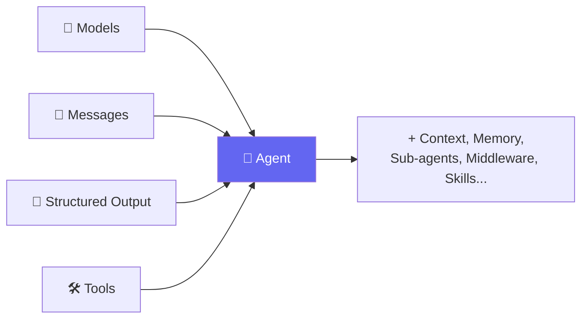
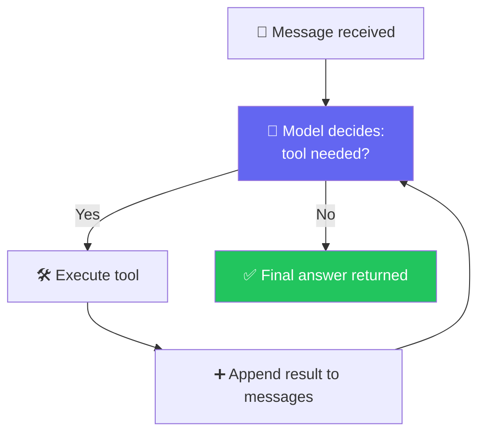
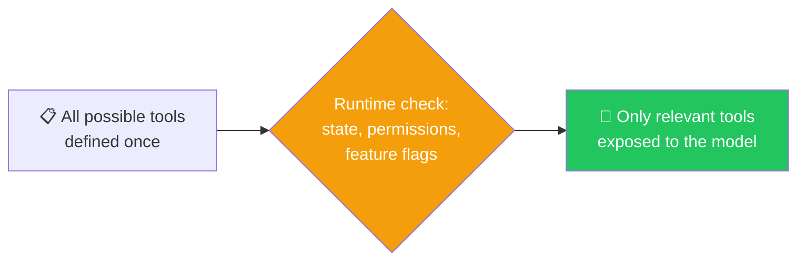
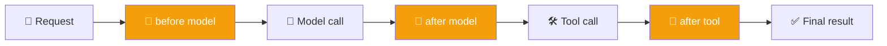
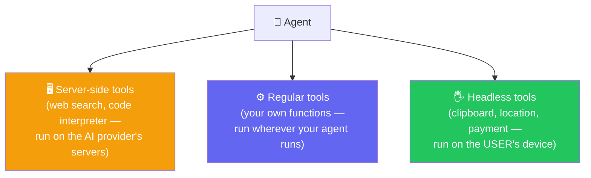
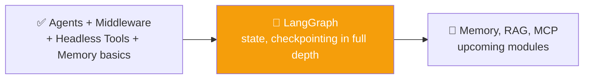

# 🤖 Class 11: Agents, Middleware & Memory — Giving CineBot a Mind
### 📋 Agentic AI 3.0 Specialization | Krish Naik Academy

**🎙️ Mentor:** Mayank Aggarwal
**⏱️ Duration:** ~4.5 hours | **📅 Session:** Day 11 (1 August 2026)

---

## 📰 Quick Updates

- 📝 Three resources were shared before this class: a **student reference notebook** (a from-scratch revision covering every concept so far), a **step-by-step assignment** with both conceptual questions and coding exercises, and a set of **interview questions** sourced from real past-candidate experiences.
- ⚠️ Most interview questions intentionally reflect **LangChain's latest version (v1.0+)**, not the older "Classic" version most companies and tutorials still use — since the field is actively shifting toward the newer version, that's where the course stays focused.
- 🎯 **Today's scope:** finish tools, then move formally into **Agents** — including a small project — before middleware, memory, RAG, and MCP in future sessions.

---

## 🧠 Everything So Far Was Already "Agents"

> *"An agent is a model plus a harness. Around the model, you can add tools, context, sub-agents, memory, skills, middleware — anything that helps you take the best advantage of the model. This is the main thing."*



Mayank pointed out something worth sitting with: models, messages, structured output, and tools were never separate topics from agents — they're literally the components an agent is built from. Whether or not it was named explicitly at the time, the class had already been building agents, piece by piece, for weeks.

> *"What has actually changed over the last 4-5 years? Logically, nothing else has changed. We have just bought an artificial brain. Apart from the LLM, everything else is exactly the same. So our whole idea becomes: how can we best harness this model?"*

---

## 🔁 The Agentic Loop, Restated

> *"At the core of an agent is the Agentic Loop. You receive a message, you request a tool call, the tool executes, the result is appended, and then you do the same again and again."*



Mayank noted this used to be called the **ReAct pattern**, but "Agentic Loop" is a more accurate term today. He confirmed a key detail live: a tool's result **always goes back to the model, never straight to the user** — the user only ever sees the model's final response after it has processed that result.

---

## ⚖️ The Real Problem: Not Every Tool Belongs to Every User

Picking up from the end of the previous class, Mayank re-posed the CineBot scenario: a booking agent has a standard tool, a VIP lounge tool, and an admin tool. A regular, non-paying user asks for a VIP seat.

He walked through — and shot down — the two tempting fixes:

> *"Why would you check with the user if they're a VIP? User will always say, yes, I'm a VIP. Who will say that I'm not a VIP? Second, we can just remove this tool — well, yes, but then what happens when a VIP is actually using it?"*

### The Menu Analogy, Revisited

> *"A menu that reprints itself before you sit down. A VIP member sees the full menu, a regular guest sees a shorter menu — not because they were told 'please don't order the VIP item,' but because these items generally aren't printed on the menu at all."*

### Real Proof: ChatGPT's Own Connectors

To make the point concrete, Mayank opened ChatGPT's connector settings live.

> *"Each connector here is nothing but a collection of tools. If you go on Gmail, you will see that it has write or delete tools. If you go on Slack, it has 11 tools. It's genuinely that easy."*

He then logged into a free-tier account to show what happens when connectors are unavailable:

> *"Do you think ChatGPT should even load those tools? Won't it be very bad design? But ChatGPT is ready with 500 tools, and it's like, hey, I know you will never use it, I know you won't even be allowed to — but I am loading it, I am loading the context, and on every call I am sending unwanted tokens to the model. This is actually something companies are losing money on, day in and day out."*

He even hit a live example of the cost of a bad tool call: asking ChatGPT "who won the FIFA World Cup" triggered an unnecessary web search that returned the wrong year's result — a small, funny, but pointed illustration of tools firing when they shouldn't.

---

## 🎛️ Dynamic Tool Loading

> *"With dynamic tool loading, the set of tools available to the agent is modified at runtime, rather than defined all upfront. I'll repeat this line, it's very, very important."*



Mayank listed two approaches, depending on whether tools are known ahead of time:

- **Filtering pre-registered tools** — when every possible tool is already known at agent-creation time, register all of them, then dynamically filter which are exposed based on state, permissions, and context.
- **Registering tools dynamically** — for cases where the full toolset isn't known upfront (e.g. tools arriving via MCP).

A student asked why a plain Python `if`/`else` couldn't just hand the agent one of two pre-built tool lists instead. Mayank's answer:

> *"Your Python code cannot read the things your agent will have access to. It will not be able to access the store or the state — for example, when the message count increases, plain Python code won't see that dynamically. That is possible only via an agent, when you are running it inside an agent."*

---

## 🧵 Middleware: Cutting Into the Loop

> *"What if you cut a few things in the middle here? Before calling the model, I do something. After calling the model, I do something. Before calling the tool, after calling the tool, after observing — you're going in the middle. That's how I understand it."*



Mayank drew a parallel to Java's Spring ecosystem (having coded in Java, though not Spring AI specifically), calling middleware a genuinely universal concept across frameworks, not a LangChain quirk.

### Live Code: State-Based Filtering

```python
def only_public_tools_if_unauthenticated(request):
    if not request.state.get("authenticated"):
        request.tools = [t for t in request.tools if t.name.startswith("public_")]
    return request
```

> *"I can read from the state if the user has authenticated. If not authenticated, only enable sensitive tools after authentication — I'm saying, give the user only the tools that start with 'public.' Makes a lot of sense: let me not give you any other tool, just the publicly available ones."*

### Live Code: Store/Context-Based Filtering

A second example used `request.runtime.context` instead of state — checking a user ID and feature flags to decide which tools to load. Mayank flagged this as relevant to production thinking:

> *"If you have 1,000 tools in public, then all the tools will load for an authenticated user? Ideally, no — you are wrong in designing 1,000 tools available in the very first place."*

### The VIP Booking Demo — Including a Live Bug

Mayank then rebuilt the earlier VIP scenario with real code:

```python
def vip_gate_middleware(request):
    is_vip = request.state.get("is_vip_member", False)
    if not is_vip:
        request.tools = [t for t in request.tools if t.name != "vip_lounge_booking"]
    return request
```

Running it with a regular user, the agent genuinely had no idea a VIP tool existed:

> *"Is it calling VIP launch booking here? No — because it's not having that tool. In the middle, we have taken away the allowed tools."*

But when Mayank tried passing `is_vip_member=True` directly into `invoke()`, it didn't work — the middleware kept reading it as `False`. He paused to debug this live, on air:

> *"What was happening earlier was, this was always going false, even when I was passing it as true. Let's jump to Agents, because then it will be much clearer... Agents allow you to create a state. Agent, you will also maintain this. I'm specifically asking my agent that this is something you will maintain, which I can pass to you."*

The fix: defining a **custom state schema** that explicitly tells the agent to track `is_vip_member` alongside its built-in fields (like the running message list). Once that schema was added, the same middleware correctly read the flag and exposed the VIP tool.

> *"Can I say that, based on the user, at runtime — not in the starting, at the runtime part — I'll be able to change which tool my agent will have and which it will not?"*

---

## 🖐️ Headless Tools

> *"If you have to get the payment done — does that happen at your end, or at the user's machine? If you have to access the clipboard of the user, does that happen at your machine or the user's machine?"*



> *"These are known as headless tools. Tool definitions — name, description, argument schema — are registered on the server with your agent, but the implementation is registered only on the client, and executed after a short interrupt-or-resume handshake."*

Mayank tied this to everyday browser APIs — geolocation, clipboard, IndexedDB — noting the concept isn't AI-specific at all; it's just that an agent now needs to trigger these client-side capabilities when appropriate.

> *"If Amazon needs my location, it will run in my browser, get the location, and send it back to Amazon — rather than running on Amazon's server in the US, because that server has no way to get it."*

---

## 🧳 Real Tools: The TripMate Project

> *"We were just dumbing up the weather till now. Let's now learn these things by creating real tools rather than mocking them."*

Alongside CineBot (kept purely for explaining concepts), Mayank introduced a second, fuller project: **TripMate**, a travel-planning agent.

### A Real Weather Tool
Built live using **Open-Meteo**, a free, keyless, open-source weather API:

> *"This is a free, open-source weather API which anyone can use. Highly suggest you go through the documentation."*

### A Real Search Tool
Tavily returned here for genuine travel research, with a reminder of what it actually is:

> *"Tavily is third-party. Is it a LangChain method? No — LangChain is just giving me an easier way to integrate it. LangChain is saying, hey, I know people will use this a lot for searching, so let me provide it. Why would you define it every time?"*

### A Real Persistent Database
Using SQLite, Mayank set up a `trips` table live, with tools to save and retrieve a trip by user ID:

> *"Why are you using SQL DB? Tell me any other DB, I'll use that. I just want to store things. It can be ChromaDB, Postgres, NoSQL, Mongo — anything. SQLite just helps you mock it up locally."*

He confirmed directly what this buys the project:

> *"If my application restarts, will this get disconnected? No — because I'm storing it outside, in a SQL DB. It will remain."*

With four real tools now in place — **save trip, get saved trip, web search, real weather** — TripMate had a genuinely working toolset, not placeholders.

---

## 🕳️ The Forgetting Problem

Mayank set up a simple but pointed demo: tell CineBot "my name is Mayank," then in the next message ask "who am I?"

> *"Your agent is not remembering you. I hope you see the problem, everyone."*

He was explicit that this connects straight back to Day 4's core lesson:

> *"An agent should be able to remember us — but by default, it does not."*

### The Fix: Checkpointing

```python
from langgraph.checkpoint.memory import InMemorySaver

checkpointer = InMemorySaver()

agent_with_memory = create_agent(
    model=model,
    tools=[...],
    checkpointer=checkpointer,
)

config = {"configurable": {"thread_id": "mayank-session-1"}}
agent_with_memory.invoke({"messages": [...]}, config=config)
```

> *"This is the official way. It's not that Mayank has defined some custom checkpointing approach — this is how your agent remembers you, straight from the documentation."*

He explained `thread_id` directly:

> *"Thread ID is just a unique ID, so it can locate the particular chat. The user will not be entering this — we will be controlling it. When you start a session, I'll name it 'Session 1.' When you start a new session, I'll make the thread different."*

`InMemorySaver` keeps everything in RAM only as long as the process runs — Mayank confirmed a persistent option (e.g. Postgres) follows the exact same pattern for anything that needs to survive a restart.

---

## 🗄️ Memory Saver vs. Memory Store vs. Caching vs. Database

A student's question ("when should I use store versus in-memory versus caching versus a database?") led to one of the clearest explanations of the day:

> *"It depends, as a developer, on the use case. There's no one right answer. Think about Swiggy's or Amazon's customer chatbot — if you don't reply in 10 minutes, they close the chat and you have to start again. Do you think it's helpful for Swiggy to maintain that chat in memory forever? Not at all."*

| Concept | What it's for | Typical lifetime |
|---|---|---|
| **Memory saver** (checkpointer) | Saving one conversation's history so an agent can resume it, tied to a `thread_id`. | As long as that thread needs — minutes to persistent, depending on backend. |
| **Memory store** | Saving information *about a user* — preferences, facts — usable across many separate conversations. | Persistent by design. |
| **Caching** | Avoiding repeated expensive calls for near-identical requests. | Short and tunable — an hour, a day, whatever fits. |
| **Database** | General persistent storage for anything the app needs to keep. | Persistent, application-defined. |

> *"If a user says, 'I like Python as a language,' storing that just in a memory saver won't help — it's better in the memory store, because then it's usable across different chats too. That's what we call long-term memory."*

On caching specifically:

> *"Let's say you're asked 'what's the weather in Delhi' a million times in an hour. Rather than reaching out to the API every time, you can cache the result. It will save you a lot — API calls are not cheap when done at a very big level."*

---

## 🗺️ What's Next



> *"State, in a lot more depth, will be in LangGraph. I'm fine even if we take one, one and a half months understanding LangGraph properly — because once you understand this framework in depth, every other framework becomes very simple."*

---

## 💬 Live Q&A Highlights

| Question | Answer |
|---|---|
| Why can't a plain Python `if`/`else` decide which tools to send instead of middleware? | Plain code outside the agent can't read the agent's own live state — that visibility only exists inside the agent's execution, which is exactly what middleware provides. |
| Is `thread_id` a reserved keyword? | No — it's just the identifier the checkpointer looks for in the config. The application controls how IDs are generated and assigned. |
| Can I inspect what's actually stored in memory for a thread? | Yes, via the checkpointer's API — but the full mechanics of state-as-checkpoints belong to LangGraph, covered there in depth. |
| Does `InMemorySaver` have a time limit? | No — it lasts exactly as long as the Python process runs. A persistent store (e.g. Postgres) removes that limit entirely. |
| What happens if a tool fails or times out? | Recoverable failures are typically retried as part of the harness; a fatal error (e.g. no internet) causes the agent to fail outright — this is exactly why defining that harness matters. |
| Can an agent discover brand-new tools at runtime, not just from a fixed list? | Yes — this is where MCP and middleware intersect; tools arriving dynamically can still be registered and made available mid-run. |
| Does running a tool cost money the same way a model call does? | No — only model calls consume tokens and cost money. A tool running on its own, with no model call involved, doesn't. |
| Will this course cover training or building a model from scratch? | No — the focus is entirely on using and harnessing existing models, not training them. |
| Is Agentic AI 2.0's content still relevant, given it used an older LangChain version? | The concepts carry over, but the code itself reflects LangChain Classic; this course deliberately stays on the latest version, since that's where the industry is shifting. |
| How do I decide between memory store, memory saver, caching, and a database? | No universal answer — short-lived conversational context → memory saver; cross-session preferences → memory store; repeated identical expensive calls → caching; everything else persistent → a database. |

---

## ✅ Action Items After Class 11

- [ ] 🔁 Recreate the VIP booking middleware example, and deliberately trigger the "state field not tracked" bug before fixing it with a custom state schema
- [ ] 🧵 Write a piece of middleware from scratch that filters tools based on `request.state`
- [ ] 🌦️ Build one genuinely real tool (a free public API, no key required) instead of a hard-coded placeholder
- [ ] 🗄️ Set up `InMemorySaver` with a `thread_id`, confirm an agent remembers a name across two `invoke()` calls, then swap the `thread_id` and confirm it forgets again
- [ ] 🧳 Walk through the TripMate build yourself: real weather, real search, real SQLite persistence
- [ ] 📖 Revise memory saver vs. memory store vs. caching vs. database until the distinctions are automatic
- [ ] 📅 Come back ready for deeper **state, checkpointing, and LangGraph** coverage in upcoming classes

---

*📝 Notes compiled from the full Class 11 transcript — "Agents, Middleware & Memory: Giving CineBot a Mind," Agentic AI 3.0 Specialization, Krish Naik Academy.*
