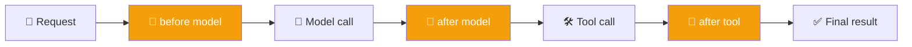
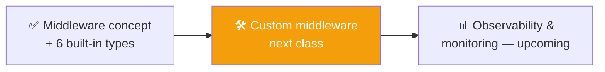

# 🧵 Class 12: Mastering Middleware — Control, Guardrails & Human-in-the-Loop
### 📋 Agentic AI 3.0 Specialization | Krish Naik Academy

**🎙️ Mentor:** Mayank Aggarwal
**⏱️ Duration:** ~4.5 hours | **📅 Session:** Day 12 (8 August 2026)

---

## 📰 Quick Updates
- 🎯 **Today's scope:** a full, deep pass through **middleware** — starting with why it's needed, then working through every major built-in middleware LangChain ships, before moving to custom middleware in the next session.
- 📖 A reminder that the course has now spent roughly three weeks inside LangChain specifically — deliberately, so that every other framework afterward feels easy by comparison.

#### Collab Notebook to follow: https://colab.research.google.com/drive/1Qt9uU2HhDvtFTWwbbFBYxK86jJypv1w_?usp=sharing
---

## 🎛️ Why Middleware Exists

Middleware exists to give developers tighter control over what happens inside an agent. Mayank motivated this with a blunt example: as things stood before today, nothing stopped an agent from replying rudely if asked to, and nothing automatically flagged personal information handed to it. This isn't a flaw in how agents were built — the agent already has everything it needs in terms of model, tools, prompts, and messages — but developers still need a way to intervene in what happens *between* those components.



Middleware hooks into six points around the agentic loop: before the agent runs, after it runs, before and after the model is called, and before and after a tool is called. Mayank noted this same idea shows up under different names elsewhere — Google's Agent Development Kit calls the equivalent concept a "callback" — but the underlying pattern is universal across serious agent frameworks, not a LangChain-specific quirk.

He also grounded it for anyone with a general software background: this is really the same control that any developer already has when writing regular code — deciding what happens before or after a given action runs. Middleware is that same idea, applied specifically to the agent's execution flow and given a name that fits the agent world.

---

## 📝 Middleware #1: Summarization

The problem summarization middleware solves: an agent's context window grows the longer a conversation runs, and at some point that growing history needs to be condensed rather than resent in full on every turn.

```python
from langchain.agents import create_agent
from langchain.agents.middleware import SummarizationMiddleware

agent = create_agent(
    model=model,
    tools=[...],
    middleware=[
        SummarizationMiddleware(
            model="anthropic:claude-haiku",   # a separate, often cheaper model
            trigger=("tokens", 4000),
            keep=("messages", 10),
        )
    ],
)
```

Mayank walked through the configuration options directly from the documentation:

- **`model`** — summarizing text is itself a task that needs a brain. It doesn't have to be the same model powering the main agent; a cheaper model works fine purely for condensing.
- **`trigger`** — when summarization kicks in: an absolute token count, a message count, or a fraction of the model's total context length (e.g. once the context is 80% full).
- **`keep`** — how much of the recent conversation to leave untouched after summarizing: a fraction, a token count, or a message count. His working example kept the last 10 messages intact and summarized everything before that.

He tied this to something everyone had likely already encountered without realizing it: the familiar "conversation has been compacted" behavior seen in long Claude chats is this exact mechanism running in the background. He demoed Claude Code's `/compact` command live, showing its context-usage breakdown (system prompt, tools, custom instructions, messages) as a visible, real-world instance of the same pattern.

He was also honest about the trade-off: compressing a long history into a short summary can genuinely lose information, and that's part of why models sometimes seem to "forget" things or hallucinate as a conversation grows long. There's no way to guarantee zero loss from summarization — the fix, if certain information absolutely must be retained, is to save it separately into long-term memory rather than relying on the summary alone.

---

## ✋ Middleware #2: Human-in-the-Loop (HITL)

Human-in-the-loop middleware pauses agent execution so a human can approve, edit, or reject a proposed tool call before it actually runs. Mayank set up the motivation with a simple scenario: if an agent decided on its own to spend a large sum of money, should it be allowed to do that without checking first? This is exactly the situation Claude and similar assistants handle when they ask for permission before taking an action — the user, in that moment, is the human in the loop.

### Why It Only Applies to Tool Calls

The reasoning is straightforward once tool calls are understood as the point where an agent actually changes something in the real world. Everything before a tool call is just the model reasoning; the tool call is the "hands" doing something. That's precisely the moment worth pausing on, not the model's internal reasoning beforehand.

### The Demo

```python
from langchain.agents.middleware import HumanInTheLoopMiddleware

agent = create_agent(
    model=model,
    tools=[read_email, send_email],
    checkpointer=checkpointer,
    middleware=[
        HumanInTheLoopMiddleware(
            interrupt_on={
                "send_email": {"allowed_decisions": ["approve", "edit", "reject"]},
                "read_email": False,  # no interrupt needed
            }
        )
    ],
)

config = {"configurable": {"thread_id": "hitl-demo"}}
agent.invoke({"messages": [{"role": "user", "content": "Send an email to my manager saying I won't be in tomorrow."}]}, config=config)
```

Running this live, the message flow played out exactly as designed: the user's request came in, the model decided to call the send-email tool, and before that tool could execute, LangChain generated an interrupt — the tool required approval, so execution paused there rather than completing.

Resolving that interrupt is left entirely to the developer. LangChain doesn't provide a UI out of the box; the decision can be resumed programmatically using LangGraph's `Command(resume=...)`, or wired into a custom interface — a pop-up, an approve/reject button, or whatever fits the application.

### A Common Mix-Up, Cleared Up Live

One question worth flagging: does a support chatbot escalating to a human agent count as human-in-the-loop? It doesn't — that's a **transfer**, where the agent hands off the entire conversation and steps out of the picture. True human-in-the-loop keeps the agent in the loop, just paused for a decision — for example, an agent proposing a refund and asking a representative to approve or adjust the amount, rather than handing the whole conversation away.

---

## 🔢 Middleware #3 & #4: Model Call Limit & Tool Call Limit

The motivating question here was cost: if an agent makes a hundred calls to the model in a single run, that cost adds up fast, and there had been no built-in way to cap it. This connects directly back to the `max_turns` safeguard introduced early in the course, in raw Python — LangChain's model call limit is essentially the same idea, formalized into the framework with better checks around it.

The same reasoning extends to **tool calls** specifically. An agent asked to find important emails could, in principle, keep digging through years of old messages unless it's capped — and every additional tool call adds to context size and cost.

Where should the limit actually be set? Mayank's answer was that this comes from domain knowledge, not a framework default — a web-search agent probably doesn't need more than 5–15 searches for most tasks, and a developer who understands the business use case should be the one setting that number, rather than leaving it unbounded or guessing arbitrarily high.

---

## 🔀 Middleware #5: Model Fallback

The scenario: if a primary model provider has an outage, should the application simply stop working? Model fallback middleware exists so that a failure with the primary model automatically routes to a secondary one, rather than requiring a developer to notice the outage and manually change code.

```python
from langchain.agents.middleware import ModelFallbackMiddleware

agent = create_agent(
    model=model,
    middleware=[
        ModelFallbackMiddleware(
            model="openai:gpt-5.4-mini",  # falls back here if the primary model fails
        )
    ],
)
```

Mayank was precise about what counts as a "failure" here — a 404, an expired key, any hard error — and equally precise about what fallback is *not*: it isn't routing based on speed or cost, and it isn't a smart dispatcher choosing the best model for a task. It only activates when the primary model genuinely fails. He also confirmed the full prior conversation history still gets passed along to whichever model ends up handling the request — nothing about the conversation itself changes when a fallback triggers.

---

## 🕵️ Middleware #6: PII Detection

PII (Personal Identifiable Information) — things like date of birth, phone number, email, government ID numbers, or passwords — generally shouldn't reach the model at all if it can be avoided.

```python
from langchain.agents.middleware import PIIMiddleware

agent = create_agent(
    model=model,
    middleware=[
        PIIMiddleware("email", strategy="redact", apply_to_input=True),
        PIIMiddleware("credit_card", strategy="mask", apply_to_input=True),
    ],
)
```

Two strategies were distinguished clearly: **redacting** removes the sensitive value entirely before it ever reaches the model, while **masking** replaces part of the value (e.g. showing only the last few digits) so the model can tell something is present without seeing the real value.

### Custom PII Types

Since ID formats like Aadhaar or PAN numbers are country-specific, LangChain naturally can't ship built-in detectors for every country's identifiers — there are simply too many. The framework instead supports defining custom PII detectors using tools like regular expressions:

```python
import re
from langchain.agents.middleware import PIIMiddleware

aadhaar_pattern = re.compile(r"\b\d{12}\b")

agent = create_agent(
    model=model,
    middleware=[
        PIIMiddleware("aadhaar", detector=aadhaar_pattern, strategy="mask"),
    ],
)
```

### Guardrail vs. Middleware — A Key Distinction

A recurring point of confusion was whether PII protection counts as a "guardrail" or "middleware." The clearest way to separate these: a **guardrail** is the concept — the goal of protecting an agent from doing something undesirable. **Middleware** is the mechanism used to actually implement that goal. Guardrails need to be applied *as* middleware; they aren't two separate, competing systems.

---

## 🧩 Multiple Middlewares Together

A natural question was how LangChain decides which middleware runs first when several are attached to the same agent. The short answer: not randomly. Middlewares are generally written so they don't collide with each other, and where ordering does matter, it either follows a defined priority or simply the order they're declared in. Multiple middlewares can be attached to a single agent without issue — there's no need for a separate agent per concern.

---

## 🗺️ LangChain vs. LangGraph — When Does Middleware Stop Being Enough?

A detailed question from the floor asked: if middleware already provides guardrails and human-in-the-loop, when is LangGraph actually necessary instead of just staying in LangChain?

The distinction Mayank drew: middleware as a concept exists in LangGraph too — it isn't unique to LangChain. LangGraph becomes worth reaching for when an application needs to very precisely manage what's happening internally and build a genuinely deterministic flow — for example, gaining much deeper control over checkpointers, stores, and interrupts than LangChain's abstractions expose by default. LangChain sits on top of LangGraph, offering a more convenient, somewhat abstracted interface to the same underlying machinery.

For most simple agents, and even for something like an enterprise RAG chatbot handling a handful of question types, LangChain with its built-in middleware is generally sufficient — middleware might not even be strictly necessary in a straightforward RAG setup.

On tools like Claude Code or Cursor building agents without any framework like LangChain at all — using MCP connections and plain instructions instead — Mayank noted this is doing essentially the same thing under a different name: those tools use "hooks" where LangChain uses "middleware." The meaningful difference is that agents built this way generally aren't deployable as standalone applications — they remain local, developer-facing tools rather than production services.

---

## 🗺️ What's Next



Today's session was scoped specifically to make sure the concept of middleware, and every built-in type LangChain ships, was fully understood. Writing **custom middleware** from scratch is the explicit focus of the next class.

---

## 💬 Live Q&A Highlights

| Question | Answer |
|---|---|
| Why can't I just tell my AI "don't call the tool more than twice" instead of using a limit middleware? | That instruction isn't reliable — a model can ignore it, and it breaks entirely if the model is swapped. Controlling it via code (which the framework now handles) is specific and dependable in a way a prompt instruction never is. |
| Will middleware add latency? | Depends on the type — if it calls a model (like summarization does), yes, some. If it's pure code logic (like a call limit check), the overhead is minimal. |
| Can I configure multiple HITL approval levels (e.g. two levels of sign-off)? | Not out of the box — that requires writing a custom middleware. |
| Does middleware that calls a model (e.g. for summarization) share the agent's main context, or use a separate one? | Separate — summarization runs against its own, separate text rather than the agent's main running context. |
| Is PII handled by guardrails or by middleware? | Guardrail is the concept (protecting the agent); middleware is the mechanism used to implement that concept — not two competing systems. |
| Can multiple middlewares be attached to one agent? | Yes, without issue — they're simply passed in as a list. |
| Do middlewares run in a random order when there are several? | No — either a defined priority applies, or they follow the order they're declared in. They're designed not to collide. |
| When should I use LangChain + middleware vs. dropping down to LangGraph? | LangChain + middleware is enough for most agents, including simple RAG use cases. LangGraph is worth it when precise, deterministic control over state, checkpointing internals, or interrupts is genuinely needed. |
| For observability/monitoring (LangFuse, OpenTelemetry, etc.), what should actually be used? | No universal best answer — it depends on the application. LangFuse integrates easily with the LangChain family; for RAG specifically, dedicated evaluation frameworks are worth testing rather than assuming defaults are enough, since early results are often deceptively easy and real quality takes further testing beyond the basics. |

---

## ✅ Action Items After Class 12

- [ ] 🧵 Recreate the `SummarizationMiddleware` example with your own `trigger` and `keep` values, and watch it fire on a long conversation
- [ ] ✋ Build the `HumanInTheLoopMiddleware` send-email demo yourself, and manually resolve the interrupt both via `Command(resume=...)` and via your own simple approve/reject logic
- [ ] 🔢 Add a model call limit and a tool call limit to an existing agent, and deliberately trigger both
- [ ] 🔀 Set up `ModelFallbackMiddleware` and simulate a primary-model failure (e.g. an intentionally wrong API key) to confirm the fallback fires
- [ ] 🕵️ Write one custom PII detector (using `re`) for an ID format relevant to your own country or use case
- [ ] 📖 Be ready to explain, in your own words, the difference between a guardrail and middleware — this came up repeatedly and is a common interview-style question
- [ ] 📅 Come back ready for **custom middleware**, building your own from scratch rather than using LangChain's built-ins

---

*📝 Notes compiled from the full Class 12 transcript — "Mastering Middleware: Control, Guardrails & Human-in-the-Loop," Agentic AI 3.0 Specialization, Krish Naik Academy.*
