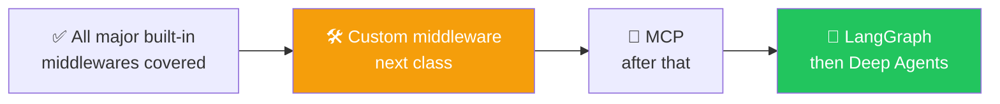

# 🛡️ Class 13: Guardrails, Todo Lists, Tool Selection & Resilient Tools
### 📋 Agentic AI 3.0 Specialization | Krish Naik Academy

**🎙️ Mentor:** Mayank Aggarwal
**⏱️ Duration:** ~4.5 hours | **📅 Session:** Day 13 (9 August 2026)

---

## 📰 Quick Updates

- ⏰ A reminder about punctuality opened the class — late joiners would no longer get a personal recap of missed material going forward.
- 🎯 **Today's scope:** finish **Tool Call Limit** (carried over from the previous class), then work through **guardrails, PII, To-Do List, LLM Tool Selector, Tool Error, Tool Retry, and LLM Tool Emulator** — the remaining built-in middlewares in LangChain's arsenal.
- 🌍 Mayank grounded the session in real industry mapping before diving in: fraud-detection hooks in fintech, PII redaction as a genuine HIPAA legal requirement in healthcare, refund approval gates in customer support, and audit logging in internal developer tools — all the same middleware patterns being taught here.

---

## 🔢 Finishing Tool Call Limit: Run Limit vs. Thread Limit

Two related but distinct settings control how often a tool can fire: **run limit** (a cap within a single `.invoke()` call) and **thread limit** (a cap across an entire conversation, tracked via the checkpointer). Mayank's analogy for holding these apart: think of a single meal as a "run" and a whole day as a "thread" — a run limit of 4 caps how many chapatis you can have in one sitting, while a thread limit of 10 caps the total across the entire day, however it's split across meals. He reinforced the same idea with a live Claude example: the searches within one reply are the run; the running total across an entire chat session is the thread.

```python
from langchain.agents.middleware import ToolCallLimitMiddleware
from langgraph.checkpoint.memory import InMemorySaver

tool_limited_agent = create_agent(
    model="openai:gpt-5-mini",
    tools=cinebot_tools,
    checkpointer=InMemorySaver(),
    middleware=[
        ToolCallLimitMiddleware(run_limit=8),                                          # global, this turn
        ToolCallLimitMiddleware(tool_name="cancel_booking", thread_limit=2, run_limit=1),  # tighter, one tool, whole conversation
    ],
)

config = {"configurable": {"thread_id": "tool-limit-demo"}}
for i in range(3):
    result = tool_limited_agent.invoke(
        {"messages": [("user", f"Please cancel my Booking with ID B{100+i}?")]}, config=config
    )
```

Running this three times in the same thread played out exactly as configured: the first two cancellations succeeded, and the third was blocked outright — a **tool message** came back reporting the limit exceeded, phrased naturally enough for the model to relay to the user without exposing a raw error. Mayank was specific that this is a tool message with an error status, not an interrupt — an interrupt exists to ask a human for a decision, and a limit rejection needs none.

On where the "right" number comes from, his point was that it isn't something LangChain decides for you — a web-search agent probably doesn't need more than 5–15 searches for most tasks, and setting that number is a matter of understanding the business use case, not guessing.

---

## 🛡️ Guardrails: The Highway Analogy

Mayank introduced guardrails through the literal, physical version of the word: a barrier on a mountain road keeps a car from going over the edge, and a barrier on a highway keeps it from swerving into oncoming traffic. An AI agent's output is similarly unpredictable by default, so the same idea applies — some mechanism needs to bound what it can say or do. His working definition, kept deliberately simple: *"a guardrail is a way to control the AI agent's behavior — that's it, nothing else."*

He demoed this live on ChatGPT — asking how to jump off a moving plane, and asking for its raw system message, both got refused or deflected, visible evidence of built-in guardrails at work. The tighter the guardrail, the harder it becomes to work around; leaving gaps makes a system correspondingly easier to push past.

A point he circled back to more than once, since it comes up often in interviews: guardrails and middleware aren't the same thing. A guardrail is the *goal* — protecting the agent from doing something undesirable. Middleware is one of several *mechanisms* for achieving that goal, alongside things like careful system prompt instructions or dedicated third-party libraries. Even something as simple as a tool call limit already counts as a guardrail, since it's a deliberate constraint on behavior. And "compliance" itself isn't defined by the framework — it's defined externally, by company policy, government regulation, or industry certification (HIPAA, GDPR, SOC 2, and similar).

---

## 🕵️ PII Detection, Revisited in Depth

PII middleware was introduced in the previous class; this session went further into *why* it matters and how the built-in detection actually behaves.

```python
from langchain.agents.middleware import PIIMiddleware

pii_agent = create_agent(
    model="openai:gpt-5-mini",
    tools=cinebot_tools,
    middleware=[
        PIIMiddleware("email", strategy="redact", apply_to_input=True),
        PIIMiddleware("credit_card", strategy="mask", apply_to_input=True),
    ],
)

result = pii_agent.invoke({
    "messages": [("user", "My email is priya@example.com and my credit card is 4111-1111-1111-1234, can you check showtimes for Dune?")]
})
```

Running this live surfaced a genuinely useful behavior: rather than silently stripping the sensitive data, the agent's reply proactively warned the user not to share full card numbers in chat — a noticeably better experience than a blunt rejection. Checking the message history confirmed the email had been redacted before it ever reached the model.

Mayank pushed the point a level deeper than just what the user sees: even with a system prompt telling the model not to misuse personal data, sending that data to a third-party provider like OpenAI in the first place is itself a real compliance question — a customer could reasonably ask why their information ever left the application's own boundary. This is exactly the kind of question increasingly asked in real audits, and one many builders haven't thought through.

### A Live Debugging Moment: Why the Credit Card Wasn't Masked

The credit card in the demo wasn't caught on the first attempt. Checking the documentation live revealed the reason: LangChain's credit card detector validates numbers using the **Luhn algorithm**, the standard checksum real card numbers satisfy — an arbitrary string of digits that fails that checksum simply won't register as a credit card.

### Strategies Recap, With the Fourth Option: Hash

| Strategy | Behavior |
|---|---|
| `block` | Raises an exception the moment PII is detected — halts the flow entirely |
| `redact` | Replaces the PII with a placeholder type label; the original value is fully gone |
| `mask` | Partially obscures the value (e.g. showing only the last few digits) |
| `hash` | Replaces PII with a **deterministic hash** — the same input always maps to the same hash, preserving identity for internal use without exposing the real value |

Mayank's example for hashing: being told a card is internally referenced as `AMZ1234ABC` reveals nothing to an outsider, but a system that generated that reference can still look it up or reuse it consistently — useful for analytics or debugging where consistent identity matters more than the raw value. He also answered a natural follow-up directly: when a tool genuinely needs the real value behind a hash, that lookup happens separately, outside the model's view entirely — the model itself never needs to see it.

### Custom PII Detectors

Since a company-specific ID format is never going to be a built-in detector, custom detection is necessary — regex for simple patterns, or a full function for more complex validation:

```python
import re
from langchain.agents.middleware import PIIMiddleware

def detect_booking_code(content: str) -> list[dict]:
    """Detect CineBot's own booking code format: BK followed by 4 digits."""
    matches = []
    for match in re.finditer(r"BK\d{4}", content):
        matches.append({"text": match.group(0), "start": match.start(), "end": match.end()})
    return matches

custom_pii_agent = create_agent(
    model="openai:gpt-5-mini",
    tools=cinebot_tools,
    middleware=[PIIMiddleware("booking_code", detector=detect_booking_code, strategy="hash")],
)
```

On real payment details specifically, a learner asked whether card numbers should ever pass through the AI at all to complete a purchase. The better pattern, as Mayank put it, is a **headless tool** — a secure payment page the user interacts with directly, entirely outside the model's view — rather than the AI ever handling raw card data.

---

## ✅ Todo List Middleware

For any complex, multi-step task, an agent benefits from planning its work upfront and tracking progress against that plan — the same visible checklist behavior seen in tools like Claude Code or Claude Cowork.

```python
from langchain.agents.middleware import TodoListMiddleware

todo_agent = create_agent(
    model="openai:gpt-5-mini",
    tools=cinebot_tools,
    middleware=[TodoListMiddleware()],
)

result = todo_agent.invoke({
    "messages": [("user", "I want to plan a movie night: check what's showing, pick something good, and book 2 seats.")]
})
```

Running this produced a structured plan before any actual tool call happened: the first AI message came back with empty content and a tool call populating a list — gather preferences, retrieve showtimes, recommend a movie, confirm, book — each carrying its own status. As the agent worked through the plan, that list updated in place.

A natural question was why this couldn't just be requested in the system prompt instead. Mayank's answer was direct: plain instructions don't reliably produce a *maintained*, structured object the model keeps updating turn over turn — it won't spontaneously create and track a persistent to-do object from a prompt alone. This middleware is what gives an agent that structured planning object, and it's a meaningful part of what makes tools like Claude Code feel more capable at multi-step tasks — not fundamentally different reasoning, just a better-scaffolded harness. Since the list needs to persist and update across turns, it also requires a checkpointer, the same memory pattern from prior classes.

---

## 🎯 LLM Tool Selector — Choosing Tools by Query, Not by State

Dynamic tool loading (covered previously) filters tools based on a known **state** — is this user a VIP, is this user authenticated. A different problem remains even for one fully authorized user: if an agent has 15 tools available, does every query really need all 15 sent to the model?

Claude's own connector system was the live illustration — with many connectors active, Claude doesn't load every available tool for every request; it loads only what's relevant to the specific query. This is a different axis of filtering from the VIP-style example: that was about *who* is asking, this is about *what* is being asked.

```python
from langchain.agents.middleware import LLMToolSelectorMiddleware

selector_agent = create_agent(
    model="openai:gpt-5-mini",
    tools=cinebot_tools,
    middleware=[
        LLMToolSelectorMiddleware(
            model="openai:gpt-5-mini",             # can be a CHEAPER model than the main agent
            max_tools=2,
            always_include=["check_showtimes"],    # always kept, doesn't count against max_tools
        ),
    ],
)
```

Under the hood, this middleware uses structured output — it asks a (potentially cheaper) model which tools are actually relevant to the current query, and only forwards that filtered subset to the main model call. The model doing the selecting still needs the full list of tool names and descriptions to judge from; the savings come from what's sent to the *main*, typically more expensive model afterward.

### Building a Custom Middleware to Prove It Live

Since there's no built-in way to directly observe which tools were sent, Mayank wrote a small custom middleware on the spot using `@wrap_model_call` — the first hands-on custom middleware example of the course:

```python
from langchain.agents.middleware import wrap_model_call

@wrap_model_call
def show_tools(request, handler):
    print("\nTOOLS SENT TO MODEL:")
    print([tool.name for tool in request.tools])
    return handler(request)

selector_agent = create_agent(
    model="openai:gpt-5-mini",
    tools=cinebot_tools,
    middleware=[
        LLMToolSelectorMiddleware(model="openai:gpt-5-mini", max_tools=2, always_include=["check_showtimes"]),
        show_tools,
    ],
)
```

Running several different queries confirmed the middleware genuinely working: a refund-policy question sent only `check_showtimes` and `get_refund_policy`; a cancellation request sent `cancel_booking` and related tools — never the full set of six. Every call to the model resends whatever tool list was filtered for that specific turn.

A pointed distinction came up when a learner asked why not just let the model decide everything on its own. Mayank's answer: if you already *know*, with certainty, that a tool should never be available to a given user — a non-logged-in user should never see `book_seats` — that decision belongs in your own code, not left to an LLM's judgment. Models are fundamentally fuzzy and can make mistakes; properly written code doesn't. Use the tool selector for genuinely query-dependent relevance, and plain deterministic logic wherever the answer is already known in advance.

---

## ⚠️ Tool Error Middleware — Failing Gracefully, Without Retrying

Tools can and do fail — a malformed argument, a missing record, a permission issue. Mayank first ran an agent *without* any error handling to show the raw failure mode: a tool's exception halted the entire agent run, because underneath everything, this is still just Python, and an unhandled exception stops a Python program the same way it always has.

```python
from langchain.agents.middleware import ToolErrorMiddleware

@tool
def lookup_seat_map(movie_title: str, seat_number: str) -> str:
    """Look up a specific seat -- fails if the seat number format is wrong."""
    if not seat_number or not seat_number[0].isalpha():
        raise ValueError(f"Malformed seat number '{seat_number}' -- expected a letter+number like 'A12'.")
    return f"Seat {seat_number} for {movie_title}: available."

def on_seat_error(exc: Exception, request) -> str | None:
    if isinstance(exc, ValueError):
        return f"`{request.tool_call['name']}` failed with {type(exc).__name__}. Please provide a valid seat number like 'A12'."
    return None  # anything else propagates and halts the run

error_handled_agent = create_agent(
    model="openai:gpt-5-mini",
    tools=cinebot_tools,
    middleware=[ToolErrorMiddleware(on_error=on_seat_error)],
)
```

`ToolErrorMiddleware` catches that exception and converts it into a regular tool message instead — something the model can actually read and react to, the same way tools like Claude visibly self-correct after hitting an error mid-task rather than crashing outright.

A few configuration details worth knowing: `on_error` accepts a single function, since everything relevant (the exception, the tool call request, the tool's name) is available inside it, with no need for multiple hooks. The return value matters — a string becomes the tool message content sent back to the model, while returning `None` lets the original exception propagate and still halt execution, useful for distinguishing recoverable errors from ones that genuinely should stop the run. Returning the **exception type** rather than the raw exception message keeps internal implementation details from leaking to the model or the user. And per the documentation, this middleware does **not** automatically retry a failed call on its own — that's a separate concern, handled by the next middleware.

---

## 🔁 Tool Retry Middleware — Automatic Exponential Backoff

```python
from langchain.agents.middleware import ToolRetryMiddleware
import random

@tool
def flaky_showtime_check(movie_title: str) -> str:
    """Check showtimes via an external service that can transiently fail."""
    if not random.random() > 1:  # always true here, deliberately simulating a persistent failure
        raise ConnectionError("Simulated network failure -- exactly what a real external call risks.")
    return f"{movie_title}: showing at 8:00 PM."

resilient_tool_agent = create_agent(
    model="openai:gpt-5-mini",
    tools=[flaky_showtime_check],
    middleware=[
        ToolRetryMiddleware(max_retries=3, backoff_factor=2.0, initial_delay=1.0, on_failure="continue"),
    ],
)
```

`max_retries` counts retries **after** the initial call — with `max_retries=3`, a tool can be called up to 4 times total. (Documentation confirms the defaults when left unspecified: `max_retries=2`, `backoff_factor=2.0`, `initial_delay=1.0`, `max_delay=60.0`, `jitter=True`, `on_failure="continue"`.)

### The Backoff Math

The delay before each retry follows `delay = initial_delay × (backoff_factor ^ retry_number)`. With `initial_delay=1.0` and `backoff_factor=2.0`: retry 0 waits 1 second, retry 1 waits 2 seconds, retry 2 waits 4 seconds. The reasoning is practical — if a service is briefly down, hammering it with instant retries doesn't help; waiting a little longer between attempts gives the underlying issue a real chance to resolve, the same instinct as not repeatedly refreshing a page when a site is down. `max_delay` caps how long any single wait can grow to, and `jitter` (on by default) adds small randomness to avoid many clients retrying in lockstep.

### A Surprising Live Result: 8 Calls, Not 4

Running the flaky tool with `max_retries=3` produced **8 total calls**, not the expected 4 — a genuinely useful surprise. After the first 4 attempts failed, `on_failure="continue"` meant the failure came back as a tool message rather than a crash. The model, reading that message, independently decided to ask the agent to try the tool again — triggering a second full cycle of 4 attempts before finally giving up and replying in plain text instead.

This became a concrete illustration of the model's fuzzy, non-deterministic behavior: `ToolRetryMiddleware` only controls how many times the *middleware itself* retries per invocation — it has no control over the model separately deciding, on its own initiative, to ask for another attempt after seeing a failure. Preventing that specific behavior requires an explicit instruction, such as a system prompt telling the model not to retry a tool call itself after a failure is reported.

---

## 🧪 LLM Tool Emulator — Faking Tool Calls for Testing

Some tools are expensive, risky, or simply not ready to hit for real during development. `LLMToolEmulator` lets a model *simulate* a plausible tool response without ever actually executing the tool.

```python
from langchain.agents.middleware import LLMToolEmulator

emulated_agent = create_agent(
    model="openai:gpt-5-mini",
    tools=cinebot_tools,
    middleware=[LLMToolEmulator(tools=["book_seats", "cancel_booking"], model="openai:gpt-5-mini")],
)
```

A live demo asked the agent to send a leave email citing bad weather, with `get_weather` emulated rather than really called — the model generated a plausible weather result on its own, and the rest of the flow (drafting the email) proceeded exactly as if the call had been genuine. The distinction that matters: the tool was never actually called, and the response was manufactured by the model itself. This is deliberately meant for testing and development — validating an agent's overall logic without the cost, risk, or side effects of a real external action. Not passing a `tools` list emulates every tool by default.

---

## 🔮 A Preview: Deep Agent Tools

Two further built-in tools were briefly previewed — a shell tool giving an agent a persistent shell to run real commands in, and filesystem search tools — both belonging properly to **Deep Agents**, a later module. A short live demo showed an agent running a real `mkdir` command on request, a glimpse of how far "an agent's hands" can extend; full depth is deferred until Deep Agents is covered directly.

---

## 🗺️ What's Next



With the built-in middleware catalog essentially complete, the stated plan is **custom middleware** next, followed by **MCP**, then a deeper pass through **LangGraph**, and finally **Deep Agents** — which, on this foundation, should feel comparatively easy by that point.

---

## 💬 Live Q&A Highlights

| Question | Answer |
|---|---|
| What's the difference between Tool Error and Tool Retry middleware? | Tool Error handles a failure gracefully once, converting it into a readable tool message without retrying. Tool Retry actively retries the failed call itself, with configurable backoff. |
| Why does a tool call limit produce a tool message instead of an interrupt? | An interrupt exists to ask a human for a decision; a call-limit rejection needs no human input — it's simply refused and reported back as information. |
| Do `always_include` tools count against `max_tools` in the LLM Tool Selector? | No — they're always sent and don't count against the limit. |
| If PII is hashed, can the agent still complete a real booking using that value? | Not directly from the hash — a separate lookup step, outside the model's view, resolves the hash back to a real value only when a tool genuinely needs it. |
| Can `onError` support more than one handler function? | No — a single function is expected, but it has full access to the exception, tool name, and request. |
| Is tool selection the same as dynamic tool loading from the earlier class? | No — dynamic tool loading filters based on known state (e.g. user type); tool selection filters based on the current query's content. |
| Why did the flaky tool get called 8 times instead of 4 with `max_retries=3`? | The middleware's own cycle accounts for 4 calls; the model, seeing the failure tool message, independently asked for the tool to be retried again — a consequence of the model's fuzzy, non-deterministic behavior, not a bug. |
| Why wrap tool errors as a tool message instead of just fixing the tool itself? | Tools are often third-party or shared, so you can't always change their internal definition — handling the failure gracefully at the middleware level is the more general solution. |

---

## ✅ Action Items After Class 13

- [ ] 🔢 Recreate the tool call limit demo with both a global `run_limit` and a tool-specific `thread_limit`, and trace through exactly when each resets
- [ ] 🕵️ Build a custom PII detector for an ID format relevant to your own use case, and try all four strategies (`block`, `redact`, `mask`, `hash`) on the same input
- [ ] ✅ Add `TodoListMiddleware` to an existing multi-tool agent and give it a genuinely multi-step request — watch the plan populate and update live
- [ ] 🎯 Build the `show_tools` custom middleware using `@wrap_model_call` yourself, and use it to verify `LLMToolSelectorMiddleware`'s filtering on at least three different queries
- [ ] ⚠️ Write a tool that deliberately raises a `ValueError`, then wrap it with `ToolErrorMiddleware` and confirm the agent no longer crashes
- [ ] 🔁 Set up `ToolRetryMiddleware` on a tool that always fails, and manually verify the backoff timing matches `initial_delay × (backoff_factor ^ retry_number)`
- [ ] 🧪 Try `LLMToolEmulator` on a tool you don't want to actually call yet, and compare its fabricated response against what the real tool would return
- [ ] 📖 Come back ready for **custom middleware** written fully from scratch, followed by **MCP**

---

*📝 Notes compiled from the full Class 13 transcript, the accompanying `middleware.py` code, and LangChain's official middleware reference documentation — "Guardrails, Todo Lists, Tool Selection & Resilient Tools," Agentic AI 3.0 Specialization, Krish Naik Academy.*
