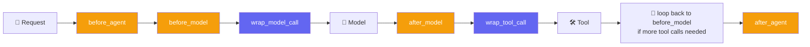
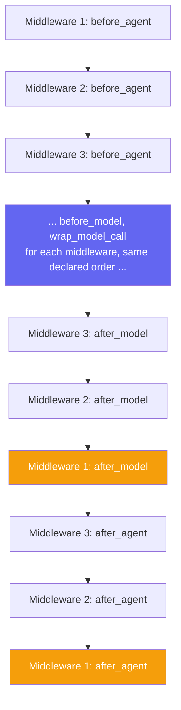
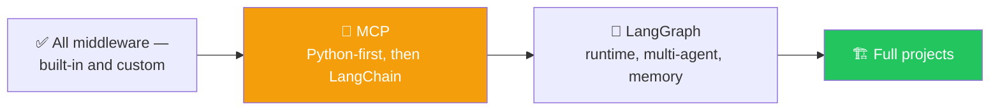

# 🐚 Class 14: Shell Tools & Writing Custom Middleware From Scratch
### 📋 Agentic AI 3.0 Specialization | Krish Naik Academy

**🎙️ Mentor:** Mayank Aggarwal
**⏱️ Duration:** ~4.5 hours | **📅 Session:** Day 14 (16 August 2026)

---

## 📰 Quick Updates

- 📎 All notes, the assignment, and the "Middleware" summary PDF/notebook were re-shared across the Craft doc and GitHub — a reminder to avoid opening these links on office laptops, since corporate restrictions often block them.
- 🎯 **Today's scope:** finish the built-in middleware catalog with **Shell Tool Middleware**, then spend the bulk of the session on **custom middleware** — the hooks system that lets you write your own, beyond anything pre-built.
- 📈 By the end of the session, the course was estimated at roughly **20–25% complete** — with the reasoning that the next framework picked up after this should already feel 60% familiar, since the underlying concepts transfer.

---

**🪝 Follow Collab** [Notebook](https://colab.research.google.com/drive/1CpnGhWhGG4r8NCIoh0WEmcPEVb6KJ2TH?usp=sharing) **for this session.**

## 🐚 Shell Tool Middleware — Building Your Own "Claude Code"

Mayank opened with the motivating question: how do tools like Claude Code, Cursor, or GitHub Copilot actually create and edit real files on your machine? The answer, demonstrated live, is simpler than it looks — these coding assistants all have one thing in common: **access to a terminal.** Anyone who can run shell commands on a machine can create files, edit them, delete them, or run scripts — and that's genuinely the entire trick behind "AI that edits your code."

```python
from langchain.agents.middleware import ShellToolMiddleware, HostExecutionPolicy
from langchain.agents import create_agent

cinebot_shell_agent = create_agent(
    model=model,
    tools=[],
    middleware=[
        ShellToolMiddleware(
            workspace_root="/content/cinebot_workspace",  # a real Colab path
            execution_policy=HostExecutionPolicy(),
        ),
    ],
)
```

### Tool or Middleware? Both, Honestly

A fair question came up immediately: this clearly behaves like a tool, so why does LangChain file it under middleware? The honest answer is that it's a framework design choice, not a deep conceptual distinction — LangChain happens to expose shell access through its middleware system, but functionally, treating it as "just a tool" is perfectly fine too. What matters is what it *does*: it exposes a persistent shell session an agent can send real commands through.

### Where Does the Agent Actually Run?

Mayank built this into the key idea of the whole demo, walking the class through it as a direct question: when an agent is defined in a Colab notebook, where does it actually execute — on some LangChain server, or on the machine running the notebook? The answer is the latter — Google Colab is a real, full Linux machine, with its own file system rooted at `/content`. The model provider (Anthropic, in this case) only ever supplies the brain — deciding *which* command should run — while the actual execution happens wherever the agent's code is running, using whatever shell access it's been given. Setting `workspace_root="/content/cinebot_workspace"` simply tells the agent that every file operation it performs should stay scoped inside that folder.

### Execution Policies

| Policy | Behavior |
|---|---|
| `HostExecutionPolicy()` | Full, direct access to the host machine — appropriate for trusted environments like a personal Colab notebook or dev sandbox |
| Docker-based policy | Spins up an isolated container per agent run, so nothing touches the host machine directly |
| Codex sandbox policy | Reuses an existing Codex CLI sandbox for additional isolation |

A live VPS terminal was also shown side-by-side — Mayank logged into one of his own servers to make the "this is just a real machine" point concrete — whichever policy is chosen, the underlying mechanism is the same: the agent gets permission to run real shell commands somewhere.

### The Live Demo Sequence

Mayank ran several increasingly complex requests against `cinebot_shell_agent`, each confirming the same pattern — the model requests a shell command, the tool executes it, and the result is fed back as a tool message before the model summarizes what happened:

- *"Create a reports folder if it doesn't already exist"* → a real folder appeared in the Colab file browser.
- *"Do research on the NBA and save it in nba_research.txt"* → Mayank used this to make a sharp point: asking ChatGPT the same thing produces a file that exists only in ChatGPT's own sandbox — it can never land on your actual machine, because ChatGPT has no access to your terminal. With shell access wired into the agent, the file appeared directly in the workspace folder, ready to use.
- *"Create a Python file `Hello_world.py` with a single print line"* → Mayank walked through the message history message by message: the human message came in, the AI message requested a tool call (`cat > Hello_world.py << ...`), a tool message confirmed the file was written, and a final AI message summarized the result — manually running the same command in a real terminal alongside it to prove the file was genuinely identical either way.
- *"Write a script that creates two folders, then run it, then delete it"* → demonstrated a full write → execute → clean-up cycle in one flow.
- *"Create and then run a simple calculator app"* → pushed the demo further, showing the same pattern scales to small, functional programs, not just empty files.

The throughline across all of this: this is, in essence, how Claude Code, Cursor, and GitHub Copilot actually work under the hood — a capable brain paired with real shell access. Two related tools were flagged as belonging properly to a later module — **Deep Agents**: a filesystem-focused middleware (offering just four scoped operations rather than full shell access) and sub-agent orchestration.

---

## 🧩 Why Custom Middleware Is Necessary

Every built-in middleware covered so far — Human-in-the-Loop, PII, Tool Call Limit, and the rest — is inherently generic. It has to be, since LangChain can't anticipate every business's specific rules. Mayank grounded this in CineBot's own hypothetical operating rules — things no pre-built middleware could ever know about in advance: no customer books more than two movies in one session, flag it if the bot ever mentions a competing cinema chain by name, or log every cancellation in a very specific internal audit format. Nothing generic can anticipate rules that are entirely yours. This is precisely the gap custom middleware closes — and the same relationship, as Mayank pointed out, that Pydantic has to plain Python: Python doesn't natively provide field-level validation, so a dedicated layer was built on top to add it.

---

## 🪝 Hooks: Six Points to Intercept Execution

Mayank pulled LangChain's own definition straight from the docs, calling it worth reading carefully: *hooks are extension points in custom middleware that let you intercept, inspect, or modify agent execution at specific stages of the lifecycle.* Put simply — you write a small piece of code, and you tell LangChain exactly *where* in the agent's execution that code should run.



The six available hooks: **before_agent, before_model, wrap_model_call, after_model, wrap_tool_call, after_agent.** `before_agent` and `after_agent` each run exactly **once per invocation** — the very start and the very end. Everything in between (`before_model`, `wrap_model_call`, `after_model`, `wrap_tool_call`) can run **multiple times**, once for every pass through the agentic loop, since a single request can trigger several rounds of model and tool calls.

### Why No `before_tool` / `after_tool`?

A sharp observation from the class: if there's a `before_model` and `after_model`, why isn't there an equivalent pair for tools? This is a LangChain-specific design decision, not a universal rule — Google's Agent Development Kit (ADK), for comparison, does expose separate before/after tool callbacks. LangChain instead folds that capability into `wrap_tool_call`, which can achieve the same result. The comparison drawn: this is similar to how different programming languages make different design choices — Python needed Pydantic bolted on for validation, while C++ and Java have it built in natively. Frameworks, much like languages, simply make different trade-offs.

### `before_model` vs. `wrap_model_call` — What's the Real Difference?

`before_model` gives you access to the agent's **state and runtime** — useful for observing and logging, but not for directly rewriting the request being sent. `wrap_model_call` gives you the **actual request object itself**, letting you genuinely modify what's about to be sent to the model — swap the model, strip out tools, alter the message list — before handing control back to the underlying handler.

---

## ✍️ Decorator-Based Custom Middleware

The simplest way to define a hook is with a decorator directly on a function:

```python
from langchain.agents.middleware import before_model, before_agent, after_agent
from langchain.agents import AgentState
from langgraph.runtime import Runtime
from typing import Any

@before_model
def log_before_model(state: AgentState, runtime: Runtime) -> dict[str, Any] | None:
    """Log every call about to be made to the model."""
    print(f"[LOG] About to call model with {len(state['messages'])} messages so far")
    return None  # None means "observed, nothing to change"

logged_agent = create_agent(model=model, tools=[], middleware=[log_before_model])
result = logged_agent.invoke({"messages": [("user", "Hi")]})
```

Running this printed the log line before every single model call — confirming the hook fires exactly where it was told to. Returning `None` from a hook is meaningful: it signals "I observed this, but I'm not changing anything," as opposed to returning a value that would actually modify state.

### `before_agent` and `after_agent` — Setup and Teardown

```python
@before_agent
def connecting_to_DB(state: AgentState, runtime: Runtime) -> dict[str, Any] | None:
    print("I have connected to DB")
    return None

@after_agent
def disconnecting_to_DB(state: AgentState, runtime: Runtime) -> dict[str, Any] | None:
    print("I have disconnected to DB")
    return None

logged_agent = create_agent(model=model, tools=[], middleware=[connecting_to_DB, log_before_model, disconnecting_to_DB])
result = logged_agent.invoke({"messages": [("user", "How are you?")]})
# Output order: "I have connected to DB" -> "[LOG] About to call model..." -> "I have disconnected to DB"
```

The framing: `before_agent` is the natural place to open a database connection or load anything needed for the whole run, since it fires exactly once, right when the agent starts — and `after_agent` is the equally natural place to close it out, once everything else has finished.

### Why "Before Model" Has to Be Its Own Hook, Not Just "Before Agent"

Mayank walked through this as a genuinely important distinction, using a live example: imagine a user's very first message already contains personal information — a name, an email, a booking ID. Should that get redacted at `before_agent`, before it ever enters the system, or at `before_model`, right before it's sent to the brain?

The answer: it depends on what still needs that raw information. A tool like `get_booking` or `cancel_booking` might genuinely need the real booking ID to do its job — so stripping it out too early, at `before_agent`, would break that. But the *model* itself doesn't need to see the raw value to have a useful conversation — masking or redacting it specifically at `before_model` protects the brain from ever seeing sensitive data, while leaving it available to tools that legitimately need it. This is exactly why these hook points exist as separate, deliberate stages rather than one single "before everything" catch-all.

---

## 🎁 `wrap_model_call`: Revisiting VIP Gating and Adding Dynamic Model Selection

`wrap_model_call` was actually used once already, back when building the VIP lounge-gating example — this session revisited it explicitly as the first real example of a wrap-style hook, before introducing a second, genuinely new use case.

```python
@tool
def book_vip_lounge(movie_title: str) -> str:
    """Book a VIP lounge seat with premium service. VIP members only."""
    return f"VIP lounge seat booked for {movie_title}."

@wrap_model_call
def gate_vip_tools(request, handler):
    """Only expose book_vip_lounge to VIP members."""
    is_vip = request.state.get("is_vip_member", False)
    if not is_vip:
        allowed = [t for t in request.tools if t.name != "book_vip_lounge"]
        request = request.override(tools=allowed)
    return handler(request)
```

### New Example: Cost-Aware Dynamic Model Selection

```python
advanced_model = init_chat_model("anthropic:claude-sonnet-4-6")
basic_model = init_chat_model("anthropic:claude-haiku-4-5-20251001")

@wrap_model_call
def dynamic_model_selection(request, handler):
    """Use a cheap model for short conversations, a capable one once it gets complex."""
    message_count = len(request.state["messages"])
    chosen_model = advanced_model if message_count > 10 else basic_model
    return handler(request.override(model=chosen_model))

cost_aware_agent = create_agent(model=basic_model, tools=cinebot_tools, middleware=[dynamic_model_selection])
```

Mayank's reasoning: a short, simple exchange doesn't need the most expensive model available — a cheaper one handles it fine. Once a conversation crosses a length threshold (here, more than 10 messages), it's automatically upgraded to a more capable model. He tied this directly to something everyone already recognized — this is functionally the same idea behind ChatGPT's and Claude's own automatic model-routing features, deciding behind the scenes which underlying model actually handles a given request. `wrap_model_call` is specifically the right hook for this because it gives access to the *exact request object* being sent, letting you override the model itself before the call goes out — something `before_model` alone can't do.

---

## 🏗️ Two Ways to Define Middleware: Decorator vs. Class

| | Decorator-based | Class-based |
|---|---|---|
| Best for | A single hook, quick prototyping | Multiple hooks, more complex or reusable configuration |
| Sync/async | One implementation only | Can define both sync *and* async versions of the same hook |
| Reuse | Re-decorate each time | Define once, instantiate and reuse across projects |

```python
class CallCounterMiddleware(AgentMiddleware):
    def __init__(self, warn_after: int = 3):
        super().__init__()
        self._num_calls = 0
        self.warn_after = warn_after

    def before_model(self, state, runtime):
        self._num_calls += 1
        if self._num_calls > self.warn_after:
            print("Bhai kaafi calls ho rhi hain. Keep credit card ready.")  # "Bro, that's a lot of calls — keep your credit card ready"
        return None
```

The joke aside, the point Mayank was making with `CallCounterMiddleware` is a real one: a class can hold its own internal state (`self._num_calls`) across multiple invocations of the same hook, something a bare decorated function can't do as cleanly. Class-based middleware is generally the production preference once a middleware needs more than one hook, needs to track internal state, or needs to be reused cleanly across multiple projects without redefining it each time.

### Extending a Pre-Built Middleware

A learner asked a question worth capturing in full: can an existing pre-built middleware, like `PIIMiddleware`, be *extended* rather than replaced — adding extra behavior on top of what it already does? Mayank's answer was yes, and he built it live using standard Python inheritance:

```python
class MyPIIMiddleware(PIIMiddleware):
    def wrap_model_call(self, request, handler):
        response = handler(request)
        return ExtendedModelResponse(
            model_response=response,
            command=Command(update={
                "trace_layer": "outer",
                "messages": [SystemMessage(content="[Outer ran]")],
            }),
        )
```

Subclassing `PIIMiddleware` and overriding `before_model` or `after_model` directly replaces that specific hook's behavior — so copying the original method's logic first, then adding to it, avoids accidentally losing existing functionality. And a hook doesn't have to stick to what the parent class already defines — a subclass is free to add an entirely new hook type, like `wrap_model_call`, that the original middleware never used at all. There's no requirement to use the decorator syntax inside a class either — a method with the exact matching hook name (e.g. `def wrap_model_call(self, ...)`) is picked up automatically.

---

## 🔢 Middleware Execution Order — The Cooking Analogy

With multiple middlewares attached to one agent, and each middleware potentially defining several hooks, understanding the *order* everything actually runs in matters. Mayank's clearest explanation used a cooking analogy: think of tasting food while cooking as its own middleware, with **two separate hook points** — once right after adding salt, and again right before serving it to a guest. One middleware, two distinct places it gets invoked.



The rule: **every "before" and "wrap" hook runs in the exact order the middlewares were declared in.** But every **"after" hook runs in reverse order** — the last middleware's `after_model`/`after_agent` fires *first*, working backward to the first middleware's. This is genuinely logical once framed the right way: whichever connection opens first should close last — the same principle behind a stack (last in, first out) as opposed to a queue (first in, first out). If the first middleware in the list opens a database connection in `before_agent`, it makes sense that it's also the *last* one to close that connection in `after_agent` — not the first.

One clarification worth being precise about: `wrap_tool_call` does **not** follow this reversed pattern — it executes in the same declared order as everything else, not in reverse.

A concrete PII example tied this together: a single, well-built PII middleware genuinely needs *two* hook points to do its job properly — masking sensitive input at `before_model` so it never reaches the brain, **and** separately checking the model's own output at `after_model`, in case the model itself generates something sensitive (like fabricating an example Aadhaar number) that also needs to be caught before it reaches the user.

---

## ✅ Best Practices for Writing Custom Middleware

- Keep each middleware focused on doing **one thing well**, rather than bundling unrelated concerns into a single piece of code.
- Handle errors gracefully inside middleware itself — a middleware's own bug shouldn't be what crashes the entire agent.
- Choose the right hook type deliberately — node-style (`before_model`, etc.) for simple observation, wrap-style (`wrap_model_call`, `wrap_tool_call`) when the request itself needs to change.
- Clearly document any custom state properties a middleware relies on or introduces.
- Test middleware independently where possible, rather than only as part of a full agent run.
- Default to a **built-in middleware whenever one already covers the need** — only reach for custom middleware when a genuinely business-specific rule requires it.

---

## 🗺️ What's Next



The stated plan going forward, as Mayank laid it out: **MCP** is next, taught first in plain Python before circling back to how it integrates with LangChain specifically — followed by a deeper pass through **LangGraph** (runtime, multi-agent systems, memory), and then full end-to-end projects once those foundations are in place.

---

## 💬 Live Q&A Highlights

The second half of this class was a long, individual-by-individual open floor — many students unmuting with real production questions. The most substantive exchanges:

| Question | Answer |
|---|---|
| What exactly can `wrap_model_call` change, beyond the two examples shown? | Anything on the outgoing `ModelRequest`: the model itself, messages, system message, tool choice, the tools list, response format, state, runtime, and model settings — Mayank pointed to the request object directly rather than listing "instances," since any of those fields is fair game. |
| Why is my LangChain agent (via Groq/Llama) calling a nonexistent `BraveSearch` tool I never defined? | Likely a model-specific dependency quirk — some open-source models expect a particular search tool to be available internally; switching models or providing that tool access resolved it. Not a bug in the learner's own code. |
| For multi-agent systems, should I use LangChain or LangGraph? | They produce the same agent from an end-user's perspective — LangGraph just gives deeper control over the underlying graph. Reach for LangGraph specifically when you need to intervene inside that graph (custom state changes, fine-grained control); LangChain already supports multi-agent setups on its own. |
| Is LangChain's execution graph a DAG? | No — it's not a DAG, since the agentic loop can cycle (a request can pass through model → tool → model again). LangGraph exposes and lets you control that graph directly; LangChain builds and runs it for you internally. |
| My production multi-agent system loses data between parallel child agents reporting back to a coordinator — how do I fix that? | Use a shared memory store (in-memory, Postgres, or any DB) that every agent in the cycle can read and write, rather than relying on data implicitly passing between agent calls. Whether parent/child agent *state* is shared natively was flagged as something to confirm directly — memory is the more dependable fix either way. |
| What's the real difference between `before_model` and `wrap_model_call`? | Explained with a restaurant analogy: `before_model` is like being seated *before* the restaurant — you can observe and set some things up, but you don't have full control. `wrap_model_call` is like *wrapping* the whole restaurant experience — you can specify your exact order, down to "no onions, I'm allergic." `before_model` gives you state and runtime; `wrap_model_call` gives you the full request object, letting you rewrite exactly what's being sent. |
| Does my own code decide which hook runs first, or does LangChain? | LangChain — when middleware is attached to `create_agent`, LangChain automatically builds the execution graph and calls each hook at its declared point. Nothing about hook order is left to interpretation. |
| Should I validate a user's login/session status using an agent? | No — that's a plain coding concern, not something that needs its own agent. Reserve agents for points in a system that genuinely need intelligence or tool access; bolting an agent onto routine auth/session checks is a design mistake. |
| I need to run shell commands against a remote, secured machine (e.g. a Kubernetes cluster) I can only reach via SSH from my local machine — is that possible? | Yes — set an SSH connection as a startup command inside the shell tool's configuration; once your own machine is connected, the agent inherits that same access and can run commands on the remote machine through it. |
| Can a browser-based/cloud web app get the same terminal access as a locally-installed tool like Claude Code? | No — browsers are deliberately sandboxed and cannot access a user's file system or terminal directly; allowing that would be a severe security flaw. Achieving similar capability requires either an installed application (a VS Code extension, for example) or routing through a proper access layer like MCP — never raw browser automation. |
| Does every step in an agentic workflow consume tokens, even ones handled by plain code? | No — tokens are only consumed when the model itself is actually called. Running your own Python logic (processing a file, deciding which script to run via code rather than a model) costs nothing. Tool execution triggered by a model decision doesn't add extra "holding" cost either — and prompt caching actually reduces cost, not increases it. |
| Should one project mix LangChain, LangGraph, and other agent frameworks together? | Generally no — pick a single framework and build multiple agents within it if needed. If genuinely separate systems need to talk to each other, connect them via A2A (agent-to-agent) or a plain API rather than mixing frameworks inside one project. |
| In real client work, where has `wrap_model_call` actually been used? | Two patterns in practice: automatic ("auto") model selection based on conversation complexity, and dynamic tool loading — the same two examples taught in class are genuinely what gets used, not exotic edge cases. |
| Why does a hook function like `before_agent` need `state` and `runtime` as parameters — is that mandatory? | You don't pass them yourself — LangChain calls your function with them automatically once it's attached as middleware. A hook decorated as `@before_model` is expected to accept exactly the parameters that hook type provides; leaving them out (as deliberately demonstrated live) throws a "takes 0 positional arguments but 2 were given" error, since the framework still tries to call it with both. |
| In a human-in-the-loop transfer approval, I edited the amount and approved it — why did the agent ask for a second approval afterward? | That follow-up decision came from the model itself, not the framework — after seeing the edited (partial) transfer completed, the model reasoned that a remaining balance still needed handling and asked again. This is the model's own judgment call, not scripted behavior from `HumanInTheLoopMiddleware`. |
| Does memory/checkpointing behavior depend on which LLM is being used? | No — the checkpointer and thread-based memory are LangChain mechanisms, entirely independent of the underlying model. Inconsistent "remembering" behavior with a specific model is more likely a setup issue than a model limitation, and should be re-tested. |
| Is it safe to have an agent read a one-time password (OTP) from email or SMS to automate a login flow? | Only through a proper, explicit integration — an MCP connection or a messaging tool that legitimately accesses a user's email/messages with their knowledge. Never through simulated browser or computer automation (moving a cursor, reading a screen) to intercept an OTP — that crosses into a serious security anti-pattern, regardless of the underlying intent. |
| For testing changes across many microservices without full shell/browser access, what's the better architecture? | Containerization (Docker) or Kubernetes-based sandboxing — spin up isolated environments to test in, rather than building a custom application that requests broad shell or browser automation access just to validate changes. |

---

## ✅ Action Items After Class 14

- [ ] 🐚 Recreate the `ShellToolMiddleware` demo yourself — create a file, run a script, then clean up after — and read through the resulting message history to map each step
- [ ] 🪝 Write a `before_agent` / `after_agent` pair that simulates connecting to and disconnecting from a resource, and confirm the print order matches expectations
- [ ] 🎯 Build the `dynamic_model_selection` example with your own two models and your own threshold condition
- [ ] 🏗️ Convert one of your decorator-based middlewares into a class-based `AgentMiddleware` subclass, and add simple internal state to it (like a call counter)
- [ ] 🧬 Try subclassing `PIIMiddleware` yourself and adding one new hook it didn't originally have
- [ ] 🔢 With three middlewares attached to one agent, add print statements to every hook and manually verify the "before runs in order, after runs in reverse" rule
- [ ] 📖 Come back ready for **MCP**, taught first in plain Python before circling back to its LangChain integration

---

*📝 Notes compiled from the full Class 14 transcript and the accompanying `custom_middleware.py` code — "Shell Tools & Writing Custom Middleware From Scratch," Agentic AI 3.0 Specialization, Krish Naik Academy.*
