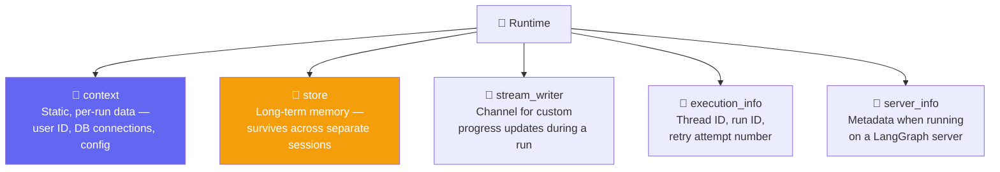
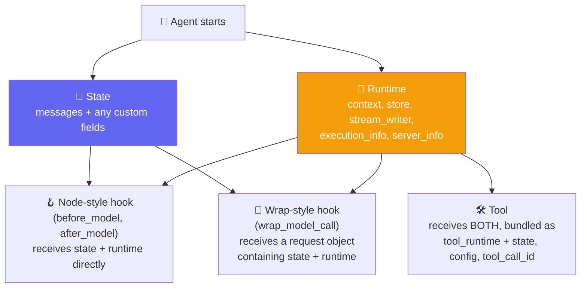
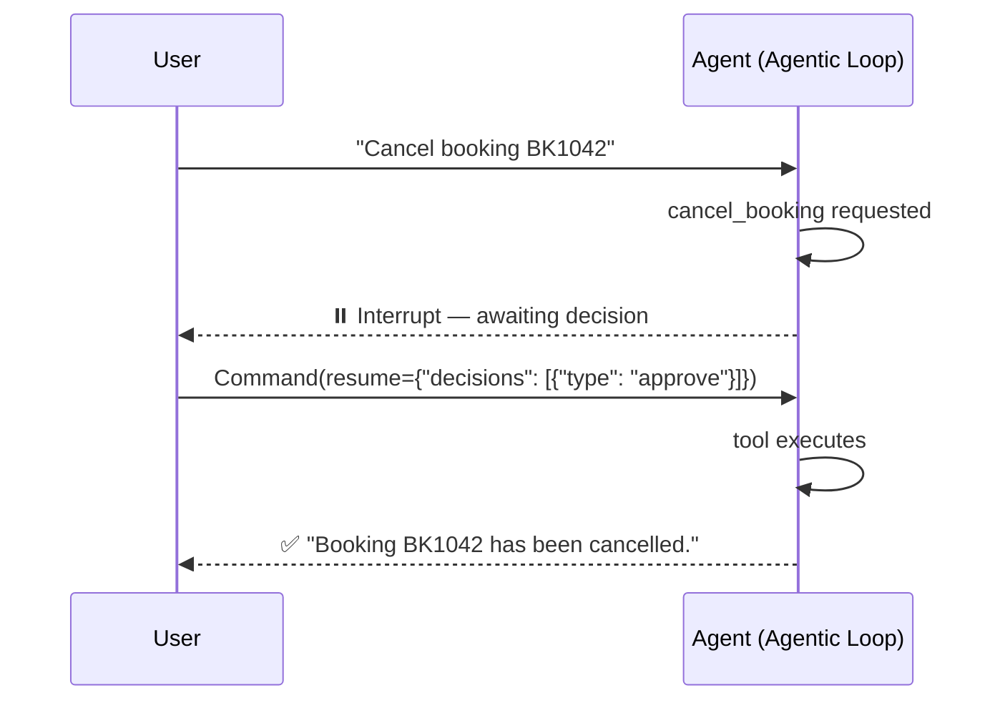
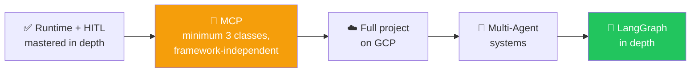

# 🧠 Class 15: Runtime Deep Dive & Human-in-the-Loop in Depth
*Disclaimer: 📝 AI-Generated Notes compiled from the full Class 15 transcript, the accompanying `Runtime_and_HITL.ipynb` notebook, and the shared Excalidraw/PDF diagrams — "Runtime Deep Dive & Human-in-the-Loop in Depth," Agentic AI 3.0 Specialization, Krish Naik Academy.*
### 📋 Agentic AI 3.0 Specialization | Krish Naik Academy

**🎙️ Mentor:** Mayank Aggarwal
**⏱️ Duration:** ~4.5 hours | **📅 Session:** Day 15 (22 August 2026)

---

## 📰 Quick Updates

- 🗺️ **The roadmap was laid out clearly:** two quick topics — **Runtime** and **Human-in-the-Loop** — before a genuine deep-dive detour into **MCP** (minimum 3 classes, covering MCP architecture, building a client and server from scratch, and publishing to the cloud), followed by a full project on **GCP**, then **multi-agent** systems, then **LangGraph**.
- 🎯 The philosophy behind the MCP detour: rather than rushing to "use" MCP the LangChain way, understanding it in depth, independent of any framework, makes every future framework's version of it trivial to pick up — the same approach applied to LangChain itself from Day 1.

Click [here](https://colab.research.google.com/drive/1dFuLlELzyS2NDIBgeVOowrqGJGFPERSL?usp=sharing#scrollTo=8LAN_6zxY_9V) to find the Collab notebook to follow along the session.

---

## 🔁 Quick Recap: Agent State

Before runtime, a fast revision of state was needed, since — as Mayank noted from revising the previous class — many learners were still mixing the two up.

> Every agent manages its execution through `AgentState` — a typed dictionary that holds the current conversation history and any custom fields tools or middleware need.

In simple terms: an agent's **state** holds its conversation history plus any other variables it needs to track. It ships with a `messages` field by default, and can be extended by inheriting from `AgentState` to add custom fields — exactly what powers every node-style middleware hook (`before_model`, `after_model`) that receives and can return updates to this state.

---

## 🩹 The Problem Runtime Solves

CineBot needs to know things that are genuinely **not part of the conversation**: which customer is talking, whether they're a VIP, which cinema location this session belongs to. A chat app like ChatGPT or Claude clearly knows things about a user — their tier, their name, their preferences — without those facts ever being typed into the conversation itself.

### The Hospital Wristband Analogy

> A patient admitted to a hospital gets a wristband. Every department they visit — the ER doctor, the pharmacist, any nurse — can read that wristband and immediately know who the patient is, what room they're in, their history — without the patient having to explain themselves over and over. That information isn't part of any single conversation; it just travels with the patient wherever they go.

That's exactly what **runtime** is: information that isn't part of the conversation history, but still needs to travel with the agent everywhere it goes — into every tool call, into every middleware hook.

---

## 🧩 The Five Components of Runtime



`create_agent` runs on **LangGraph's runtime** under the hood — LangChain doesn't invent this concept, it exposes what LangGraph already maintains. And this isn't unique to LangChain either: every framework (Google's ADK, various agent CLIs) maintains some equivalent concept, just under a different name — "streaming runtime contract," "agent capabilities," and so on. The reason for going this deep in one framework first is that the underlying idea transfers directly.

---

## 🎬 Defining Context: `context_schema`

```python
from dataclasses import dataclass
from langchain.agents import create_agent

@dataclass
class CineBotContext:
    user_name: str
    # geo_state: str  -- e.g. Delhi, Bangalore, Chennai

agent_with_context = create_agent(
    model="openai:gpt-5-mini",
    tools=[],
    context_schema=CineBotContext,   # declares the SHAPE of context this agent expects
)

result = agent_with_context.invoke(
    {"messages": [{"role": "user", "content": "What's my name?"}]},
    context=CineBotContext(user_name="Priya"),   # injected at invocation time
)
```

`context_schema` is LangChain handing over a skeleton — the shape of whatever per-run information an agent should expect, defined once as a dataclass. Passing `context=CineBotContext(user_name="Priya")` at invocation time injects that information without it ever needing to appear in the conversation itself. Note that simply passing context doesn't automatically make the agent *use* it in its reply — that link still has to be made deliberately (as the dynamic prompt example below shows).

---

## 🛠️ Runtime Inside Tools: `ToolRuntime`

```python
from langchain.tools import tool as tool_rt, ToolRuntime
from langgraph.store.memory import InMemoryStore

@dataclass
class CustomerContext:
    user_id: str

loyalty_store = InMemoryStore()

@tool
def fetch_customer_preferences(runtime: ToolRuntime[CustomerContext]) -> str:
    "Fetch the customer's saved preferences from long-term memory"
    user_id = runtime.context.user_id
    preferences = "No preferences"

    if runtime.store:
        if memory := runtime.store.get(("users"), user_id):
            preferences = memory.value["preferences"]

    return preferences

pref_agent = create_agent(
    model="openai:gpt-5-mini",
    tools=[fetch_customer_preferences],
    context_schema=CustomerContext,
    store=loyalty_store,
)
```

### The Loyalty Store Example

```
mayank, mayank123    ----> Horror, Thriller
priya, priya1234     ----> Romance, Thriller
priya, priya2222     ----> RomCom, Horror
```

Rather than asking a user for their ID every time, the ID travels through `runtime.context.user_id`, and the tool reads long-term preferences straight out of the store — all without the user ever explicitly stating any of it in the conversation. This is precisely how Claude "remembers" a user's name or preferences across sessions: that information lives in a store, accessed via runtime, entirely separate from message history.

### Why `ToolRuntime`, Not Just `runtime` Directly?

A fair question came up: why not just access the agent's runtime object directly from inside a tool? The honest answer: LangChain, as a framework, has decided that's simply not how it works — tools don't get a raw reference to a shared store object floating around; they get a `tool_runtime` parameter, deliberately passed to them, containing the five runtime components plus a few tool-specific extras (state, config, tool call ID). There's no "get the store directly" shortcut — LangChain controls exactly what gets passed where, and a tool only ever sees what it's explicitly handed.

---

## 🔀 Who Gets What: State vs. Runtime vs. Tool Runtime

This turned into the most repeated, most carefully worked-through idea of the whole runtime section — deliberately explained multiple ways since it tripped up many learners the previous week.



- **State** holds the conversation history (`messages`) plus any custom fields.
- **Runtime** holds the five components above — context, store, stream_writer, execution_info, server_info.
- **Tools** get both, bundled together as `tool_runtime`, along with a couple of tool-specific extras.
- **Node-style hooks** (`before_model`, `after_model`) receive `state` and `runtime` as two separate parameters, directly.
- **Wrap-style hooks** (`wrap_model_call`) receive a single `request` object (a `ModelRequest`), which itself contains both state and runtime inside it.

None of this is optional or something a developer opts into — it's simply how LangChain calls these functions. A deliberately broken hook (defined with zero parameters) was run live to prove the point: it failed immediately with *"takes 0 positional arguments but 2 were given"* — confirming that state and runtime are always sent, whether or not a function is written to catch them. Parameter *names* don't matter (catching them as `a, b` works exactly the same as `state, runtime`) — only the *position* and *count* matter.

---

## 💬 Dynamic Prompting with Runtime

```python
from langchain.agents.middleware import dynamic_prompt

@dataclass
class ClaudeContext:
    user_specific_instructions: str

@dynamic_prompt
def personalize_the_prompt(request: ModelRequest):
    user_name = request.runtime.context.user_name
    return f"You are CineBot. Always address the user as {user_name}."
```

This is presented as the concrete mechanism behind something everyone has already experienced: a chat assistant that greets a returning user by name, in a way that feels personalized without that name ever being typed into the current conversation. The prompt itself is being dynamically rebuilt using values pulled straight from runtime context on every call.

---

## 🔐 An Authorization Gate Using `server_info` and `execution_info`

```python
from langchain.agents.middleware import before_model
from langchain.agents import AgentState
from langgraph.runtime import Runtime

@before_model
def auth_gate(state: AgentState, runtime: Runtime) -> dict | None:
    "Block unauthenticated users"
    server = runtime.server_info
    if server is not None:
        raise ValueError("Unauthenticated user")

    print(f"[AUTH] Passed the check for user {runtime.context.user_name} and thread ID {runtime.execution_info.thread_id}")
```

A practical illustration of pulling multiple runtime components together — `execution_info.thread_id` for identifying the current run, `server_info` for detecting a LangGraph-server context — to build real gating logic before a model call is even allowed to proceed.

---

## ✋ Human-in-the-Loop, In Depth

> Agents run in a loop — the **Agentic Loop**, already covered when it was hand-built in raw Python. Human-in-the-loop is simply the moment a human is deliberately brought *into* that loop.

### The Motivating Problem

```python
@tool
def cancel_booking(booking_id: str) -> str:
    """Cancel an existing booking. Irreversible."""
    return f"Booking {booking_id} cancelled."

unguarded_agent = create_agent(model="openai:gpt-5-mini", tools=[cancel_booking])
result = unguarded_agent.invoke({"messages": [("user", "Cancel my booking BK1042")]})
```

Run as-is, this agent cancels the booking immediately — no questions asked. The obvious problem: *anyone* who can talk to this agent can cancel *anyone's* booking, with zero authorization. This is the same class of problem authorization/PII middleware addressed earlier, and it's exactly what motivates HITL: certain actions are too consequential to let an agent complete without a human confirming first.

### Recap: Memory Is Required First

Since HITL needs to pause a conversation and resume it later, it depends on the checkpointing/memory mechanics from earlier classes — `InMemorySaver` and a `thread_id`, without which there'd be nothing to resume *into*.

```python
from langchain.agents.middleware import HumanInTheLoopMiddleware
from langgraph.checkpoint.memory import InMemorySaver
from langgraph.types import Command

@tool
def send_booking_confirmation(booking_id: str, email: str) -> str:
    """Send a booking confirmation email. Safe, no approval needed."""
    return f"Confirmation for {booking_id} sent to {email}."

guarded_agent = create_agent(
    model="openai:gpt-5-mini",
    tools=[cancel_booking, send_booking_confirmation],
    middleware=[
        HumanInTheLoopMiddleware(
            interrupt_on={
                "cancel_booking": True,               # all four decisions allowed
                "send_booking_confirmation": False,    # safe, auto-approved, never pauses
            },
            description_prefix="CineBot action pending your approval",
        ),
    ],
    checkpointer=InMemorySaver(),   # REQUIRED -- HITL needs to pause and later resume
)

config = {"configurable": {"thread_id": "hitl-demo-111"}}
result = guarded_agent.invoke(
    {"messages": [("user", "Cancel booking BK1042")]},
    config=config,
    version="v2",   # the current, recommended invoke pattern for reading interrupts
)
```

Checking `result.interrupts` after this call reveals the pause: an `action_request` naming the tool (`cancel_booking`), its arguments, a description, and the allowed decisions (`approve`, `edit`, `reject`, or `respond`). Notably, `send_booking_confirmation` — marked `False` — never triggers an interrupt at all; it just runs, since it's flagged as a safe, reversible action.

### `Command`: Answering an Interrupt



> `Command` is what gets sent back as the answer to an interrupt — it's how the agent is told what to do about the pause it raised.

```python
resumed = guarded_agent.invoke(
    Command(resume={"decisions": [{"type": "approve"}]}),
    config=config,   # SAME thread ID -- resumes the paused conversation
    version="v2",
)
```

### The Four Decision Types, in Practice

| Decision | What Happens | Interactive example |
|---|---|---|
| `approve` | Executes the original tool call unchanged | Confirm the booking cancellation as requested |
| `edit` | Modifies arguments before executing | Cancel a *different* booking ID instead |
| `reject` | Skips execution entirely | Deny the cancellation with a reason ("requires manager sign-off") |
| `respond` | Answers with a message *without* calling the tool at all | Answer a clarifying question the agent asked |

```python
# Edit example
resumed_edit = guarded_agent.invoke(
    Command(resume={"decisions": [{
        "type": "edit",
        "edited_action": {"name": "cancel_booking", "args": {"booking_id": "BK1042"}},
    }]}),
    config=config2, version="v2",
)

# Reject example
resumed_reject = guarded_agent.invoke(
    Command(resume={"decisions": [{
        "type": "reject",
        "message": "Cancellations require manager sign-off first. Ask the customer to call support.",
    }]}),
    config=config3, version="v2",
)
```

### The Fourth Decision: `respond`

`respond` was called out as the one genuinely new addition beyond what had been covered before — it's for tools that are really just *asking the user something*, not performing an irreversible action:

```python
@tool
def ask_customer(question: str) -> str:
    """Ask the customer a clarifying question and wait for their reply."""
    return "placeholder -- never actually reached, respond intercepts this"

ask_agent = create_agent(
    model="openai:gpt-5-mini",
    tools=[ask_customer],
    middleware=[HumanInTheLoopMiddleware(interrupt_on={"ask_customer": {"allowed_decisions": ["respond"]}})],
    checkpointer=InMemorySaver(),
)

resumed_agent_respond = ask_agent.invoke(
    Command(resume={"decisions": [{
        "type": "respond",
        "message": "It's booking BK1042, for the movie Interstellar",
    }]}),
    config=config_ask,
)
```

`respond` isn't approving, rejecting, or editing anything — it's a genuine two-way conversation: the tool result is skipped, and the human's message is fed back to the agent as though it came from the tool itself, letting the conversation continue collaboratively. This is exactly the behavior visible whenever Claude or ChatGPT pauses mid-task to ask a clarifying question rather than guessing — the human isn't approving an action, they're supplying missing information.

---

## 🎯 Conditional Interrupts

Not every cancellation needs a human — a real interview-style scenario: an e-commerce company only wants a human involved when an order value crosses some threshold, not for every single cancellation.

```python
from langchain.agents.middleware import ToolCallRequest

@tool
def cancel_booking_priced(booking_id: str, amount: float) -> str:
    """Cancel a booking with a refund amount."""
    return f"Booking {booking_id} cancelled, ${amount:.2f} refunded."

def is_large_refund(request: ToolCallRequest) -> bool:
    amount = request.tool_call["args"].get("amount", 0)
    return amount > 100

conditional_agent = create_agent(
    model="openai:gpt-5-mini",
    tools=[cancel_booking_priced],
    middleware=[
        HumanInTheLoopMiddleware(
            interrupt_on={
                "cancel_booking_priced": {
                    "allowed_decisions": ["approve", "edit", "reject"],
                    "when": is_large_refund,
                },
            },
        ),
    ],
    checkpointer=InMemorySaver(),
)
```

`ToolCallRequest` (the same object underlying `wrap_tool_call`) carries `tool_call`, `tool`, `state`, and `runtime` — everything `is_large_refund` needs to inspect the actual arguments being passed and decide, on the fly, whether this particular call warrants a human's attention. Confirmed live: a $25 refund sailed through with zero interrupt; a $500 refund on the exact same tool paused and generated a full approval request. Same tool, same middleware — the presence or absence of an interrupt is entirely conditional on the data in that specific call.

### A Real-World Framing: The Amazon Executive

The PDF notes from this session sketch the production version of this pattern directly: a user asks to cancel booking `BK1011` worth $101 and requests a refund — the request flows through the agentic loop, hits the `cancel_booking` tool behind `HumanInTheLoopMiddleware`, and pauses for an **Amazon executive** (not the end customer) to approve, exactly mirroring how a real refund-approval workflow would route a large, above-threshold request to a human reviewer rather than the requester.

---

## 🔄 The Interactive HITL Loop

Putting everything together into the same pattern Claude's own UI uses under the hood:

```python
def run_interactive_hitl(agent, config):
    """A real, interactive HITL loop."""
    result = agent.invoke({"messages": [("user", "Cancel booking BK1042")]}, config=config, version="v2")
    if not result.interrupts:
        print("Nothing paused for review.")
        return

    print("CineBot wants to cancel booking BK1042. Choose a decision:")
    print("  1) approve")
    print("  2) edit     -- cancel a DIFFERENT booking ID instead")
    print("  3) reject")
    choice = input("Type 1, 2, or 3: ").strip()

    if choice == "1":
        decision = {"type": "approve"}
    elif choice == "2":
        new_id = input("Booking ID to cancel instead: ").strip()
        decision = {"type": "edit", "edited_action": {"name": "cancel_booking", "args": {"booking_id": new_id}}}
    elif choice == "3":
        reason = input("Reason: ").strip()
        decision = {"type": "reject", "message": reason}
    else:
        print("Not a valid choice.")
        return

    resumed = agent.invoke(Command(resume={"decisions": [decision]}), config=config, version="v2")
    print("Final:", resumed.value["messages"][-1].content)
```

This is described plainly as the highest level of depth HITL requires in practice — a real UI would replace the `input()` calls with actual buttons (exactly what Claude's own interface does), but the underlying loop — invoke, check for interrupts, collect a decision, resume with a `Command` — is identical regardless of framework. The same concepts (approve, reject, edit, respond) show up under different names in every other agent framework's documentation — the practice differs slightly, the concept never does.

---

## 🗺️ What's Next



MCP begins next class — taught deliberately independent of LangChain first, covering the full architecture, building both a client and server from scratch, and publishing to the cloud, before circling back to how LangChain integrates with it. VS Code setup was flagged as required, since this portion won't be done in Colab.

---

## 💬 Live Q&A Highlights

The second half of this class was a long open floor — many learners unmuting individually with real questions. The most substantive technical exchanges:

| Question | Answer |
|---|---|
| My agent has both a `response_format` and tools — why does every reply come back in the structured format, even a plain "hi"? | Expected behavior — once an agent has structured output configured, it will always try to shape its final answer that way, every single time, not just most of the time. This is separate from a tool's own `return_direct` setting, which controls whether a *tool's* raw result skips the LLM entirely rather than being folded into the structured response. |
| If I apply `ToolErrorMiddleware` and `ToolRetryMiddleware` together, does declaration order change behavior? | Retry logically has to be resolved before an error is finally reported, since a retry attempt happens first — declaring tool retry ahead of tool error matches this natural flow. Declaring them the other way around can cause confusing repeated-looping behavior rather than a clean "retry a few times, then report the error" outcome. |
| Is MCP basically the same as defining tools directly in LangChain? | In a simple sense, yes — MCP is a collection of tools, wrapped in a standardized protocol. The underlying "agent calls a tool" mechanic doesn't change; MCP mainly changes *how* those tools are packaged, discovered, and shared across applications. |
| When should I use LangGraph instead of LangChain? | When LangChain's default level of control isn't enough. Every `create_agent` call already builds a LangGraph graph internally — LangGraph is what lets you reach into and directly modify that same graph (custom node ordering, fine-grained control) rather than letting LangChain build and run it for you automatically. |
| How does Google's ADK compare to LangChain/LangGraph? | Conceptually near-identical once you strip away naming — ADK has multi-agent support, human-in-the-loop, graph-style workflows, and models, just under different terms. The same is true of AutoGen (which adds a built-in "team" concept for multi-agent). Once core concepts are solid in one framework, evaluating another is mostly a vocabulary exercise, not new learning. |
| In real production systems, is RAG always used for agentic memory, or can a plain database work too? | Depends entirely on the use case. If the point is genuinely retrieving relevant documents by meaning, RAG fits. If the goal is simpler — just persisting and looking up structured data — a plain database read through LangChain works just as well; RAG isn't a default requirement for "having memory." |
| I have an on-premise Bedrock model and need to keep it current with changing company policy — should I fine-tune it, or use RAG? | RAG, not fine-tuning, for this case. Fine-tuning is expensive, slow, and still won't reliably reflect a fast-changing policy. RAG handles frequently-updated reference material far better; fine-tuning only makes sense at the scale of a company like Google building something deeply optimized for its own permanent needs. |
| I want to build a voice-driven document editor — should I build it from scratch or use existing tools? | Depends on the actual requirement. Voice-to-text itself is simple enough to build directly rather than relying on a third-party tool. For a light workload (one or two ~50-page documents a day), free models with large context windows (some open-source models via OpenRouter, for example) should comfortably handle it without needing a paid tier. |
| What do you focus on when interviewing candidates for Agentic AI roles? | Software engineering fundamentals and genuine problem-solving ability over memorized framework syntax. A candidate doesn't need to write every line from scratch, but should be able to clearly explain *why* code does what it does — including basics like knowing what Pydantic is for. Someone strong in general software development can integrate AI into anything; the reverse (knowing LangChain deeply but weak on fundamentals) is a real gap. |
| Is there a real difference between putting a custom field in **state** versus in **runtime context**? | Yes, and it comes down to two properties: **mutability** and **persistence**. State is mutable and persists across multiple invocations within the same conversation — use it for anything that needs to change over time, like a running call count. Context is immutable per run — use it for static, per-run values like a user ID or DB credentials that won't change mid-conversation. *(Mayank initially answered this the wrong way round live, caught the mistake during the break, and corrected it explicitly at the start of the next segment — a genuine real-time correction worth noting.)* |
| Within a single agent invocation, if I modify data inside a plain tool (using its own runtime/state access) versus inside a `wrap_tool_call` middleware, does the change persist the same way? | Only **state** changes persist across multiple tool calls within the same invocation — runtime's context stays fixed and unchangeable throughout. Arguments and tool-specific values are fresh on every individual call regardless of which access method is used; state is the only thing that reliably carries forward. |
| Can I name my `wrap_model_call`/`wrap_tool_call` decorated functions anything I want? | For **decorator-based** middleware, yes — any function name works, since the decorator itself is what registers the hook. For **class-based** middleware, no — the method name must exactly match the hook it's meant to override (e.g. `before_model`), since that's how the framework knows which built-in hook is being replaced. |
| With multiple middlewares attached to one agent, does declaration order actually matter? | Yes. "Before" and "wrap" style hooks run in declared order; "after" hooks run in reverse — the same "gate that opens first closes last" logic covered when execution order was first introduced, reconfirmed here with a live walkthrough of three middlewares in sequence. |
| How can I reduce token usage in a long-running conversation, rather than resending the entire multi-month history every time? | This is exactly what long-term memory (the `store`, accessed via runtime) is for — rather than loading a conversation's full history on every call, build logic that retrieves only semantically relevant memories for the current message (similar to how dedicated memory libraries like Mem0 support semantic lookup natively). Whether to load everything, load selectively, or summarize is entirely a design decision left to the developer — LangChain doesn't do this automatically. |

---

## ✅ Action Items After Class 15

- [ ] 🩹 Recreate the `CineBotContext` example and confirm passing `context=` at invocation time makes the value accessible without it being part of the conversation
- [ ] 🛠️ Build the `fetch_customer_preferences` tool with `ToolRuntime` and a real `InMemoryStore`, and confirm preferences persist across separate `invoke()` calls
- [ ] 🪝 Deliberately define a hook with zero parameters and observe the "takes 0 positional arguments but 2 were given" error firsthand
- [ ] 💬 Build the `dynamic_prompt` example and confirm the system prompt genuinely changes based on injected context
- [ ] ✋ Recreate the `unguarded_agent` vs. `guarded_agent` comparison — confirm the unguarded version cancels immediately, and the guarded version pauses for approval
- [ ] 🔄 Practice all four HITL decisions — `approve`, `edit`, `reject`, `respond` — against the same agent
- [ ] 🎯 Build `is_large_refund` and confirm a small amount sails through while a large one triggers an interrupt, using the same middleware and tool
- [ ] 🔀 Test the mutability distinction directly: try changing a value in `runtime.context` mid-invocation (it shouldn't stick) versus changing a value in `state` (it should persist across tool calls in the same invocation)
- [ ] 🖥️ Set up VS Code ahead of next class — MCP will be taught there, not in Colab

---
