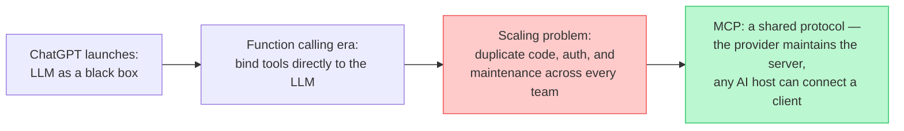
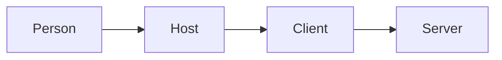
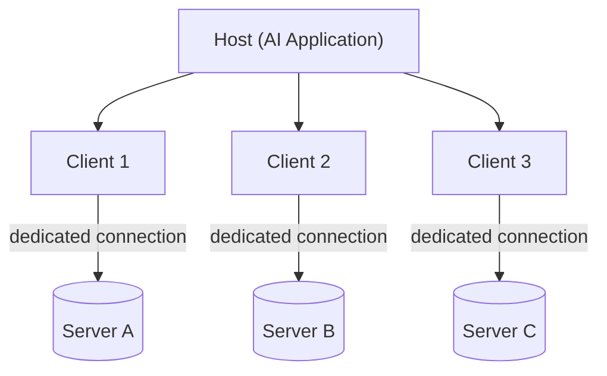
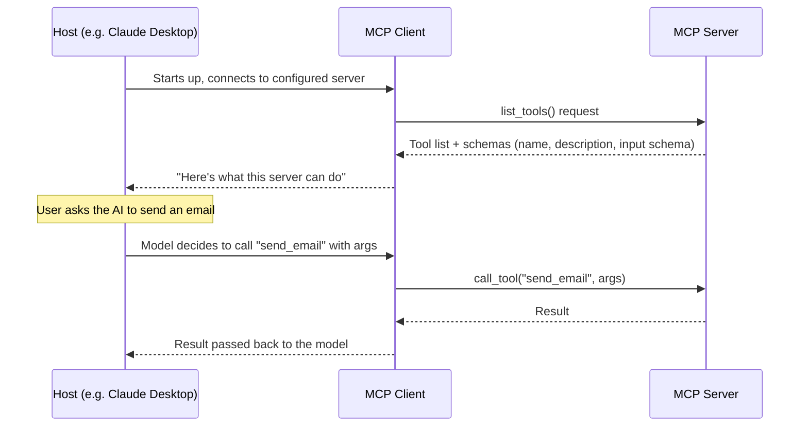
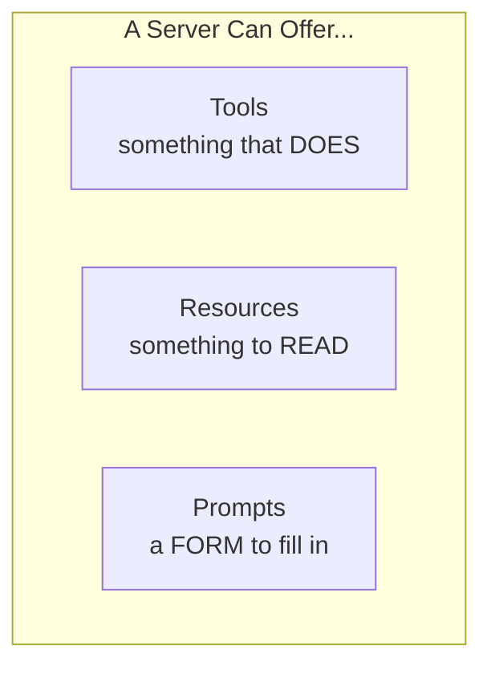
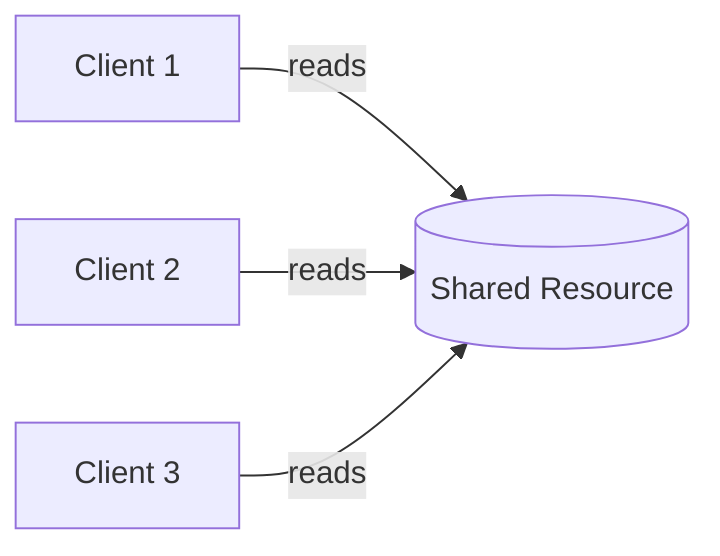
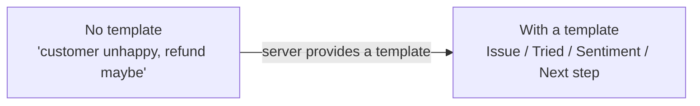

# 🔌 MCP Class 1: Why MCP Had to Exist
*📝 Disclaimer: AI-Generated notes compiled from the full Class 1 (MCP module) transcript — "Model Context Protocol," Agentic AI & AgentOps Specialization Bootcamp 3.0 with Cloud, Krish Naik Academy.*

### 📋 Agentic AI & AgentOps Specialization Bootcamp 3.0 with Cloud | Krish Naik Academy

**🎙️ Mentor:** Mayank Aggarwal
**⏱️ Duration:** ~5 hours | **📅 Session:** Day 1 of the MCP module (23 Aug 2026)

---

## 📰 Quick Updates

- CVs: please send them following the format Mayank has asked for before, not just a plain CV — several people have been sending them the wrong way.
- The course content page is being updated with 5–7 hours of new material this week.
- MCP is a big topic — Mayank expects it to take **3–4 classes** to cover in full depth (protocol internals, building your own servers/clients, dockerizing, and publishing a server as a package). After MCP wraps up, the plan is to jump back into LangChain, then move on to multi-agent systems.
- If you haven't finished revising the LangChain classes yet, this is a good two-week window to catch up before things move fast again.

Click [here](https://ai-automation-with-mayank.netlify.app/#home) to see the detailed notes about MCP
and Mayank's git [repo](https://github.com/mayank953/Live-Class-2026/tree/main/23rd%20Aug%20-%20MCP/Complete%20MCP) for the other artefacts.

---

## 🧠 From Black Box to Hands: Why MCP Had to Exist

Mayank framed the whole topic as a story rather than a spec, and it's worth following in order because MCP only makes sense in light of the problem before it.

It starts with ChatGPT's launch on November 30, 2022 — roughly 1 million users in a week, ~100 million within a few months. Before that, Mayank pointed out, machines mostly only understood fixed inputs like buttons; ChatGPT was the first mass moment where a machine could take natural language in and give natural language back. But underneath, the very first ChatGPT was just an LLM — a next-token predictor. He likes to describe an LLM at that stage as **"just a brain"**: it could write you a great leave-application email, but it had no hands. It couldn't actually *send* the email.

That gap — a brain with no hands — is what triggered the whole chain of developments MCP sits at the end of.

**Step 1: Function calling (mid-2023).** OpenAI shipped the ability to bind tools/functions to an LLM: give it a description of an action (e.g. "send email"), and the model could tell you *which* function to call and with what arguments — though the model itself never executes anything; it just requests the call. This felt like magic at first: no more manual copy-pasting between ChatGPT and your inbox.

**Step 2: The scaling problem.** The catch showed up once this pattern scaled past a single hobby project. Mayank's example: a company running three AI assistants (general chatbot, coding assistant, analytics assistant) each touching ~20 tools across a handful of applications — that's dozens of tools, each with its own auth, its own data format, its own error handling, and its own risk of breaking whenever the underlying API changes. Multiply that across every company doing the same integration work independently, and — as he put it — **"we found a shorter way, but now we need a complete, complete thing to make the shortcut running."** The tool-calling era solved the problem at individual scale but recreated it as a maintenance problem at company scale.

**Step 3: Anthropic's answer.** Anthropic's response was to introduce a *protocol* — not another wrapper, but a shared language, the way HTTP is a shared language for the web — so that an application could expose "here are my tools, resources, and prompts" once, and any AI host could speak to it the same way. That protocol is MCP: Model Context Protocol.



One line Mayank repeated to anchor the whole idea:

> *"MCP is not about giving our LLM more intelligence. It is about giving it an ability to see more."*

That's also, he noted, exactly why "context" is in the name — the M is model, the C is context, and the P (protocol) is the new piece that makes context-sharing standardized instead of ad hoc.

---

## 📖 What MCP Actually Is

Quoting the pattern he displayed on screen: MCP is an **open-source standard for connecting AI applications to external systems** — data sources, local files, databases, tools, search engines, calculators, workflows, and specialized prompts.

He deliberately avoided the common "USB-C port" analogy, saying it oversimplifies things. His framing instead: an MCP server is fundamentally a **collection of tools** (used ~99% of the time), wrapped around APIs that already existed, plus two other pieces — resources and prompts. All three are called **MCP primitives**, and get a full section of their own below once the server/client architecture is in place.

---

## ⚖️ Before vs. After MCP

| | Before MCP (raw tools/functions) | After MCP |
|---|---|---|
| **Defining an integration** | Easy for a single API — any LLM can generate a quick Python wrapper for, say, Gmail's send API | Easy to *connect* — just point your host at the server |
| **Maintenance** | Every team/company writes and maintains its own wrapper code — violates DRY at scale | Maintenance sits with whoever runs the MCP server (usually the provider) |
| **Change management** | If Gmail changes its API, every integrator has to update their own code | The MCP server absorbs the change; connected clients don't need to touch anything |
| **Security** | Every tool needs its own auth handling, owned by you | Still needs auth, but it's centralized at the server |

Mayank's summary of the core trade-off: at 500 teams all wrapping the same "send email" API independently, you haven't saved effort — you've just relocated it. MCP's value isn't a new capability so much as who's responsible for keeping the integration working.

---

## 🏗️ Architecture: Host, Client, and Server

MCP follows a client-server pattern with one added layer — the **host**, which is the actual application a person uses (Claude Desktop, VS Code, Cursor, any LangChain/LangGraph/AutoGen-based app). The host doesn't talk to an MCP server directly; it starts up an **MCP client** internally, and that client does the talking.

Two analogies came up for this, worth holding onto together rather than picking one:

- **Mayank's live analogy (and a real-time self-correction worth keeping):** *"Mobile phone is your host, and network is your server"* — with the SIM card as the client in between, since a phone can't reach the network without one.
- **The companion notebook's analogy:** a universal remote sitting in a house full of smart gadgets, with a dedicated adapter behind each one translating button-presses into whatever signal that specific gadget expects. The person holding the remote is the host — they never rewire a gadget themselves, they just press a button and something else handles the rest.



**The host never talks to a server directly.** It delegates entirely. If every host had to understand the internal wiring of every tool it might ever use, adding one new capability would be a real engineering project every time. Instead, a host only ever needs to know how to *ask*.

**The client is one-per-server, not one shared line.** The host creates a dedicated client for each server it wants to use, and that client maintains a private, 1:1 connection with exactly one server. A host connected to five servers is running five separate clients — never one shared connection to all five.



> Each MCP client maintains a dedicated, 1:1 connection with its corresponding MCP server. Local servers typically serve a single client, whereas remote servers typically serve many clients at once. *(MCP official documentation, via the companion notebook)*

**Why dedicated connections instead of one shared line to every server?**


- **Decoupling** — changing how one server works never requires touching how the host talks to any other server.
- **Safety** — a crash in one server's connection stays contained to that one connection. The notebook proves this directly: start `server.py`, connect Inspector to it, then hit Ctrl+C in the server's terminal — Inspector doesn't crash, it just shows that one connection as closed. With five servers connected, killing one leaves the other four untouched.
- **Scalability** — if one server needs to handle much heavier load, that growth is entirely local to that one client-server pair.
- **Parallelism** — a host with three live connections can talk to all three servers at once instead of taking turns, the way a single shared connection would force it to.

**The transport layer.** The client and server communicate using **JSON-RPC 2.0**, not plain REST — when asked "is MCP just a REST client?", Mayank's answer was: at a very high level you can think of it that way, but it's a distinct protocol with its own transport rules. There are two transport types:
- **STDIO** (standard input/output) — for servers that run locally on your own machine.
- **Streamable HTTP** — for remote/hosted servers. This replaced the older **HTTP + SSE** transport, which was deprecated in the MCP spec released in March 2025 (though the practical cutoff for individual servers varies).



A subtlety Mayank flagged live with a real example: connecting even two MCP servers to Claude already added a large chunk of tokens to a single "hi" message — because the **entire tool list from every connected server is sent up front**, on the first message, so the model knows what's available before it can decide what to call. He showed this directly in Claude's context inspector (custom tools alone were tens of thousands of tokens with just two servers attached). This is a real cost, and he pointed to **middleware/interceptors** as the mechanism for trimming the tool list down to only what's relevant for a given request rather than loading everything by default.

---

## 🎛️ What a Server Can Offer: Three Primitives

Once a client and server are connected, the protocol defines exactly three things a server is allowed to give that client:



**Tools** are executable actions — something with a real effect when called, not just information returned. `greet` and `add` (built live, see the demo below) are both tools: calling `add` doesn't retrieve a fact that already existed, it runs logic and produces a new result. Tools are the one primitive that lets an AI application actually *do* something rather than only describe what doing something would look like.

**Resources** are read-only reference data — no side effects, nothing performed, just something sitting there for anyone connected to read. In the smart-home picture, a resource is the small digital display on a thermostat: you don't actively ask it the temperature, you just glance, because it's always there.



Resources solve an easy-to-miss problem: without a shared resource, every client needing the same reference data would hard-code its own copy — and over time, as one copy updates and another doesn't, they quietly drift apart. One resource, read fresh by everyone, means there's only ever one copy of the truth.

**Prompts** are reusable templates that shape *how* a request gets phrased — not data, not an action, closer to a form with blank fields provided by the server. Picture an AI logging a support escalation with no guidance — it might write something as thin as "customer unhappy, refund maybe." Now picture a server handing it a template requiring four fields every time: issue, what was tried, customer sentiment, recommended next step. The model didn't change; only the presence of a form did.



The value is consistency that survives *who's* asking — every application using that prompt produces the same structure, because the structure lives once, on the server, instead of being separately reinvented inside every app that uses it.

*(Full working code for resources and prompts is planned for a dedicated follow-up notebook — this session covered the shape and reasoning for all three, with real running code only for tools.)*

---

## 💻 Live Demo: A Local MCP Server, End to End

**Setup** (using [`uv`](https://astral.sh/uv) as the package/project manager):

```bash
# install uv if you don't have it
curl -LsSf https://astral.sh/uv/install.sh | sh        # macOS/Linux
powershell -ExecutionPolicy ByPass -c "irm https://astral.sh/uv/install.ps1 | iex"   # Windows

# set up the project
uv init mcp-warmup && cd mcp-warmup
uv add fastmcp
```

**The server itself** — a minimal FastMCP server with two tools, `greet` and `add`, exactly as demoed in class:

```python
from fastmcp import FastMCP

mcp = FastMCP("Warm-Up Server")

@mcp.tool
def greet(name: str) -> str:
    """Greet someone by name."""
    return f"Hello, {name}! Welcome to MCP."

@mcp.tool
def add(a: int, b: int) -> int:
    """Add two numbers together."""
    return a + b

if __name__ == "__main__":
    mcp.run()
```

No special MCP boilerplate beyond the `@mcp.tool` decorator — FastMCP picks up each function's docstring as the tool description automatically, which is exactly what showed up in Inspector's tool list without being written by hand a second time.

**Running it with the Inspector:**

```bash
uv run fastmcp dev server.py
```

This opens **MCP Inspector** at `http://127.0.0.1:6274` — a browser tool that connects to any MCP server and lets you try its tools directly, no full AI application required. Calling `greet` and `add` from the Tools tab is watching two separate programs — Inspector (acting as host + client) and `server.py` (the server) — complete a task together over the actual protocol, not a simulation of it.

**Wiring the same server into a real host — VS Code:**

For a host to launch the server itself (rather than through the Inspector's dev wrapper), the registration uses the plain run command:

```bash
uv run python server.py
```

as the launch command in VS Code's MCP server config (`Add Server` → STDIO), with the working directory set to the folder containing `server.py`. Once added, VS Code's own `mcp.json` records the server, and a new chat session in VS Code can immediately see and call `greet` and `add`.

**Claude Desktop:** the same kind of server connects via Manage Connectors → Add custom connector, pointing at a remote MCP server URL (or the same local-server pattern) — showing the same server works across hosts with zero changes, which was the actual point of the demo.

Mayank also flagged, in response to a student's use case, that a locally-running server can be shared with a small team by port-forwarding or tunneling it (not the most secure option) — full team-wide hosting is "next class" territory, along with pushing a server as an installable PyPI package.

---

## 🗺️ What's Next

- **Next weekend:** a proper deep-dive cleanup of MCP — full working code for resources and prompts (not just the shape of them), authentication patterns, and live-building + publishing an MCP server to PyPI so anyone can install and use it.
- The companion notebook's own next step: the actual wire-level language these three participants speak — what a message looks like on the wire, and how a connection knows when it has started and ended.
- After MCP wraps: back to **LangChain**, then **multi-agent systems**.
- At least two cloud-based projects are planned across major cloud providers later in the course.

---

## 💬 Live Q&A Highlights

| Question | Answer |
|---|---|
| How is MCP different from just calling a REST API directly? | Functionally the end result can be the same, but with a raw API *you* maintain the wrapper, auth, and error handling in every project that uses it. With MCP, whoever owns the server maintains it once, and every AI host just connects a client. |
| Is MCP basically a REST client? | At a big-picture level you can think of it that way, but it's a distinct protocol built on JSON-RPC 2.0, not literally REST. |
| Won't connecting many MCP servers/tools blow up context or confuse the agent? | Yes — the full tool list from every connected server is sent on the first message. Mayank showed this live (two servers already added tens of thousands of tokens). A good tool description helps, and middleware/interceptors can filter down to only relevant tools instead of loading everything by default. |
| Can an MCP server "extend" another one, like inheritance? | Not in a code sense — but a server *can* contain an MCP client internally that forwards certain requests on to another MCP server. This is possible but not a common pattern. |
| How is an MCP server actually hosted/deployed? | However you'd host any other server — a plain running process, a Docker container, or a cloud service like Cloud Run/AKS. MCP doesn't mandate a deployment method. |
| Can tool access be restricted per user role (e.g. read-only vs. read-write)? | In principle yes — since the client requests the tool list from the server, the server can check the caller's auth token/scope before deciding which tools to return. It's not something MCP prescribes out of the box; you'd build that check yourself. |
| If a company already has 25–30 working APIs, why build an MCP server on top? | Because AI hosts speak MCP's protocol natively. Without a server, every team that wants AI to use those APIs has to write and maintain its own tool wrapper — the exact duplication problem MCP exists to remove. |
| How is MCP different from RAG? | They're unrelated mechanisms for giving a model context — RAG retrieves and injects relevant text into a prompt; MCP is a protocol for letting a model call tools/actions on external systems. Not to be confused, and not typically compared directly. |
| Is MCP an orchestrator? | No — it's a connection/communication protocol between a host and external tools, not something that plans or sequences agent behavior. |
| When was the older HTTP+SSE transport deprecated? | The MCP spec update deprecating it in favor of Streamable HTTP was released in March 2025, though the practical cutover date varies server by server. |

---

## 📎 Additional FAQ (from the companion notes site)

Source: [ai-automation-with-mayank.netlify.app/#mcp](https://ai-automation-with-mayank.netlify.app/#mcp)

| Question | Answer |
|---|---|
| Why do I even need MCP for my own small project? | You might not, yet. One app, a handful of tools, nobody else reusing them — plain function calling is genuinely fine. MCP starts paying for itself once more than one app or team needs the same tool. |
| Is MCP an Anthropic product I have to pay for? | No. It's a free, open specification, now governed by a multi-company foundation, not one company's paid product. |
| Function calling already solved my problem — why learn MCP at all? | Because the scaling crack only shows up once you're past one app and one tool — which happens faster than most teams expect. Learning MCP now means not having to relearn the integration approach later. |
| Couldn't a company just build one great function-calling library instead of a whole protocol? | That's basically what MCP is — except the key word is "agreed." A library only works if everyone adopts that one company's library. A protocol is a shared agreement multiple companies co-govern, which is why OpenAI and Google support MCP even though Anthropic built it first. |

---

## ✅ Action Items After Class

- [ ] If LangChain revision isn't done yet, use this window before MCP ramps up further
- [ ] Work through the `p2_MCP_Architecture` notebook end-to-end: build `server.py`, run it with `uv run fastmcp dev server.py`, and call `greet`/`add` from Inspector
- [ ] Try the Ctrl+C safety test from the notebook — kill the running server while Inspector is connected and observe that only that one connection closes
- [ ] Register the same server as a STDIO server in VS Code and/or as a custom connector in Claude Desktop, to see the "same server, any host" idea firsthand
- [ ] If prepping for interviews touching MCP auth, read up on JWT tokens and OAuth flows — Mayank pointed to this as the background knowledge worth having, even though the course will cover an authentication layer for MCP servers directly in an upcoming session

---
