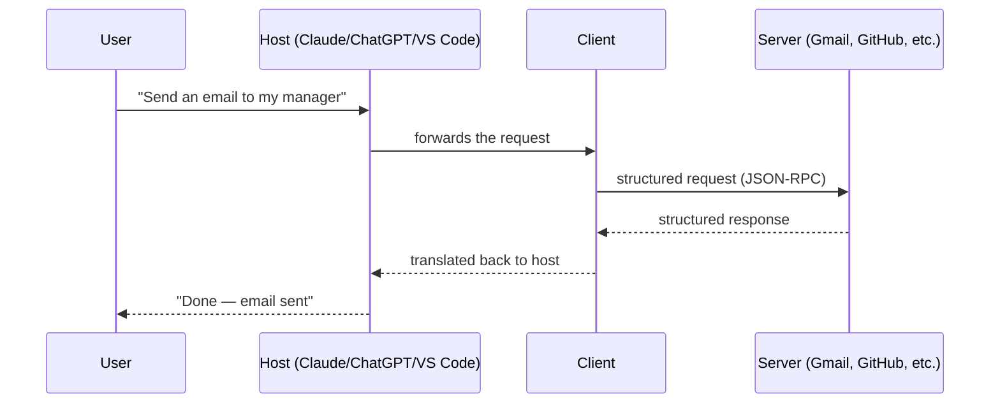
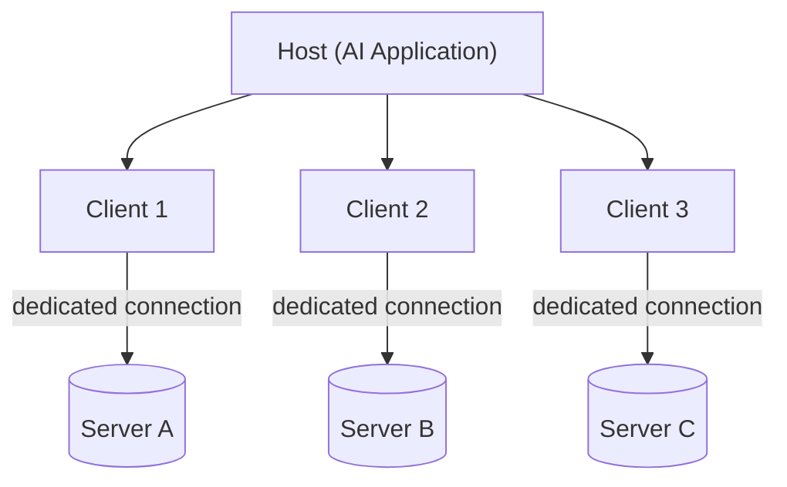
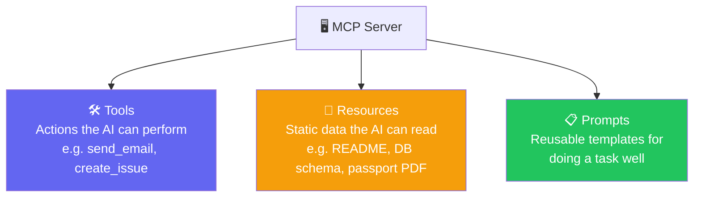
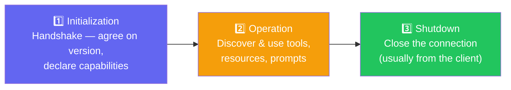
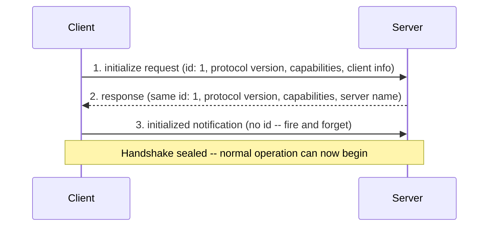
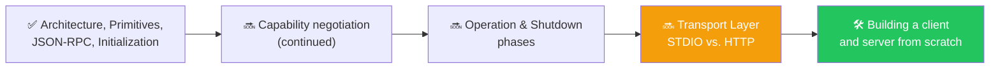

# 🔌 Class 17: MCP Deep Dive — Primitives, Lifecycle & JSON-RPC
### 📋 Agentic AI 3.0 Specialization | Krish Naik Academy

**🎙️ Mentor:** Mayank Aggarwal
**⏱️ Duration:** ~4 hours | **📅 Session:** Day 2 from MCP (5 September 2026)

---

## 📰 Quick Updates

- 🏠 There had been no class the previous weekend due to a personal emergency at home, and Mayank was teaching this session while recovering from a throat infection — he pushed through with a shorter, slightly slower-paced session as a result.
- 📚 All notes, code, and a class summary continue to be updated on GitHub, alongside a dedicated revision notebook for MCP created specifically to consolidate everything covered so far.
- 🎯 **Today's scope:** a full recap of MCP fundamentals, followed by genuinely new material — MCP Primitives, the MCP Lifecycle, and a deep dive into JSON-RPC as the protocol underneath it all.
- 🧭 The philosophy behind spending this much time on MCP was restated plainly: understanding it this deeply is what separates someone who can *use* an MCP connector from someone who can walk into a Google- or Amazon-level interview and explain how to *build* one that scales to millions of users.

---
## Resources for the session
- https://ai-automation-with-mayank.netlify.app/#mcp
- https://mcp-lifecycle.netlify.app/
- https://mcp-lifecycle-simulator.netlify.app/
- https://github.com/mayank953/Live-Class-2026/tree/main/Complete%20MCP
- https://modelcontextprotocol.io/docs/2026-07-28/getting-started/intro

---

## 🔁 Recap: Why MCP Exists

Before going further, the class revisited the original motivation: as AI tools like ChatGPT got popular, people quickly wanted more than just a conversational AI — they wanted it connected to the applications they actually use every day: Google Drive, Slack, GitHub, Gmail. Simply defining custom tools for each of these didn't scale well, and that gap is exactly what Anthropic's Model Context Protocol (MCP) was built to close.

MCP itself is made up of three ideas baked into its name: **Model** (the AI), **Context** (the information and capabilities it needs), and **Protocol** (a standardized way for the AI to get that context).

---

## 🏗️ Recap: Host, Client, Server



A **host** (Claude Desktop, VS Code, Cursor, Codex, any chatbot) never talks to a server directly — it can't, because they don't speak the same language. Instead, the host spins up a dedicated **client** for each server it needs to reach, and it's the client and server that actually communicate, in a shared language covered in depth later in this session.

### Seeing It Run: A Real, Minimal Server

The accompanying course notebooks build this from actual working code rather than diagrams alone — a tiny "warm-up" MCP server, built with the `fastmcp` library:

```bash
uv init mcp-warmup && cd mcp-warmup
uv add fastmcp
```

```python
from fastmcp import FastMCP

mcp = FastMCP("Warm-Up Server")

@mcp.tool
def greet(name: str) -> str:
    """Greet someone by name."""
    return f"Hello, {name}! Welcome to MCP."

@mcp.tool
def add(a: int, b: int) -> int:
    """Add two numbers together."""
    return a + b

if __name__ == "__main__":
    mcp.run()
```

Running `uv run fastmcp dev server.py` opens **MCP Inspector** (`http://127.0.0.1:6274`) — a browser tool that connects to any MCP server and lets you try its capabilities directly, with no AI application involved at all. Calling `greet` and `add` from Inspector's Tools tab confirms something worth noticing: the description shown for each tool is exactly the Python docstring written above it — generated automatically, never typed twice.

In this setup, **Inspector plays the role of both host and client** (it's the interface a person interacts with, and it opens the actual connection), while `server.py` is the server. The instant Inspector launches and connects, that handshake **is** a client doing its job.

### The One-to-One Relationship, Confirmed Against the Spec

**Each client connects to exactly one server** — a single client is never shared across multiple servers. If a host needs to reach several servers, it spins up a separate client for each one, each with its own dedicated, private connection:



The reverse direction is more nuanced than "always one-to-one" — and the accompanying course notebook quotes the official MCP documentation on this directly:

> *"Each MCP client maintains a dedicated, 1:1 connection with its corresponding MCP server. Local servers typically serve a single client, whereas remote servers typically serve many clients at once."* — Model Context Protocol official documentation

So "one client per server" always holds; "one server per client" only holds for local, STDIO-based servers — a remote server (a hosted Gmail or Slack MCP server, for example) is generally designed to serve many clients at once.

### Benefits of This One-to-One Design

Four distinct reasons this design beats one shared connection to every server:

- **Decoupling** — since each client only ever talks to one server, changing or updating how one server works never requires touching how the host talks to any other server. The connections are entirely independent.
- **Safety** — a crash or serious bug in one server's connection stays contained to that one connection. This is provable directly: with `server.py` running, killing it (Ctrl+C) doesn't crash or freeze Inspector — it simply shows that one connection as closed. Four other live connections, had they existed, would be completely unaffected.
- **Scalability** — if one particular server suddenly needs to handle much heavier use, that growth is entirely local to that one client-server pair; none of the host's other connections need to change to accommodate it.
- **Parallelism** — a host with three live connections can talk to all three servers at the same time, rather than being forced to wait for one slow server before even starting the next. A shared connection would force them to effectively take turns.

---

## 🧩 MCP Primitives: What a Server Can Actually Offer

A server's capabilities all fall into exactly three categories, referred to as **primitives**. A useful way to hold them apart: picture a smart-home gadget on a universal remote — something it *does* when a button is pressed (a tool), something you can just *glance at* like a status display (a resource), and a *suggested routine* built in ahead of time, like a "movie night" preset (a prompt).



- **Tools** are actions — something the AI asks the server to *do*, like sending an email or creating a GitHub issue. This is the one primitive where the AI itself decides to act; every other primitive is initiated by someone — or something — else first. Without a tool, an AI can describe in perfect detail what sending an email would involve; with one, it can actually send it.
- **Resources** are read-only, near-static data sources — a GitHub repo's README, a database's schema file, a team's style guide sitting in Google Drive, or (from MCP's own official travel-planning example) a passport PDF or visa checklist. Notably, it's typically the *application*, not the model itself, that decides to read a resource and feed its content in as context. The distinction that matters: a resource never changes anything; it's something to look at. Resources solve a real, easy-to-miss problem — without one shared resource, every client needing the same reference data would hard-code its own copy, and those copies would quietly drift apart over time. A single resource, read fresh by everyone who needs it, never has that problem.
- **Prompts** are predefined, reusable templates that help the AI perform a task *well*, not just perform it — closer to a form with blank fields than to data or an action. The GitHub-issue example made this concrete: a bare `create_issue` tool call can produce a thin, low-detail issue — a **prompt** can instead guide the AI to gather a title, description, and reproduction steps first, consistently, every time. Nothing about the underlying model changes when a prompt is introduced; only the presence of a form does — and because that structure lives once on the server, every application connecting to it produces consistently structured results, rather than each one separately (and differently) reinventing the same template.

A pointed clarification that came up more than once: **resources and prompts are optional, not mandatory.** GitHub's own official MCP server, for instance, ships tools only — no resources or prompts at all — and that's a completely valid, common design.

### The Primitive Functions

Each primitive exposes its own small set of functions a client calls to interact with it:

| Primitive | Functions | What they do |
|---|---|---|
| **Tools** | `list`, `call` | `list` discovers what tools exist and their argument schemas; `call` actually invokes one |
| **Resources** | `list`, `read`, (`subscribe`/`listen`) | `list` discovers available resources; `read` retrieves one; subscribing lets a client learn when a resource changes |
| **Prompts** | `list`, `get` | `list` discovers available prompt templates; `get` retrieves a specific one |

The moment a client connects to a server, it calls the relevant `list` functions first — this is how a host becomes aware of everything a server can offer before ever using any of it.

### All Three, in Real Code

The genuinely surprising part, proven directly in the course notebooks: starting from the tools-only warm-up server above, adding a real resource and a real prompt takes exactly **two more decorators** — nothing more elaborate than that.

```python
@mcp.resource("file://server-notes")
def server_notes() -> str:
    """Read-only notes about this server, straight from a local file."""
    with open("server-notes.txt") as f:
        return f.read()

@mcp.prompt
def structured_escalation(issue_summary: str, what_was_tried: str, customer_sentiment: str) -> str:
    """Guides the AI to log a customer escalation with every required field, in order."""
    return f"""Log this customer escalation with the following structure:
Issue Summary: {issue_summary}
What Was Already Tried: {what_was_tried}
Customer Sentiment: {customer_sentiment}
Recommended Next Action: [determine this from the details above]
"""
```

Reopening MCP Inspector against the updated server confirms all three primitives live side by side: `greet` and `add` still sit under **Tools**, `file://server-notes` now appears under **Resources** and returns the real file's content, and `structured_escalation` now appears under **Prompts**, asking for exactly the three fields defined above. Filling that prompt in produces a consistently structured escalation record every time:

```
Issue Summary: Order #4521 arrived damaged
What Was Already Tried: Customer emailed support once, no reply in 3 days
Customer Sentiment: Frustrated, considering a refund request
Recommended Next Action: Escalate to logistics team, offer expedited replacement
```

Most tutorials stop at tools because tools are the easiest thing to demo — the honest takeaway from building all three is that resources and prompts are just as easy to add; they simply get skipped more often.

---

## 🔄 The MCP Lifecycle: Three Phases

> Every MCP connection that has ever existed follows exactly these three stages, in exactly this order — described with a simple analogy: initialization is the handshake and introduction, operation is the actual conversation, and shutdown is saying goodbye and leaving the room. You can't skip straight to a conversation before anyone has been introduced.



To make this tangible, Mayank pulled up Claude Desktop's actual MCP log files directly from the local machine (on macOS: `~/Library/Logs/Claude/mcp.log`; the equivalent exists on Windows too), showing real JSON-RPC messages exchanged with a genuinely connected local server (Apple Notes, running via STDIO). This is also exactly why a connector in Claude sometimes shows a warning icon even before it's been used: the moment Claude starts up, it initializes a connection to every configured server, and if that initial handshake fails, it already knows and flags it.

---

## 📡 The Data Layer: JSON-RPC 2.0

Whenever two systems need to exchange information, they need a shared language — the same way two people need a common language to have a conversation. For MCP, that shared language, spoken exclusively between client and server, is **JSON-RPC 2.0**.

Breaking down the name: **JSON** is the familiar JavaScript Object Notation data format. **RPC** stands for **Remote Procedure Call** — it allows a program to execute a function on another machine as if it were local, abstracting away the actual network communication involved. Rather than a client manually specifying "query the database with these exact low-level parameters," it can simply say "please query the DB with these arguments" and let the protocol handle everything else.

Every JSON-RPC message shares the same basic shape:

```json
// Request (client -> server)
{ "jsonrpc": "2.0", "id": 1, "method": "tools/list", "params": {} }

// Response (server -> client)
{ "jsonrpc": "2.0", "id": 1, "result": { "tools": [ /* ... */ ] } }
```

- **`jsonrpc`** is always `"2.0"` — the shared format version both sides must agree on.
- **`id`** matches a response back to its original request. This matters specifically because responses can arrive asynchronously and out of order — without an ID, there'd be no way to know which response answers which request.
- **`method`** and **`params`** describe what's being requested.
- A response contains either a `result` or an `error` — never both.

### Why JSON-RPC and Not a Plain REST API?

This is presented as a genuinely important interview-level question, and the reasoning is deliberate, not arbitrary:

- **Lightweight** — plain JSON, human-readable at a glance, with none of the extra headers and overhead a typical REST or XML-based request carries.
- **Transport-agnostic** — the same protocol works whether the connection is local (STDIO) or remote (HTTP), covered in more depth next class.
- **Genuinely two-way** — this is the single biggest departure from REST. In a standard HTTP API, only the client can initiate a call; the server can only reply. In JSON-RPC, **either side can initiate a request** — the server can call the client too, which matters directly for long-running operations, where a server can proactively report progress rather than forcing the client to repeatedly poll for status.
- **Notifications built in** — a message can be sent with no `id` at all, meaning "fire this and expect nothing back," which a strict REST request-response cycle doesn't naturally support.
- **Standard error codes**, inherited wholesale, the same way HTTP has its own familiar set (404, 500, and so on).

Worth being precise about: **JSON-RPC is not something MCP invented.** It's a pre-existing, general-purpose specification used elsewhere in networking; Anthropic simply chose to adopt it because it already fit MCP's needs well.

---

## 🤝 The Initialization Handshake, Step by Step

Watching this play out live in the actual Claude Desktop logs, the very first phase breaks down into exactly three steps:



1. **The client speaks first**, sending its supported protocol version, its capabilities, and basic client info — all tagged with a request ID (e.g. `id: 1`).
2. **The server responds**, matching that same ID, with its own protocol version, its capabilities (does it support tools? resources? prompts?), and its server name.
3. **The client sends an `initialized` notification** — no ID this time, since no reply is expected. This is the "notifications built in" feature of JSON-RPC in action: a message that's genuinely fire-and-forget.

Two small rules exist purely to keep this handshake orderly: the client shouldn't send anything but a ping before the server responds to its initialize request, and the server shouldn't send anything but a ping before it receives that final `initialized` notification.

### Version & Capability Negotiation

The client always sends the *latest* protocol version it supports — never a list of every version it's ever supported. If the server also supports that exact version, it responds with the same one. If not, it responds with the latest version *it* does support, and the client then decides whether that's acceptable. If there's truly no overlap, they disconnect.

> The analogy offered: think of Windows and a game like GTA 5 negotiating DirectX support. Windows says it supports DirectX 11; if the game only supports up to DirectX 8, the negotiation settles on the highest version both sides actually share — never a vague "I support all of them."

This has a very concrete real-world consequence, illustrated with WhatsApp's own versioning behavior (a message deleted in a newer WhatsApp version may not disappear correctly on an older one, because the versions don't fully agree on behavior). The practical takeaway for anyone building their own MCP client for a real company: it's not enough to just say "I'll connect to whatever URL is given" — a serious client implementation needs to explicitly decide which historical protocol versions it will support and handle every behavioral difference across them. This was flagged directly as the kind of depth a strong interview answer would need to show.

---

## 🗺️ What's Next



Running out of time before covering everything planned, the remaining pieces — the rest of capability negotiation, the full **operation** and **shutdown** phases, and the **transport layer** (STDIO for local servers vs. HTTP for remote ones, plus why the older HTTP+SSE approach has been discontinued) — were explicitly deferred to the next class, to be followed by actually building a client and server from code.

---

## 💬 Live Q&A Highlights

| Question | Answer |
|---|---|
| Are resources and prompts mandatory for an MCP server? | No — GitHub's own official MCP server, for example, ships with tools only, no resources or prompts. Both are optional additions, not a requirement. |
| Can one MCP server call another MCP server? | Yes — an MCP server is just a server; there's nothing stopping it from acting as a client to a different MCP server internally, effectively chaining them. |
| Is FastMCP the only way to build an MCP server, and is there a "best" library? | No single best choice — FastMCP is simply the most popular option, alongside Anthropic's own official MCP SDK. The relationship was compared to Keras sitting on top of TensorFlow: the official SDK is the underlying base, and other libraries like FastMCP just make building on top of it easier. |
| Does the client send every protocol version it supports, or just the latest? | Just the latest — sending "I support all of these" isn't correct behavior. The client sends its single latest supported version, and negotiation proceeds from there. |
| Why does JSON-RPC's two-way communication matter — isn't a normal API response already enough? | A standard HTTP API is strictly one-way: only the client can initiate a call. JSON-RPC allows the *server* to initiate a call too — useful specifically for long-running tasks, where the server can proactively report progress rather than the client having to repeatedly poll for status. |
| Is this the same as asynchronous communication? | No — asynchronous means the client fires a request and continues other work, expecting a response later, but the server still never initiates contact on its own. Two-way/bidirectional communication is a distinct concept: either side can start a request at any time. |
| If we already have working REST APIs and a chatbot, why go through the effort of also building an MCP server? | The scalability math: without MCP, connecting N applications (Claude, VS Code, ChatGPT...) to M sets of tools means writing and maintaining roughly N×M separate integrations. MCP standardizes this down to roughly N+M, since any compliant host can talk to any compliant server without custom integration work. It was also candidly acknowledged that from a pure engineering-elegance standpoint, MCP can feel like unnecessary abstraction over an API call — but the real value is making that access usable by non-technical end users and dramatically cutting the integration burden at scale. |
| Is MCP's bidirectionality basically the same as a WebSocket? | Not quite — a WebSocket is a persistent, constantly-open connection, which is heavier than what most MCP interactions need. Two-way capability doesn't require an always-on socket; it's a property of the JSON-RPC protocol itself, not of maintaining a permanent connection. |
| How does a client know which server to connect to without manual IP resolution? | The server's address/URL is provided directly when the client is configured (the same way pasting a server URL into an "Add custom connector" dialog works) — it isn't discovered dynamically at connection time. |
| Internally, how does a server recognize which client a given request came from, if there's no traditional IP/port handshake visible to the user? | That resolution happens inside the transport layer itself — the client and server maintain their connection details (IDs, session info) internally once connected, the same way any other client-server networking connection tracks its own session, just abstracted away from the end user. |
| Is there an official SDK for building MCP servers and clients? | Yes — Anthropic's own official MCP SDK, plus popular community options like FastMCP, which wraps the same underlying base to make development easier (the same relationship Keras has to TensorFlow). |
| If I own my own email domain and want it to work with AI assistants, how do I make it "MCP compatible"? | There's no way to make an existing domain or product inherently MCP-compatible on its own — you build a normal MCP server for it, exposing whatever tools/resources/prompts make sense, the same way any other MCP server is built. |
| For a service like Gmail, who builds the MCP server, and who builds the client that connects to it? | The service provider (Gmail's own team) builds and owns the server. The client/connector logic lives on the host side — for Claude's Gmail connector, that client is built and maintained by Anthropic, not by Gmail. |

---

## 🔑 Key Pointers to Remember

- **MCP exists to solve an integration problem, not to add AI capability.** Before it, connecting an AI host to every outside application meant custom, one-off integrations for each pairing. MCP standardizes that connection so any compliant host can talk to any compliant server.
- **Host → Client → Server, always in that order.** A host never talks to a server directly — it always goes through a dedicated client, because host and server don't share a language on their own.
- **Client-to-server is strictly one-to-one; server-to-client is not.** A client only ever connects to one server. Whether a server serves one client or many depends on transport: local STDIO servers typically serve a single client, but remote HTTP servers (like a hosted Gmail MCP server) are built to serve many clients at once — confirmed directly against the official MCP documentation.
- **Two decorators are the entire distance between a tools-only server and one offering all three primitives** (`@mcp.resource` and `@mcp.prompt`, on top of `@mcp.tool`) — resources and prompts are just as easy to build as tools; they're just demoed less often.
- **Service providers build servers; host developers build clients.** Gmail's team would build and own a Gmail MCP server; it's Anthropic (or whoever owns the host) that builds the client/connector logic that lets their application talk to it.
- **The three primitives are Tools, Resources, and Prompts** — actions, static reference data, and reusable templates for doing a task well, respectively. Only tools are effectively required; resources and prompts are genuinely optional (GitHub's official MCP server ships tools only).
- **Every primitive is discovered before it's used**, via its own `list` function (`tools/list`, `resources/list`, `prompts/list`) — this is how a client learns what a server offers before ever calling anything.
- **The MCP lifecycle has exactly three phases, always in this order:** Initialization (handshake), Operation (the actual work), Shutdown (closing the connection).
- **The initialization handshake is exactly three steps:** client sends `initialize` (with an ID) → server responds matching that ID → client sends `initialized` as a notification (no ID, no reply expected).
- **JSON-RPC 2.0 is the shared language between client and server** — chosen over REST specifically because it's lightweight, transport-agnostic, genuinely two-way (either side can initiate a request), and has notifications built in.
- **The `id` field exists purely to match responses back to requests**, since responses can arrive out of order — without it, there'd be no way to know which reply answers which call.
- **Version negotiation always proposes the latest version each side supports** — never a list of everything a side has ever supported — and the connection is dropped if no shared version can be agreed on.
- **JSON-RPC's two-way capability is not the same as an always-open connection like a WebSocket.** It just means either side can initiate a message; it doesn't require a constantly maintained connection.
- **The business case for MCP is an N×M → N+M reduction in integration work**, plus making these integrations usable by non-technical end users who would never call a raw API directly.

---

---

## ✅ Action Items After Class 16

- [ ] 🏗️ Re-draw the host → client → server flow from memory, including where the one-to-one relationship applies
- [ ] 🛠️ Build the real warm-up FastMCP server yourself (`greet` + `add`), run it with `uv run fastmcp dev server.py`, and confirm both tools work in MCP Inspector
- [ ] ➕ Add a real `@mcp.resource` and a real `@mcp.prompt` to that same server, and confirm all three primitives show up correctly in Inspector
- [ ] 💥 Prove the "safety" benefit yourself — kill the running server with Ctrl+C while Inspector is connected, and observe that it fails contained rather than crashing anything else
- [ ] 🧩 List, for a service you use daily (e.g. your own company's internal tool), what would qualify as a tool, a resource, and a prompt if it were exposed as an MCP server
- [ ] 📖 Read through an actual MCP server's published tool list (e.g. GitHub's or Gmail's official MCP server) and confirm whether it includes resources/prompts or tools only
- [ ] 🔍 Find and open your own Claude Desktop or equivalent host's MCP log file, and try to identify the three initialization-handshake messages in a real log
- [ ] 📡 Write out a JSON-RPC request/response pair by hand for a hypothetical `send_email` tool call, including a matching `id`
- [ ] 🧠 Practice explaining, out loud, why JSON-RPC was chosen over a plain REST API — this came up as a genuine interview-depth question
- [ ] 📅 Come back ready for **transport layer (STDIO vs. HTTP)**, the **operation and shutdown phases**, and building a real client and server from scratch

---

*📝 Notes compiled from the full Class 16 transcript and the accompanying `MCP Architecture` and `MCP Primitives` course notebooks — "MCP Deep Dive: Primitives, Lifecycle & JSON-RPC," Agentic AI 3.0 Specialization, Krish Naik Academy.*
