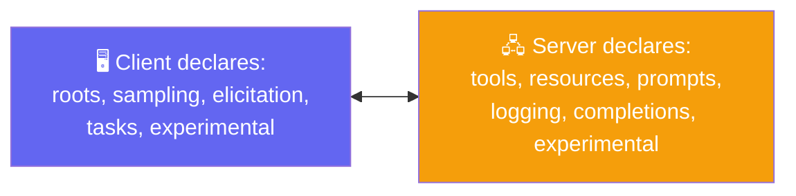
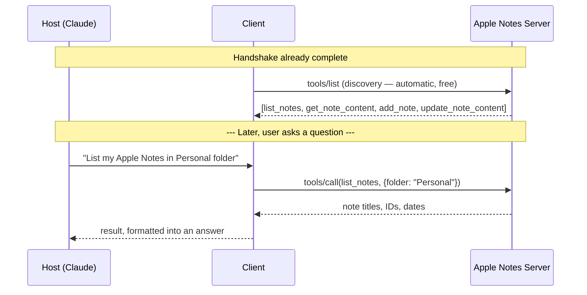
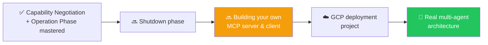

# 🔓 Class 18: Capability Negotiation, Operation & MCP in the Real World
### 📋 Agentic AI 3.0 Specialization | Krish Naik Academy

**🎙️ Mentor:** Mayank Aggarwal
**⏱️ Duration:** ~4.5 hours | **📅 Session:** Day 18 (6 September 2026)

---

## 📰 Quick Updates

- 🎯 **Today's scope:** finish capability negotiation, work through the full **Operation phase** with real, live MCP connections (Apple Notes, a time-server debugging tool, and Claude's own connectors), then close with a no-code "AI News Updater" blueprint project tying everything together.
- 🗺️ Confirmed remaining MCP roadmap: the **Shutdown phase**, the newest protocol version's changes, and **building a real MCP server and client from scratch** are what's left — expected to take one to two more classes before moving into a GCP deployment project and, eventually, a proper multi-agent architecture built on custom MCP servers.
- 💼 Referral opportunities continue to be shared for learners with 4–6 years of experience; interested learners were asked to send their CVs directly.

---

## 🔁 Quick Recap

Before going further, the class briefly revisited where things stood: the client's role, the three primitives (tools, resources, prompts), and the initialization handshake — including the real JSON-RPC messages pulled directly from Claude Desktop's own logs, showing the exact request/response pair that establishes a connection. With that foundation in place, today picked up with the second half of the initialization phase: capability negotiation.

---
## Resources for the session
- https://ai-automation-with-mayank.netlify.app/#mcp
- https://mcp-lifecycle.netlify.app/
- https://mcp-lifecycle-simulator.netlify.app/
- https://github.com/mayank953/Live-Class-2026/tree/main/Complete%20MCP
- https://modelcontextprotocol.io/docs/2026-07-28/getting-started/intro
---

## 🤝 Capability Negotiation, Completed

Capability negotiation was described plainly: **both sides handing over an honest menu before anyone orders.** Client and server each declare what they're capable of — not what they're about to do, just what's *possible* — so the other side knows what it can ask for later.

- **Client capabilities** include *roots* (the ability to expose file-system access), *sampling* (support for an LLM sampling request), *elicitation*, *tasks*, and *experimental* (non-standard features).
- **Server capabilities** include the three primitives themselves, plus *logging*, *completions* (argument auto-completion support), and *experimental*.

### Elicitation: The Server Asking the Client

This is where the two-way nature of JSON-RPC, introduced last class, becomes concrete. **Elicitation is the mechanism for a server to request additional information from the user, through the client, mid-interaction** — not just replying to a request, but proactively reaching out for something it needs. A direct citation from LangChain's own documentation was pulled up to ground this: elicitation surfaces as a LangGraph interrupt, so a human reviewing the agent's work answers it and the run resumes.

A pointed clarification: **this is not the same concept as Human-in-the-Loop.** HITL is an AI-lifecycle safety mechanism layered on top of tool calls; elicitation is a native MCP mechanism for a server to ask the client (and, through it, the user) for information it's missing.

### A Word on Deprecation (and a Live Correction)

Referencing an older communication pattern that's now marked deprecated in the newest MCP spec, Mayank was careful to note that "deprecated" doesn't mean "unused" — the majority of servers in the wild are still running on the older pattern, and migrating an entire ecosystem realistically takes close to a year. (A student corrected his pronunciation — "deprecated," not "depreciated" — which he took in stride: "totally, totally on me.")

---

## 🎬 Watching Capability Negotiation for Real

Rather than staying purely theoretical, this was demonstrated on two real, live systems:

- **VS Code + Context7**: adding the Context7 MCP server live showed the exact sequence — connect, discover tools — happening automatically the moment the server was added, before any request was made. Context7 itself was called out as a genuinely useful, authentication-free MCP server that returns the *latest* documentation for a library, solving the common problem of an AI's own training data lagging behind a fast-moving library's real current API. It was named as one of the top 5 most-used MCP servers in the wild for exactly that reason.
- **Claude Desktop + Apple Notes**: opening an existing Apple Notes connection surfaced its real tool list — `list_notes`, `get_note_content`, `add_note`, and `update_note_content` — with Claude visibly aware of each one's purpose and arguments before any note-related question was asked.

Both demonstrations made the same point: none of this discovery is something a developer writes by hand — it's baked into the MCP architecture itself. The reason to still understand every step in depth is that things fail at these exact points in production, and a developer who only knows "it just works" has no way to diagnose why it stopped working.

---

## ⚙️ The Operation Phase: Discovery and Calling

With initialization complete, the second lifecycle phase — **Operation** — breaks down into exactly two steps:

- **Discovery** (`tools/list`) fires automatically the instant the handshake completes — before the user has even asked a question. It costs nothing: no LLM is involved, since it's purely the client asking the server "what do you offer," and the server answering.
- **Calling** (`tools/call`) happens only when an actual request needs a specific tool, and always requires exactly two things: the tool's **name** and its **arguments**.

### A Real, Live Example

Asking Claude Desktop to "list my Apple Notes" was walked through end to end, cross-checked directly against the real tool schema in Claude's own MCP logs. The `list_notes` tool's actual definition takes a `folder` argument (string, optional — "filter notes by folder") and a `limit` argument (number, default 20). Requesting notes from the "Personal" folder produced a request with `folder: "Personal"` and no `limit` specified — so the server's own default of 20 applied. Every tool, across every MCP server (Gmail, Google Calendar, Apple Notes alike), carries exactly this same shape: a name, a description, and an input schema — and the quality of that description is what determines whether the AI reliably picks the right tool at all.

A live follow-up drove home why discovery matters even though it feels invisible: a student asked why the client bothers calling `tools/list` at all if capability negotiation already told it the server "has tools." The answer: capability negotiation only confirms *that* tools exist as a category — it says nothing about *which* tools, what they're called, or what arguments they expect. Discovery is what actually retrieves that detail.

### Errors in Operation

Malformed requests don't fail silently — they come back as a proper JSON-RPC error object, using the same standard error codes the protocol inherits wholesale (a wrong tool name returns a "method not found"-style error, for instance). This connects directly to the resilience-focused middleware covered previously: those tool-error and retry patterns exist precisely to handle failures at this exact point in the lifecycle gracefully.

### A Genuine Privacy Trade-off, Discussed Head-On

A student's blunt question — "so with MCP, we're exposing our data to the LLM?" — got an equally blunt answer: yes. Whatever a tool returns is information the client hands to the host, which sends it to the model provider to generate a response. This is real information flow, not a hypothetical concern, and it's a legitimate reason a company might choose to lock down which notes, files, or folders an MCP connection can even see (Apple Notes' own lock feature was demonstrated live — a locked note becomes invisible to any MCP call, full stop). Beyond just restricting access at the application level, this is also exactly what **middleware** — PII detection, custom guardrails before a model call — exists to control on the developer's own side, for a custom-built client or server.

---

## 🕵️ Debugging Tool Spotlight: Watching Real JSON-RPC Live

A third-party MCP debugging application (a "playground"-style inspector) was used to make the entire lifecycle visible on a genuinely simple two-tool server (`getCurrentTime` and `convertTime`). Asking it to "convert the current Indian time to Chicago time" produced a live, traceable sequence: an LLM call to understand the request, a `tools/call` to `getCurrentTime`, a second LLM call to interpret that result, a `tools/call` to `convertTime`, and a final LLM call to produce the answer — with the *exact* JSON-RPC request and response bodies visible at every step, IDs incrementing with every single call regardless of which primitive was being used.

### Why a Separate Tool Was Needed At All

This tied directly into a real, live debugging problem raised earlier: **Claude Desktop's own `mcp.log` file used to contain the complete JSON-RPC message body for every exchange, and at some point stopped.** Comparing entries from earlier in the year against recent ones confirmed it directly — older log entries show the full `initialize` request and response verbatim; recent entries show only a terse one-line summary (method name, ID, whether parameters were present) with no actual content. A student pushed on this precisely: if version negotiation hadn't changed, why did the logging suddenly get worse? Mayank's honest answer, live: this isn't a protocol version change at all — it's Anthropic's own client quietly changing how much detail it chooses to write to disk, unrelated to the MCP specification itself. He was candid that even he hadn't found a clean way to recover full logging on a current install, and committed to solving it properly — likely by building a small relay that sits between Claude Desktop and a real server, forwarding every byte unchanged while independently printing the full conversation — once the class starts building its own MCP servers and clients directly in Python.

---

## 🧑‍💻 The "Legacy vs. Modern" Reality of Version Support

Digging into the debugging tool's own connection log surfaced a genuinely instructive moment: connecting to an older, unmigrated server, the tool first attempted a **newer discovery call**, received an error because the server didn't recognize it, and *then* fell back to the older `initialize`-first handshake — succeeding on the second attempt. This is version negotiation working exactly as designed, visible in real time rather than just described.

The realistic timeline for ecosystem-wide migration to a newer MCP version was estimated at **8 months to a year** for the majority of servers, with only the most actively maintained ones (LangChain's, for instance) moving in the first couple of months. The practical implication for anyone building a client: it has to gracefully support both the modern and legacy handshake patterns, not just the newest one — exactly the kind of detail that separates a demo-quality implementation from one built for a real company.

---

## 🌍 Why MCP, Not Just Function Calling?

Recurring doubts throughout the day ("does MCP replace APIs?", "what happens without MCP?", "is there an alternative to MCP?") are worth answering plainly and together, since they all point at the same underlying question.

Plain function calling is genuinely fine for a small, single-app project — MCP starts earning its keep specifically once more than one application, or more than one team, needs to reuse the same tool. Without a shared protocol, each application would have to define its own version of the same integration from scratch; with one, a service builds its connector once and every compliant application can use it. It's also worth being precise about what MCP actually *is*: a free, open specification now governed by a multi-company foundation, not a paid Anthropic product — which is exactly why competitors like OpenAI and Google support a protocol Anthropic originated. A single company's proprietary library could theoretically solve the same problem technically, but only a shared, multi-party-governed agreement actually gets adopted broadly enough to matter.

---

## 🧩 Live Project: A No-Code "AI News Updater"

To ground everything in a genuinely useful workflow, the class built a real, no-code project entirely through Claude's connector settings: Gmail, Google Calendar, Tavily, and Apple Notes were all connected as live MCP servers, and Claude itself was used to turn a rough diagram of the desired flow into a well-structured system prompt — recursively researching AI news via Tavily, categorizing it, drafting an HTML email, creating a recurring calendar reminder, and producing both a LinkedIn post and a Substack-ready article.

Walking a student through the resulting execution trace step by step reinforced the core mental model one more time: **the brain (the model) is used every single time a decision needs to be made — which tool to call, what arguments to send, how to interpret a result — while the actual data movement happens strictly through tool calls.** A calendar event is created directly via a tool call once the brain decides on a time; a batch of search results gets assembled into a coherent narrative *by the model itself*, never by the search tool; a final draft gets saved to Gmail via a tool call once the model has finished composing it. Nothing here happens through any mechanism other than "brain decides, tool acts" — the same agentic loop from the very beginning of the course, just now running across four real, independent external services at once.

A live piece of feedback from the same walkthrough is worth keeping in mind for future projects: without explicitly telling the model how many headlines to include per news category, it made its own (undocumented, hard-to-predict) assumption and quietly dropped some real stories during summarization. The fix isn't a framework feature — it's simply being explicit in the prompt about exactly how much detail is wanted per category, and testing until it holds up.

---

## 💬 A Real Enterprise Scenario, Worked Through Live

A DevOps architect on the call raised a genuinely representative production constraint: managing 150+ microservices across AWS, Azure, and GCP, tasked with building a vulnerability-remediation agent — but working inside an enterprise Claude account with connector installation locked down entirely, specifically to prevent data leaving the organization.

The guidance given was concrete and reusable: this is precisely the situation that justifies **building a custom MCP server** rather than relying on any pre-built connector — a self-hosted server (potentially packaged as its own Docker container, fitting neatly into an existing multi-cloud container deployment pipeline) keeps sensitive data entirely inside the organization's own infrastructure, since nothing has to pass through a third-party connector at all.

---

## 🗺️ What's Next

The next class was framed as noticeably more hands-on: finishing the Shutdown phase, then moving into writing a real MCP server and client from scratch in Python — including proper handling of the logging gap and legacy-version support discussed today — before a GCP-based deployment project and, eventually, a full supervisor/sub-agent multi-agent system built on custom MCP servers.

---

## 🔑 Key Pointers to Remember

- **Capability negotiation is an "honest menu," not a commitment** — both sides declare what they *can* do; nothing is used until it's actually needed later.
- **Elicitation is a server asking the client (and user) for missing information mid-task** — a native MCP mechanism, surfaced in LangGraph as an interrupt, and distinct from Human-in-the-Loop.
- **Discovery (`tools/list`) is automatic and free** — it fires the instant the handshake completes, costs no LLM tokens, and happens before any user question. **Calling (`tools/call`) always needs a name and arguments**, and only happens when a real request needs it.
- **Capability negotiation says a category of feature exists; discovery says exactly what's available inside it.** They're different steps for a reason.
- **Sending data through an MCP tool call means that data is genuinely being shared with the model provider** — this is real information flow, and it's a legitimate reason to lock down sensitive folders/files or build a custom server instead of using a public connector.
- **A protocol version marked "deprecated" is still what most real servers run on** — ecosystem-wide migration realistically takes the better part of a year, so a serious client has to support both old and new handshakes gracefully.
- **MCP is a free, multi-company-governed specification, not an Anthropic product** — that's exactly why competing providers support it.
- **The brain decides; tools act.** Every step of a multi-service workflow — searching, drafting, scheduling — is still just this same repeated pattern, running across more services at once.

---

## 💬 Live Q&A Highlights

| Question | Answer |
|---|---|
| Why does the client call `tools/list` if capability negotiation already said the server has tools? | Capability negotiation only confirms tools exist as a category; discovery is what actually retrieves their names, descriptions, and argument schemas. |
| How is elicitation different from Human-in-the-Loop? | HITL is an AI-lifecycle safety mechanism for approving/editing/rejecting tool calls. Elicitation is a native MCP mechanism for a server to request missing information from the client/user mid-task — a different concept entirely. |
| If Claude's logs used to show full JSON-RPC and now don't, doesn't that mean the protocol version changed? | No — this is Anthropic's own client changing how much it writes to disk, unrelated to the MCP specification itself. Version negotiation and this logging change are two separate things. |
| How do we restrict specific tools for specific users inside an MCP setup? | That's not an MCP-architecture concern — it's ordinary software engineering, solved with middleware (the same guardrail/dynamic-tool-loading patterns covered earlier), not a built-in MCP feature. |
| Can we create our own MCP server directly inside Claude? | No — you can *connect* your own MCP server to Claude, but Claude itself isn't where you build and host one. |
| Does calling an MCP tool cost LLM tokens? | No — a tool call by itself is a plain client-server transaction. Tokens are only spent when the model itself is actually invoked to reason or generate a response. |
| Does MCP have built-in caching? | Not by default, as far as could be confirmed live — caching, if wanted, would need to be built separately. |
| Are "connectors" in Claude the same thing as MCP servers? | Yes — Claude just uses friendlier language ("connectors," "tools") for a general audience instead of "MCP server," to avoid confusing non-technical users. |
| What's the realistic timeline for the whole MCP ecosystem to move to the newest protocol version? | Roughly 8 months to a year for most servers; only the most actively maintained ones move within the first couple of months. |
| For an enterprise account where connector installation is locked down entirely, how should sensitive internal tooling be built? | Build a custom, self-hosted MCP server (optionally as its own container) so data never has to leave the organization's own infrastructure through a third-party connector. |
| Should I claim a "production-grade" AI project on my resume if it wasn't actually deployed at scale? | Describe it honestly as what it is, and frame it around the real problem it solved rather than the technology used — interviewers care far more about problem-solving depth than buzzwords, and shallow claims get exposed quickly under real questioning. |

---

## ✅ Action Items After Class 17

- [ ] 🤝 Recreate the capability-negotiation exchange for yourself — connect a new MCP server (Context7 is free and authentication-free) inside VS Code and watch the discovery happen automatically
- [ ] ⚙️ Walk through the Operation phase yourself: trigger a `tools/list` discovery, then a `tools/call`, and inspect both the request and response bodies
- [ ] 📁 Deliberately compare an older vs. newer entry in your own `mcp.log` (or equivalent) to see the real-world logging change firsthand
- [ ] 🕵️ Try the third-party MCP debugging/inspector tool on a simple two-tool server and trace one full multi-step request end to end
- [ ] 🌍 Practice explaining, in your own words, why MCP earns its keep only past a single app/single tool — this is a genuine interview-depth question
- [ ] 🧩 Build your own no-code connector-based mini-project (news digest, meeting prep, or similar) using at least three real connectors, and pay attention to where the model's own assumptions quietly shape the output
- [ ] 📖 Come back ready for the **Shutdown phase** and **building a real MCP server and client from scratch in Python**

---

*📝 Notes compiled from the full Class 17 transcript and a real captured Claude Desktop `mcp.log` file — "Capability Negotiation, Operation & MCP in the Real World," Agentic AI 3.0 Specialization, Krish Naik Academy.*
