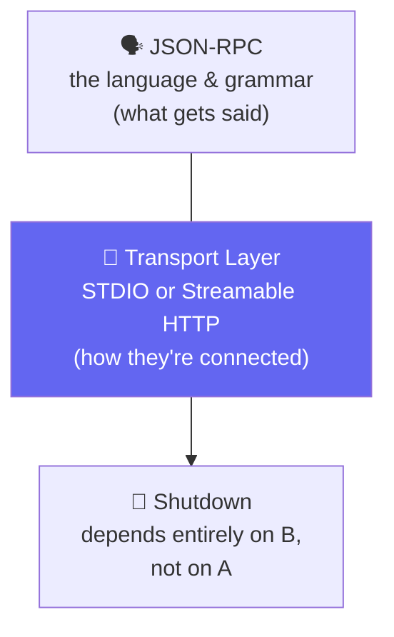
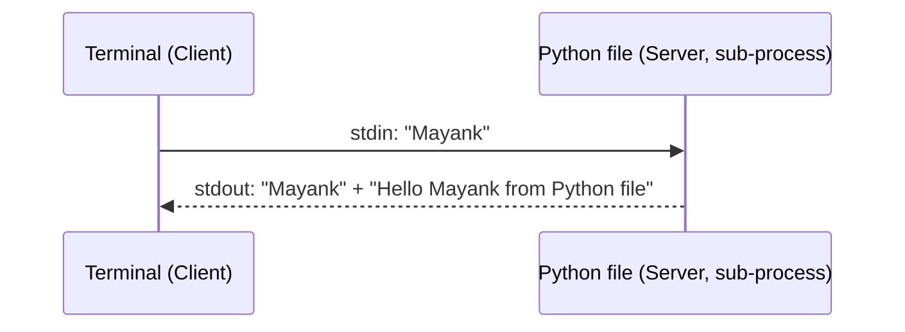
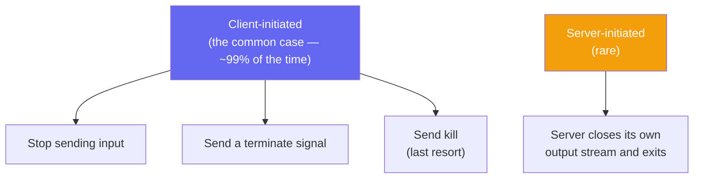

# 🛠️ Class 19: Shutdown, Transport Layer & Building Your First Real MCP Server
### 📋 Agentic AI 3.0 Specialization | Krish Naik Academy

**🎙️ Mentor:** Mayank Aggarwal
**⏱️ Duration:** ~4.5 hours | **📅 Session:** Day 19 (12 September 2026)

---

## 📰 Quick Updates

- 💼 Two learners who'd been forwarded for interviews got feedback: strong on concepts, weaker on coding — a direct, useful signal for anyone else preparing to interview soon. More profiles were expected to go out the following Monday.
- 🎯 **Today's scope:** finish the MCP lifecycle with the **Shutdown phase**, understand the **Transport layer** properly (since shutdown depends entirely on it), then move into genuinely new territory — **building a real MCP server from scratch**, first the painful legacy way, then the easy way with FastMCP, and finally installing it directly into Claude Desktop.
- 🗺️ Confirmed near-term roadmap: tomorrow's class was flagged as code-heavy — connecting a real database to an MCP server, hosting a server publicly on the internet, and (time permitting) revealing a technique for getting full real-time JSON-RPC logs back out of Claude Desktop, since its own logging has gotten less detailed over time.

---
## Resources for the session
- https://www.mcpjam.com/
- https://mcp-lifecycle.netlify.app/
- https://mcp-lifecycle-simulator.netlify.app/
- https://ai-automation-with-mayank.netlify.app/#mcp
- https://github.com/mayank953/Live-Class-2026/tree/main/Complete%20MCP
- https://modelcontextprotocol.io/docs/2026-07-28/getting-started/intro
---

## 🔌 Why Shutdown Needed Transport Layer First

Everything up to this point — the handshake, discovery, every tool call — has been the actual *conversation* between a client and server. Shutdown is different: it's not about what gets said, it's about **how the connection itself closes**, and that depends entirely on *how* the two were connected in the first place. This is exactly why the class paused on shutdown to properly cover the **transport layer** — the piece that had been used constantly but never explained in depth.

The analogy that anchored the whole session: closing a conversation with a friend depends entirely on how you're talking. If you're chatting on WhatsApp, closing the connection means closing your internet. If you're on a phone call, closing your internet does nothing — you'd have to hang up instead. JSON-RPC is the *language and grammar* of what gets said; the transport layer is *how the two parties are physically connected* in order to say it at all.



---

## 🖥️ Transport Layer #1: STDIO

**STDIO — Standard Input/Output** — was introduced through something everyone had already unknowingly used for years: any C or C++ program that starts with `#include <stdio.h>`.

### A Live, Genuinely Illuminating Demo

Rather than diagramming it abstractly, a tiny Python script was written and run live:

```python
name = input("Please tell me your name: ")
print(name)
print("Hello Mayank from Python file")
```

Running this from a terminal made the whole mechanism visible: the **terminal is the client**, the **Python file is started as a sub-process and acts as the server**, and the two are connected via STDIO the instant the file runs. Whatever the terminal sends in becomes the Python file's input; whatever the Python file prints becomes something the terminal can display. The takeaway: this exact three-step pattern — launch a sub-process, share input via `stdin`, share output via `stdout` — is precisely what every STDIO-based MCP connection does, just with JSON-RPC messages flowing instead of a name and a greeting.



### Benefits of STDIO

- **Fast** — both sides run on the exact same machine, so there's no network round trip at all.
- **Secure** — with nothing exposed outside the local machine, there's no real attack surface to defend.
- **Simple** — no server address, no network setup, nothing to configure beyond the command itself.
- **The obvious trade-off**: it only works when both sides can run on the same machine — it simply doesn't scale to "anyone on the internet."

### Shutdown, in STDIO



The key line, worth remembering verbatim: **no JSON-RPC messages are exchanged during shutdown at all** — the entire responsibility shifts to the transport layer itself. Closing Claude Desktop, for instance, sends a plain termination signal to its connected servers — nothing in JSON-RPC, just the underlying process being told to stop.

---

## 🌐 Transport Layer #2: Streamable HTTP

The second option is built on the HTTP protocol everyone already knows from the web — which is exactly the point: **because HTTP already works over the internet, this is what lets a client connect to a server running anywhere, not just on the same machine.**

- The client sends a **POST request** to a single, commonly-named endpoint — almost always `/mcp` — carrying the JSON-RPC message in the request body, with the usual HTTP mechanisms (headers, standard auth methods like OAuth or an API key) available.
- **Streamable HTTP replaces the older, now-deprecated "HTTP + SSE"** (server-sent events) pattern — but that older approach is still what a majority of existing servers actually run, since a full ecosystem migration realistically takes the better part of a year.

### Seeing It for Real

A live connection to a real, HTTP-based Excalidraw MCP server made every step visible: an `initialize` request sent as an actual POST call (with the full request/response headers on screen), followed by an `initialized` notification, then a `tools/list` POST call returning 5 tools, then a `resources/list` POST call. Copying the URL of the class's own LangChain MCP server confirmed the same pattern — every real HTTP-based MCP server ends in `/mcp`.

### Shutdown, in Streamable HTTP

Simply **closing the HTTP connection** — no different, conceptually, from closing a browser tab or turning off Wi-Fi to stop a chat session. If a server closes *unexpectedly* mid-connection, that's a signal something went wrong on the server's end, and a well-built client should attempt to reconnect gracefully rather than just failing silently.

With that, all three MCP lifecycle phases — **Initialization, Operation, and Shutdown** — were formally complete.

---

## 📜 A Quick, Grounding JSON-RPC Recap

Before moving into building anything, the reasons for JSON-RPC were revisited one more time, now that every concept behind each reason had actually been seen in practice: **lightweight** (plain, human-readable JSON), **transport-agnostic** (the exact same JSON-RPC works identically over STDIO or over Streamable HTTP), **two-way by design** (either side can send a request), and **notifications built in** (a message with no ID, fired with no reply expected — exactly what `initialized` is).

---

## 🏗️ Building an MCP Server: The Legacy Way (and Why It Hurt)

Before reaching for the easy tool, the *painful* original approach was shown deliberately — not to be memorized, but so its difficulty would be genuinely felt, and because **this exact style of code still shows up in real companies today.**

Using Anthropic's own low-level `mcp` Python SDK, defining a simple three-tool server (`list_recipes`, `get_recipe`, `search_recipes`) required manually writing a `list_tools` function enumerating every tool by hand, plus a large nested `if`/`elif` block matching incoming tool names to their implementations — real, working code, but verbose and easy to get wrong.

---

## ✨ Building an MCP Server: The FastMCP Way

### A Little History (and a Correction Worth Remembering)

The relationship between the two libraries in play was explained through a clean analogy: **it's TensorFlow and Keras, all over again.** Anthropic released the original MCP specification and its own official Python SDK, which was correct but genuinely difficult to write against. An independent developer — **Jeremiah Lowin**, a co-founder of Prefect HQ, *unrelated to the FastAPI project despite the similar naming* — built a standalone **FastMCP** library specifically to make defining servers dramatically easier. It became popular enough that Anthropic folded a version of it directly into the official SDK (renaming an internal class to avoid confusion), the same way Google eventually hired Keras's creator and absorbed its best ideas into TensorFlow itself. Standalone FastMCP remains what most real-world servers actually use today.

A pointed clarification worth keeping straight for an interview: **FastMCP and FastAPI are not from the same team or company** — they just happen to share a naming convention, and they *are* highly compatible with each other in practice, since an MCP tool is conceptually so close to a regular API endpoint.

### The Real Code

```python
from fastmcp import FastMCP

mcp = FastMCP("Recipe Box")

recipes = {
    "123": {"title": "Weeknight Pasta", "minutes": 20, "tags": ["quick", "weeknight"]},
    "124": {"title": "5-Minute Salsa", "minutes": 5, "tags": ["quick", "no-cook"]},
    # ...
}

@mcp.tool
def list_recipes() -> list[dict]:
    """List all recipe IDs and titles."""
    return [{"id": k, "title": v["title"]} for k, v in recipes.items()]

@mcp.tool
def get_recipe(recipe_id: str) -> dict:
    """Get full details for one recipe by its ID."""
    return recipes[recipe_id]

@mcp.tool
def search_recipes(tag: str) -> list[dict]:
    """Search recipes by tag, e.g. 'quick'."""
    return [{"id": k, "title": v["title"]} for k, v in recipes.items() if tag in v["tags"]]

if __name__ == "__main__":
    mcp.run()
```

The entire comparison in one line: what took a hand-written `list_tools` function plus a nested `if`/`elif` block in the legacy approach here takes **one decorator per function** — `@mcp.tool` reads the function's signature and docstring and handles `tools/list` and `tools/call` automatically, with nothing extra to define.

### Adding a Resource and a Prompt — Live, No Restart Required

```python
@mcp.resource("recipe://tags")
def valid_tags() -> list[str]:
    """The full list of valid recipe tags, so an LLM knows what it can search for."""
    return ["quick", "weeknight", "no-cook", "vegan", "dessert"]

@mcp.prompt
def plan_weekly_meals() -> str:
    """A template for planning a full week of meals from the recipe box."""
    return "Using the available recipes, plan a balanced set of meals for the next 7 days..."
```

A genuinely nice, real detail observed live: FastMCP **doesn't require restarting the server** to pick up a newly added resource — connecting again inside MCP Inspector immediately showed the new resource, the same way FastAPI hot-reloads code changes. Adding the prompt did need a fresh connect/disconnect cycle in the Inspector, and it showed up immediately afterward under Prompts.

### Why the Resource Matters, Concretely

A sharp doubt from the room, worth preserving: a recipe's own `tags` field only exists *inside* a tool's returned data — an LLM has no way to know what valid tag values even exist unless it has already called `list_recipes` or `search_recipes` at least once. The `recipe://tags` resource solves this directly: it lets the model discover the full set of valid tags upfront, so a request like *"give me something for the holidays"* can be reliably translated into a tag the server actually understands (e.g. `"weekend"`), rather than the model guessing at something that doesn't exist in the data at all.

---

## 🩹 A Real Debugging Moment: Port Conflicts

Trying to launch MCP Inspector against the new server (`npx @modelcontextprotocol/inspector python3 recipebox_fastmcp.py`) failed immediately — port `6274` was already in use, because MCP Jam happened to be running on the exact same port. Rather than treating this as a blocker, it became a live lesson in ordinary debugging: identify what's occupying the port, then either close the conflicting application or explicitly redirect the new one to a different port (`--client-port 9999` solved it here). The moral stated directly: **two things can't run on the same port any more than two websites can both be `google.com`** — this is completely ordinary, expected friction, not a sign that anything about MCP itself is broken.

---

## 📲 Installing a Real Server Into Claude Desktop

```bash
uv run fastmcp install claude-desktop recipebox_fastmcp.py
```

Running this single command registers the new RecipeBox server directly inside Claude Desktop's own configuration — after a restart, it appears alongside every other connected server, genuinely usable in a real conversation, not just inside a developer-facing inspector tool. Under the hood, this is exactly what populates an entry like the following in Claude Desktop's own config file:

```json
"RecipeBox_Updated": {
  "command": "/opt/homebrew/bin/uv",
  "args": [
    "run", "--with", "fastmcp", "fastmcp", "run",
    "/Users/mayank/Complete MCP/first-mcp-server/recipebox_fastmcp.py"
  ],
  "transport": "stdio"
}
```

Two details worth noticing in that config entry itself: it explicitly declares `"transport": "stdio"` — confirming everything covered earlier about STDIO being the natural choice for a server running locally alongside its client — and the command is `uv run --with fastmcp fastmcp run <file>`, meaning Claude Desktop launches the server exactly the same way it would be run manually from a terminal, just automated.

---

## 🌍 A Preview: Making a Local Server Reachable by Anyone

A student asked the natural next question: if MCP Inspector (or a server) is running on `localhost`, how could someone else ever access it? The answer given was **tunneling** — specifically **ngrok** — a tool that exposes a local port to a real, shareable internet URL without needing to actually deploy anything to a cloud server. This was flagged as exactly the mechanism that will matter once a server needs to be reachable by a real LangChain agent or another person entirely, rather than just the same machine it's running on.

---

## 🗺️ What's Next


Tomorrow's session was explicitly framed as heavily code-focused: building an MCP server backed by a real database (tables for profile data, transaction data, and so on, with one tool per meaningful read operation, letting the model decide which to call based on the request), hosting that server so it's genuinely reachable over the internet, and — time permitting — a look at recovering full, real-time JSON-RPC visibility from Claude Desktop, since its own on-disk logging has become noticeably less detailed over time.

---

## 🔑 Key Pointers to Remember

- **Shutdown depends entirely on the transport layer, not on JSON-RPC.** No JSON-RPC messages are exchanged during shutdown at all — closing a connection is purely a transport-layer action.
- **STDIO connects a client and server as a parent-and-sub-process on the same machine** — fast, secure, and simple, but limited to local use. Shutdown is almost always client-initiated (stop input → terminate signal → kill, in that order).
- **Streamable HTTP connects a client and server over the internet**, using an ordinary POST request to a shared `/mcp` endpoint. Shutdown is just closing the HTTP connection.
- **FastMCP turns a function into a full MCP tool with one decorator** (`@mcp.tool`), handling `tools/list` and `tools/call` automatically — the same is true of `@mcp.resource` and `@mcp.prompt` for the other two primitives.
- **FastMCP and FastAPI are unrelated projects** that happen to share a naming style — don't conflate them in an interview.
- **A resource can teach a model what values are even valid to search for** — without one, a model can only guess at things like tag names it's never actually seen returned by a tool.
- **`uv run fastmcp install claude-desktop <file>`** is the real, one-line command that registers a custom server directly inside Claude Desktop's own configuration.
- **Tunneling tools like ngrok expose a local server to a real internet URL** — this is the bridge between "runs on my machine" and "anyone (or any other agent) can actually connect to it."

---

## 💬 Live Q&A Highlights

| Question | Answer |
|---|---|
| Does STDIO only work when both sides are on the exact same machine? | Yes, by default — unless it's being proxied through something else, STDIO fundamentally requires a parent/sub-process relationship on one machine. |
| If I want to connect an agent to an MCP server backed by a real database, is one tool needed per read operation? | Yes, exactly — one tool per meaningful operation (e.g. get profile, get transactions), with the model deciding at runtime which tool best matches the current request. |
| Why would an LLM call `list_recipes` first instead of jumping straight to `get_recipe` if it already seems to know what it wants? | The model only becomes aware a specific tool like `get_recipe` even exists through the discovery step (`tools/list`) — it can't skip straight to calling something it hasn't been told about yet, especially at real scale where there could be thousands of records, not just three. |
| For an MCP resource holding a document, how does an LLM know what kind of file it's getting? | Through the resource's declared **MIME type** — the same concept used across the web generally, indicating whether the underlying content is plain text, a PDF, audio, video, and so on. |
| Should I mention frameworks like FastMCP by name in an interview, or focus on concepts? | Concepts first, always — knowing *why* MCP is structured the way it is, and being able to explain the legacy-vs-modern history, is what separates a candidate who's really understood it from the ~90% who can define an MCP server but can't explain what's happening underneath. |
| Is a language preference (Python vs. Node) relevant to building a good MCP server? | No — the underlying protocol doesn't care which language implements it; the choice comes down to a team's own stack, not anything MCP-specific. |

---

## ✅ Action Items After Class 18

- [ ] 🖥️ Recreate the terminal + Python `input()`/`print()` demo yourself, and narrate out loud which part is "the client" and which is "the server"
- [ ] 🔌 Trace through a real Streamable HTTP MCP connection (Excalidraw's, or any public one) in MCP Inspector or MCP Jam, and find the `/mcp` endpoint in the request URL yourself
- [ ] 🏗️ Build the RecipeBox server exactly as shown — `list_recipes`, `get_recipe`, `search_recipes` — then add the `recipe://tags` resource and the `plan_weekly_meals` prompt
- [ ] 🩹 Deliberately trigger a port conflict (run two things on the same port) and practice resolving it via a `--client-port`-style flag
- [ ] 📲 Run `uv run fastmcp install claude-desktop <your_file>.py` yourself and confirm your own server shows up as a real Claude Desktop connector after restarting
- [ ] 🌍 Look into ngrok and understand, at a high level, how it exposes a local port to a real URL
- [ ] 📖 Come back ready for **connecting a real database to an MCP server** and **hosting a server publicly**

---

*📝 Notes compiled from the full Class 18 transcript, cross-referenced against a real `claude_desktop_config.json` — "Shutdown, Transport Layer & Building Your First Real MCP Server," Agentic AI 3.0 Specialization, Krish Naik Academy.*
