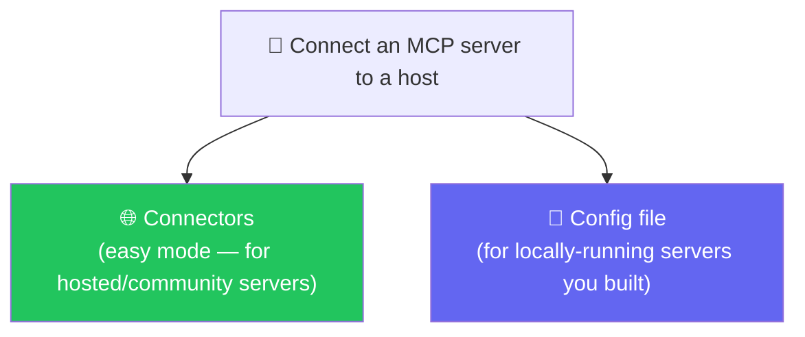
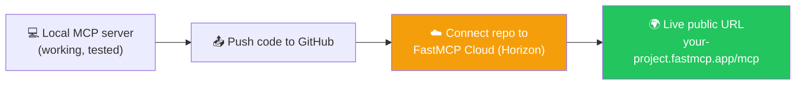
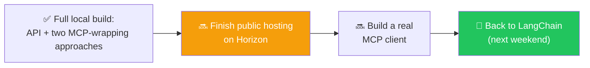

# 🕐 Class 20: The Time Tracker Project — Wrapping a Real API in MCP
### 📋 Agentic AI 3.0 Specialization | Krish Naik Academy

**🎙️ Mentor:** Mayank Aggarwal
**⏱️ Duration:** ~4.5 hours | **📅 Session:** Day 20 (13 September 2026)

---

## 📰 Quick Updates

- 🎯 **Today's scope:** revise how MCP servers actually get connected to a host, then build something genuinely real end-to-end — a **Time Tracker** application with a real database and API, wrapped in an MCP server two different ways, and prepared for public hosting via FastMCP Cloud.
- 🗺️ Confirmed near-term roadmap: building an actual MCP **client** and finishing the public deployment are what's left before circling back to LangChain (targeted for the following weekend), followed by understanding the newest MCP architecture changes.
- 💬 A direct, memorable piece of framing repeated throughout: **AI-assisted coding is expected and encouraged in this course** — the goal is understanding architecture and decisions deeply, not memorizing syntax by hand. Pasting code into ChatGPT to understand or debug it is treated as a normal, professional habit, not a shortcut to be ashamed of.

---
## Resources for the session
- https://www.mcpjam.com/
- https://mcp-lifecycle.netlify.app/
- https://mcp-lifecycle-simulator.netlify.app/
- https://ai-automation-with-mayank.netlify.app/#mcp
- https://github.com/mayank953/Live-Class-2026/tree/main/Complete%20MCP
- https://modelcontextprotocol.io/docs/2026-07-28/getting-started/intro
---

## 🔌 Recap: Two Ways to Connect an MCP Server to a Host



- **Connectors** are the simple, discoverable way most people add a server — click "Add," paste a name and a hosted URL, done. This is what a layperson uses, and it's what a public, already-hosted MCP server (Firecrawl was used as a live example) is designed for.
- **The config file** (`claude_desktop_config.json` on Mac, an equivalent on Windows) is what actually powers *both* methods under the hood — even a connector added through the UI ends up as an entry here. This is the file a developer edits directly to run their *own* locally-built server, since a local server has no public URL to simply paste in.

A real, live look at this config file made the structure concrete — it lists each server by name, alongside the exact command used to start it:

```json
"RecipeBox_Updated": {
  "command": "/opt/homebrew/bin/uv",
  "args": ["run", "--with", "fastmcp", "fastmcp", "run", ".../recipebox_fastmcp.py"],
  "transport": "stdio"
},
"demo-filesystem-wiretapped": {
  "command": "python3",
  "args": ["mcp_wiretap.py", "--log", "wiretap-live.log", "--", "npx", "-y", "@modelcontextprotocol/server-filesystem", "..."]
}
```

Two real, practical lessons came directly out of debugging this live:

1. **A bare `uv` command often silently fails inside Claude Desktop**, because Claude doesn't necessarily know where `uv` is installed on the machine. Running `which uv` in a terminal reveals its full path (e.g. `/opt/homebrew/bin/uv`), and swapping that into the config's `command` field is what actually gets a server showing up under Connectors after a restart.
2. **The `demo-filesystem-wiretapped` entry is a real, existing example of "wiretapping" a server** — running it through a relay script that transparently forwards every message while independently logging the full JSON-RPC conversation, exactly the kind of technique needed now that Claude Desktop's own on-disk logs have gotten less detailed. This was named as existing infrastructure rather than rebuilt live in this session.

### The Same Pattern in VS Code

Adding a server in VS Code follows an identical logic, just through a different interface: `Cmd/Ctrl+Shift+P` → "MCP: Add Server" → choose STDIO → provide the exact command to run the server file. This generates VS Code's own `mcp.json`, and once saved, restarting the connection makes the same tools available to VS Code's own AI features — proving, yet again, that every host (Claude, VS Code, Cursor, ChatGPT) is running through the exact same underlying architecture, just with a different settings screen wrapped around it.

A sharp doubt worth settling clearly: **the MCP server itself never decides which tool to call.** A server just sits there, waiting to be asked. The *client* sends a `tools/call` request naming exactly which tool and which arguments — all the "deciding" happens on the model/brain side, before the request is ever sent.

---

## 🏗️ The Real Project: Time Tracker

Rather than another toy example, the rest of the class built something with a genuine, real shape: a **time-tracking application** — the same category of tool as commercial products like Toggl or Clockify — with real employees logging real hours against real projects.

### The Database Layer

A SQLite database was set up with a `time_entries` table (auto-incrementing ID, employee name, project, entry date, hours, and a description of the work done), seeded with sample data on first run so the app never starts genuinely empty. A small `row_to_dict` helper was used throughout to convert SQLite's native row objects into plain Python dictionaries — the shape every API endpoint actually needed to return.

### The API Layer (FastAPI, Not Yet MCP)

**This part deliberately has nothing to do with MCP yet** — it's the same kind of REST API layer that Gmail, Google Calendar, or any real product already has *before* anyone builds an MCP server on top of it:

```python
from fastapi import FastAPI
import database as db

app = FastAPI(title="Time Track", description="A simple time tracking app with REST and MCP endpoints")

db.init_db()  # creates the table and seeds sample data if empty

@app.get("/api/entries")
def list_all_entries():
    return db.list_all_entries()

@app.get("/api/projects")
def list_projects():
    return db.list_projects()

@app.get("/api/projects/{project}/summary")
def get_project_summary(project: str):
    return db.get_project_summary(project)

class NewEntry(BaseModel):
    employee_name: str
    project: str
    entry_date: str
    hours: float
    description: str

@app.post("/api/entries")
def log_time(entry: NewEntry):
    return db.log_time(entry.employee_name, entry.project, entry.entry_date, entry.hours, entry.description)
```

Running this with `uv run fastapi dev main.py` produced a working Swagger docs page (`/docs`) — every endpoint testable directly in the browser — and a real front-end (plain HTML, CSS, and an `app.js` handling the actual `fetch` calls) that lets someone log time and see project summaries through a normal web UI, with the browser's own network tab used live to show exactly which REST calls fire when a new entry gets logged.

> The point made explicitly here: **this is the same starting position almost every real integration begins from** — a working product with its own REST API, built with zero awareness that MCP will ever sit on top of it. Nothing about a real company's Gmail or Slack API was designed "for AI" — MCP is what gets added afterward.

---

## 🔀 Two Ways to Turn an API Into an MCP Server

With the Time Tracker's API working end to end, the class then built an MCP layer on top of it — and crucially, **two different ways**, with an explicit discussion of when to choose each.

### Option 1: Manual Tools — Full Control

```python
from fastmcp import FastMCP
import database as db

mcp = FastMCP("Time Tracker")

@mcp.tool
def log_time(employee_name: str, project: str, entry_date: str, hours: float, description: str) -> dict:
    """Log a new time entry for an employee against a project."""
    return db.log_time(employee_name, project, entry_date, hours, description)

@mcp.tool
def get_timesheet(employee_name: str, week_start: str) -> list[dict]:
    """Get all time entries for one employee for a given week."""
    return db.get_timesheet(employee_name, week_start)

@mcp.tool
def get_project_summary(project: str) -> dict:
    """Get total hours and a per-employee breakdown for one project."""
    return db.get_project_summary(project)

@mcp.tool
def list_projects() -> list[str]:
    """List every known project name."""
    return db.list_projects()

@mcp.prompt
def generate_weekly_report(employee_name: str, week_start: str) -> str:
    """A template guiding the AI to pull an employee's week and write a clean summary report."""
    return f"Generate a weekly report for {employee_name} starting {week_start}, using their timesheet and project summaries..."

if __name__ == "__main__":
    mcp.run()
```

Confirmed live via MCP Inspector: the exact same lifecycle steps taught in every earlier class — `initialize`, discovery of tools/resources/prompts, then a real `tools/call` — all showed up identically for this brand-new, genuinely custom-built server. The `generate_weekly_report` prompt was highlighted as something that **can't be replicated by a plain API alone** — it's a template that guides the AI to combine *multiple* tool calls into a single, well-structured output, exactly the kind of value a hand-written server can add beyond just mirroring existing endpoints.

### Option 2: Automatic Conversion — Speed

```python
from fastmcp import FastMCP

mcp = FastMCP.from_fastapi(app)  # 'app' is the exact FastAPI instance already defined above
```

In literally four lines, every existing FastAPI endpoint became a callable MCP tool automatically — confirmed live in MCP Inspector, showing tools mapped straight from the REST routes, with no prompts and no resources (since those don't exist as a concept in plain REST).

### Choosing Between Them — A Real Q&A Worth Preserving

A learner working with real production Java APIs asked exactly the right question: when should a team just auto-convert existing APIs versus building tools by hand? The guidance given was direct:

- **Auto-convert** when the goal is simply *making already-working, already-trusted APIs available to AI quickly*, with no interest in reshaping how they're described or combined.
- **Build manually** when finer control matters: combining two or more API calls into a single, well-named tool; writing richer, more AI-friendly descriptions and argument documentation than the original API ever needed for human developers; or adding prompts entirely (which auto-conversion cannot produce, since a REST API has no equivalent concept).
- A practical, risk-averse reason favoring the manual route in real companies: **teams are often reluctant to modify an already-working, already-deployed API** just to make its descriptions more AI-friendly — writing a separate, hand-built MCP layer avoids touching code that's already trusted in production.

---

## ☁️ Preparing for Public Hosting: FastMCP Cloud (Horizon)

With a working server confirmed locally, the plan for making it genuinely usable by *anyone* — not just the machine it's running on — was laid out:



**Horizon** (built by Prefect, the same company behind FastMCP itself) is the hosting platform FastMCP's own documentation recommends. Its free tier was noted directly: **one developer, up to 200 MCP servers, one-hour log retention**, with remote hosting via a straightforward GitHub connection (so any future code change deploys automatically). Once live, the resulting URL follows a predictable shape (`your-project.fastmcp.app/mcp`) and can be pasted into *any* AI host's connector settings — Claude Desktop, Claude Web, ChatGPT, or Cursor — exactly the same way the earlier Firecrawl connector was added, closing the loop on the whole session: **a locally-built, fully understood server becomes something anyone in the world can add to their own AI in a single paste.**

---

## 🗺️ What's Next



Client creation and completing the live hosting were the two pieces explicitly left for the very next session, with a return to LangChain (and understanding the newest MCP architecture's changes) targeted for the following weekend.

---

## 🔑 Key Pointers to Remember

- **A connector and a config-file entry are the same underlying thing** — connectors are just the friendly UI for what's really stored in a config file every host maintains.
- **The MCP server never decides which tool to call.** It only executes what a client's `tools/call` request explicitly names — all the deciding happens upstream, in the model.
- **A UV path failure inside a host's config is one of the most common real setup bugs** — `which uv` (or `which python`) gives the exact path a config file often needs spelled out in full.
- **Real products already have APIs before anyone thinks about MCP.** Building an MCP layer is something added *afterward*, on top of infrastructure that was never designed with AI in mind.
- **`FastMCP.from_fastapi(app)` auto-converts an entire existing API into MCP tools in four lines** — genuinely useful, but it produces no prompts, no custom descriptions, and no combined multi-API tools.
- **Manual `@mcp.tool` definitions are worth the extra effort when you need control**: better AI-facing descriptions, combining multiple API calls into one tool, or adding prompts — none of which auto-conversion can give you.
- **Teams often prefer a separate, hand-built MCP layer specifically to avoid touching already-trusted production API code.**
- **Horizon (by Prefect) is FastMCP's own recommended free hosting path**, connected via GitHub, turning a local server into a real public URL any AI host can use.

---

## 💬 Live Q&A Highlights

| Question | Answer |
|---|---|
| For production APIs already deployed, should we use the 4-line auto-conversion or build tools manually to expose them internally? | Auto-conversion is the faster, safer starting point specifically because it doesn't require touching already-trusted production code — manual tools are worth it once finer control (better descriptions, combined calls, prompts) is genuinely needed. |
| If I have 5 connectors, do they all need to be defined in one config file? | Yes — each connector corresponds to its own separate server entry; the host starts each one independently, exactly the same way multiple servers were shown running side by side earlier. |
| How does an MCP server decide which tool to call for a given request? | It doesn't — the server only executes whatever tool a client's request explicitly names. The decision itself happens on the model/client side, before the request is even sent. |
| Is this deployment step (GitHub → Horizon) similar to how a Java developer might build and deploy to Kubernetes? | Conceptually yes — it's the same underlying idea of taking working local code and making it available as a running, reachable service, just via a hosting platform built specifically for MCP servers rather than a general container orchestrator. |
| Will authorization be added to this project? | Yes — planned as a natural next step once the server is properly hosted, since a publicly reachable time-tracking server for a real company would need real access control. |
| Is writing code without AI assistance still expected in interviews? | No — using AI assistance to write and understand code is treated as a normal, expected professional skill in this course, not something to hide or avoid; what matters is understanding the resulting architecture and decisions well enough to explain and defend them. |

---

## ✅ Action Items After Class 19

- [ ] 🔌 Open your own host's config file (Claude Desktop, VS Code, or similar) and identify the exact command/path structure for at least one connected server
- [ ] 🩹 Deliberately break a server's config with a bare `uv`/`python` command (no full path) and fix it using `which uv` / `which python`
- [ ] 🏗️ Build a small FastAPI backend with at least two endpoints and a SQLite-backed database, exactly like the Time Tracker's entries/projects tables
- [ ] 🛠️ Wrap that same API in MCP two ways: manually with `@mcp.tool`, and automatically with `FastMCP.from_fastapi(app)` — compare the resulting tool lists in MCP Inspector
- [ ] 📋 Add one `@mcp.prompt` to your manually-built server that combines two or more of your tools into a single guided output
- [ ] ☁️ Look into Horizon's free tier and understand, at a high level, the GitHub-to-live-URL deployment flow
- [ ] 📖 Come back ready for **building a real MCP client** and completing the public deployment

---

*📝 Notes compiled from the full Class 19 transcript, cross-referenced against a real `claude_desktop_config.json` — "The Time Tracker Project: Wrapping a Real API in MCP," Agentic AI 3.0 Specialization, Krish Naik Academy.*
