# 🤖 Class 21: Taking an MCP Server Live: Deployment, Real Code, and Building Your Own Client
### 📋 Agentic AI 3.0 Specialization | Krish Naik Academy

**🎙️ Mentor:** Mayank Aggarwal
**⏱️ Duration:** ~4.5 hours | **📅 Session:** Day 21 (19 September 2026)

---
## Resources for the session
- https://horizon.prefect.io/
- https://mcp-legacy-vs-modern.netlify.app/
- https://github.com/mayank953ai/time-track-mcp-server
- https://time-track-mcp-server.vercel.app/

---

## From "It Works on My Machine" to "Anyone Can Use It"

A working local MCP server is a good start, but it only helps the machine it's running on.

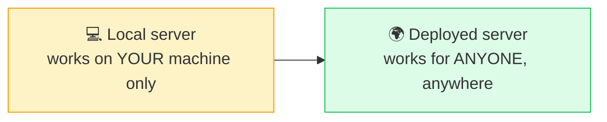

Getting from one side of that arrow to the other means understanding two things clearly: which transport a server should run on, and what it actually takes to put it somewhere reachable.

### STDIO vs. HTTP, Side by Side

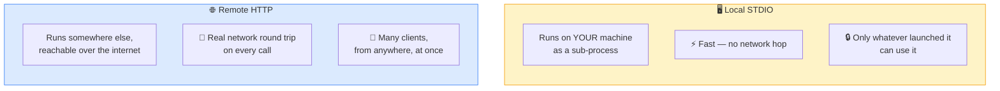

| | Local STDIO | Remote HTTP |
|---|---|---|
| Where the power lives | Split across whoever's running it locally | Centralized — the server can be genuinely powerful, serving everyone from one place |
| Typical use case | A personal tool, one person, one machine | Team or company-wide tools meant to be shared |

This is exactly why most serious, shared MCP servers run over HTTP rather than STDIO — a locally-started server, however well built, simply isn't reachable by anyone else.

### The Same File, Two Transports

Switching a FastMCP server between the two is a one-line change.

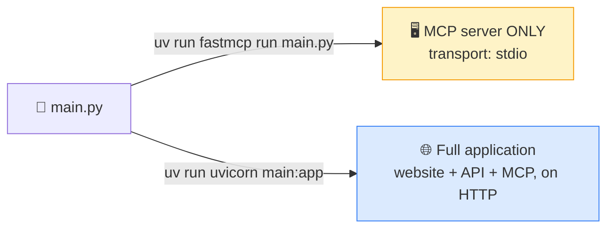

```bash
uv run fastmcp run main.py
# Starting MCP server 'TimeTrack' with transport 'stdio'
```

```bash
uv run uvicorn main:app --reload
# now reachable at http://127.0.0.1:8000, with the MCP endpoint at /mcp
```

The distinction matters: `uv run fastmcp run main.py` starts *just* the MCP server object. `uv run uvicorn main:app` starts the whole application — the website, the REST API, and the MCP server mounted together — because `app` is the FastAPI instance that has everything wired into it.

---

## The Real Code, Wired Together Correctly

The actual `main.py` for this project (from the [time-track-mcp-server](https://github.com/mayank953ai/time-track-mcp-server) repo) shows the complete pattern: one running application, two front doors onto the exact same database.

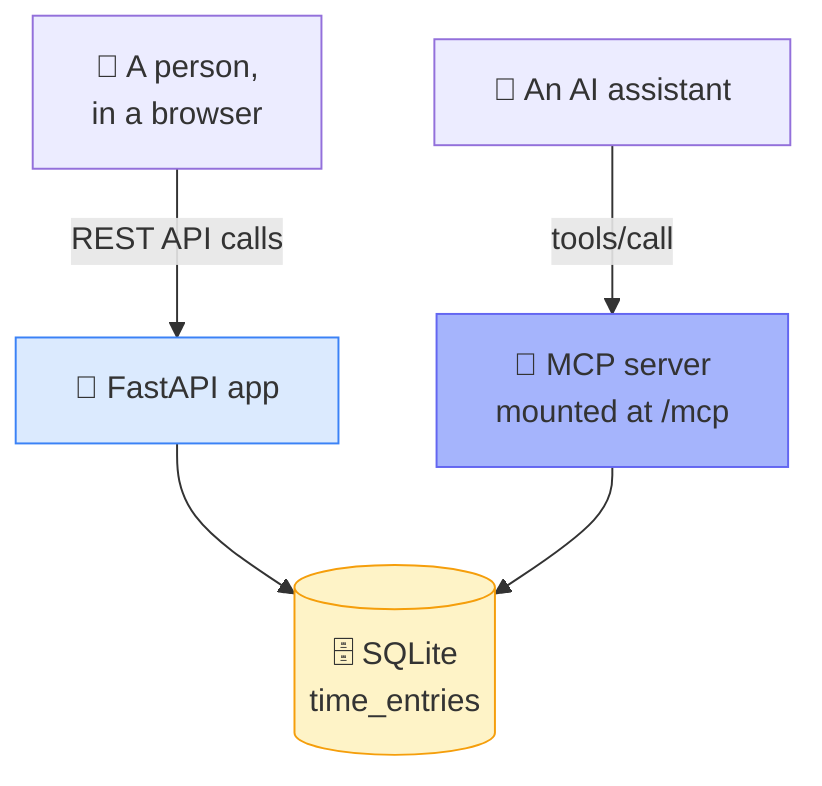

```python
from fastapi import FastAPI
from fastapi.staticfiles import StaticFiles
from fastapi.responses import FileResponse
from pydantic import BaseModel
from fastmcp import FastMCP
import database as db

db.init_db()

# ---------- Step 1: build the MCP server first ----------
mcp = FastMCP("TimeTrack")

@mcp.tool
def log_time(employee_name: str, project: str, entry_date: str, hours: float, description: str = "") -> dict:
    """Log a time entry. entry_date must be YYYY-MM-DD. Shows up on the website immediately."""
    return db.log_time(employee_name, project, entry_date, hours, description)

@mcp.tool
def get_timesheet(employee_name: str, start_date: str = "", end_date: str = "") -> list[dict]:
    """Get one employee's logged entries, optionally filtered to a date range (YYYY-MM-DD)."""
    return db.get_timesheet(employee_name, start_date or None, end_date or None)

@mcp.tool
def get_project_summary(project: str) -> dict:
    """Get total hours logged against a project, broken down by employee."""
    return db.get_project_summary(project)

@mcp.tool
def list_projects() -> list[str]:
    """List every project that has at least one logged time entry."""
    return db.list_projects()

@mcp.resource("timesheet://projects")
def known_projects() -> list[str]:
    """The current set of projects with logged time, for consistent naming."""
    return db.list_projects()

@mcp.prompt
def generate_weekly_report(employee_name: str, week_start: str) -> str:
    """Guides the AI to build a structured weekly hours report from this server's own tools."""
    return f"""Build a weekly report for {employee_name}, starting {week_start}.
1. Call get_timesheet with employee_name='{employee_name}', start_date='{week_start}'
2. Group the results by project
3. Present it as:
{{employee_name}} -- Week of {week_start}
[Project]: {{total hours for that project}}h
Total: {{sum of all hours}}h
If no entries are found for that week, say so plainly instead of inventing data."""

# path="/" here, NOT "/mcp" -- app.mount() below adds that prefix.
mcp_app = mcp.http_app(path="/")

# ---------- Step 2: build the FastAPI app, lifespan wired in AT CONSTRUCTION ----------
app = FastAPI(title="TimeTrack", lifespan=mcp_app.lifespan)

class NewEntry(BaseModel):
    employee_name: str
    project: str
    entry_date: str
    hours: float
    description: str = ""

@app.get("/api/entries")
def api_list_entries():
    return db.list_all_entries()

@app.post("/api/entries")
def api_log_entry(entry: NewEntry):
    return db.log_time(entry.employee_name, entry.project, entry.entry_date, entry.hours, entry.description)

@app.get("/")
def serve_index():
    return FileResponse("static/index.html")

app.mount("/static", StaticFiles(directory="static"), name="static")
app.mount("/mcp", mcp_app)
```

### Two Rules That Genuinely Matter Here

These are easy to get wrong, and both were verified directly against FastMCP's own documentation.

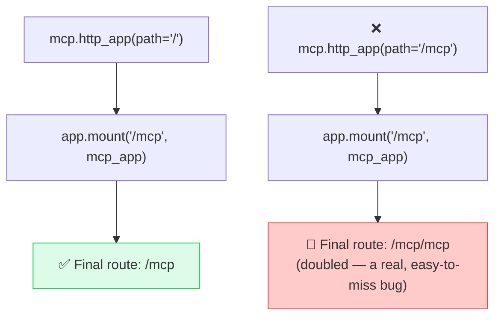

1. **`mcp.http_app(path="/")` — not `path="/mcp"`.** The `app.mount("/mcp", mcp_app)` call below it already adds that prefix. Setting both doubles it into `/mcp/mcp`.
2. **`FastAPI(lifespan=mcp_app.lifespan)` has to be passed at construction**, not set on the app afterward. Get this wrong and the MCP session manager silently never initializes — the server looks fine until the first real request fails.

### The Persistence Layer

`database.py` is a small, honest SQLite layer — nothing exotic, which is exactly the point:

```python
import os
import sqlite3
from pathlib import Path

DB_PATH = Path(os.environ.get("TIMETRACK_DB_PATH", "/tmp/timetrack.db"))

def get_connection():
    conn = sqlite3.connect(DB_PATH)
    conn.row_factory = sqlite3.Row
    return conn

def init_db():
    conn = get_connection()
    conn.execute("""
        CREATE TABLE IF NOT EXISTS time_entries (
            id INTEGER PRIMARY KEY AUTOINCREMENT,
            employee_name TEXT NOT NULL,
            project TEXT NOT NULL,
            entry_date TEXT NOT NULL,
            hours REAL NOT NULL,
            description TEXT NOT NULL DEFAULT ''
        )
    """)
    count = conn.execute("SELECT COUNT(*) FROM time_entries").fetchone()[0]
    if count == 0:
        seed = [
            ("Asha Patel", "Website Redesign", "2026-09-08", 6.5, "Homepage layout"),
            ("Rahul Mehta", "Internal Tools", "2026-09-09", 8.0, "Dashboard bug fixes"),
        ]
        conn.executemany(
            "INSERT INTO time_entries (employee_name, project, entry_date, hours, description) "
            "VALUES (?, ?, ?, ?, ?)", seed,
        )
        conn.commit()
    conn.close()

def log_time(employee_name, project, entry_date, hours, description=""):
    if hours <= 0:
        raise ValueError("hours must be a positive number")
    conn = get_connection()
    cursor = conn.execute(
        "INSERT INTO time_entries (employee_name, project, entry_date, hours, description) VALUES (?, ?, ?, ?, ?)",
        (employee_name, project, entry_date, hours, description),
    )
    conn.commit()
    row = conn.execute("SELECT * FROM time_entries WHERE id = ?", (cursor.lastrowid,)).fetchone()
    conn.close()
    return dict(row)

def get_project_summary(project: str) -> dict:
    conn = get_connection()
    rows = conn.execute(
        "SELECT employee_name, SUM(hours) as total_hours FROM time_entries "
        "WHERE project = ? GROUP BY employee_name ORDER BY employee_name",
        (project,),
    ).fetchall()
    conn.close()
    if not rows:
        raise ValueError(f"No time logged against project '{project}'")
    by_employee = {r["employee_name"]: r["total_hours"] for r in rows}
    return {"project": project, "total_hours": sum(by_employee.values()), "by_employee": by_employee}
```

A couple of details worth noting: `log_time` validates that `hours` is positive and raises a real error otherwise — the kind of small guardrail that's easy to skip in a demo but matters the moment a real tool is exposed to an AI that might send bad input. `get_project_summary` does a genuine `GROUP BY` — the per-employee breakdown isn't computed in Python after the fact, it's the database doing what databases are good at.

---

## Deploying to Prefect Horizon

With the server working locally, making it public follows a specific, repeatable sequence.

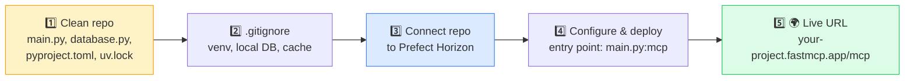

**1. Create a clean, separate repository containing just the MCP server** — not an entire course-learning project with scratch files and notes mixed in. This matters because the hosting platform builds from exactly what's in the repo: `main.py`, `database.py`, `pyproject.toml`, and `uv.lock` are what it actually needs. `pyproject.toml` lists which libraries the project depends on; `uv.lock` pins the exact versions — together they're what a hosting platform reads to reproduce the environment exactly.

**2. Exclude anything the server doesn't need to run** in `.gitignore` — the virtual environment, local database files, cache, editor-specific folders. None of this belongs in the repo: the database gets created fresh wherever the server actually runs, and a `.gitignore`'d database file locally has no relationship at all to whatever database file gets created on the hosting platform. They're separate files, separate data, full stop — updating one never touches the other.

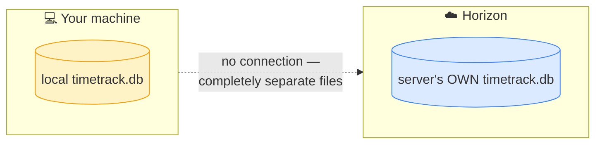

**3. Connect the repo to Prefect Horizon** (the current name for what used to be called FastMCP Cloud — same team, same idea, built by Prefect, the company behind FastMCP itself). Signing in with GitHub and selecting the repository is enough for Horizon to auto-detect dependencies from `pyproject.toml`.

**4. Configure and deploy** — give the server a name, set the entry point to `main.py`, and point it at the `mcp` object specifically (not the whole `app`). Horizon then installs every required library and starts the server, with logs visible during the build.

**5. Get a live URL.** Once deployed, the server is reachable at a predictable address (`https://your-project-name.fastmcp.app/mcp`), pasteable into any AI host's connector settings.

One thing worth confirming directly for any project with more than just an MCP server: Horizon is purpose-built for the *MCP piece* specifically, so it's worth checking whether a website's static routes deploy along with it. If not, a general-purpose host like Vercel or Railway is the fallback for the full application.

### Connecting Claude Desktop to a Deployed Server

```json
{
  "mcpServers": {
    "timetrack": { "url": "https://your-project-name.fastmcp.app/mcp" }
  }
}
```

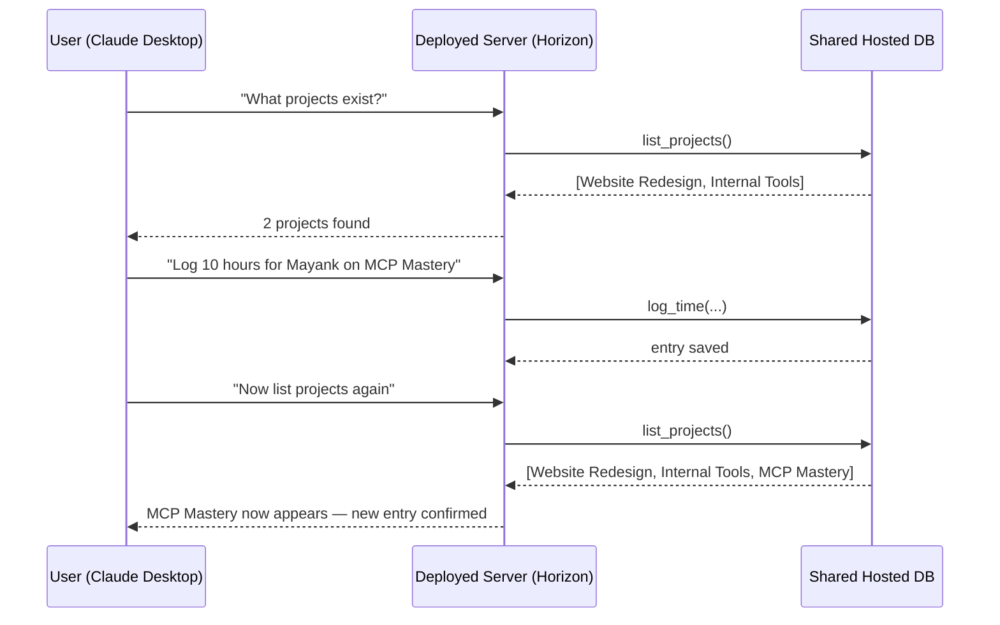

Once connected, a real conversation can use the deployed server exactly like a local one — asking for a project list, logging a new entry, and asking for the list again shows the new entry already reflected, live. Anyone who has that URL can connect the same way — logging their own hours through their own AI assistant, all writing to the same shared, hosted database.

---

## A Second, Simpler Example: No API at All

It's worth being explicit that MCP has no dependency on having a REST API underneath it.

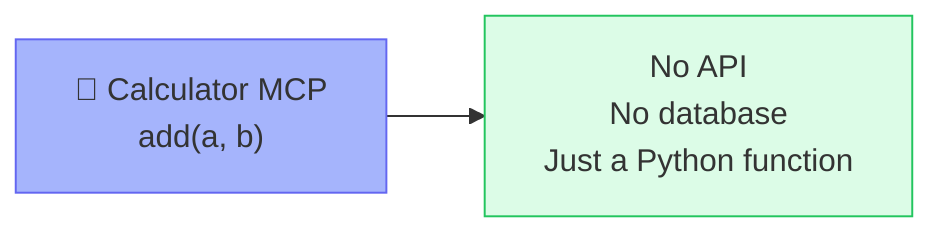

A second, deliberately bare-bones server proves this — a calculator-style MCP with an `add` tool that calls no API, touches no database, and does nothing but return a computed value directly:

```python
from fastmcp import FastMCP

mcp = FastMCP("Calculator")

@mcp.tool
def add(a: float, b: float) -> float:
    """Add two numbers."""
    return a + b

if __name__ == "__main__":
    mcp.run()
```

Deployed the same way as the Time Tracker server, a request like "what is 5 plus 3?" triggers a `tools/call` to `add`, which runs the raw Python function and returns the result — nothing about MCP requires an API layer underneath it. An MCP server is just a server; what it does internally is entirely up to whoever builds it.

---

## Building Your Own MCP Client: Why It's Necessary at All

Every earlier session took MCP clients for granted, because Claude Desktop, VS Code, and similar hosts quietly *are* MCP clients — they handle the handshake, discovery, and tool calling invisibly.

### The Harness Engineering Framing

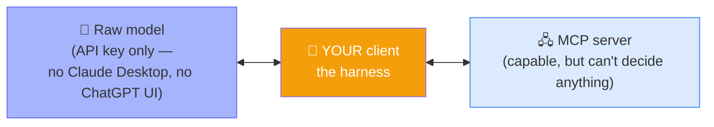

Picture having two separate things: a raw model, accessed directly through a provider's API key, and an MCP server, sitting there capable of doing useful work. Neither one, by itself, does anything for the other. The model has no idea the server exists; the server has no way to decide anything on its own. **Something has to sit in the middle, connecting the model's intelligence to the server's capabilities** — and building that connective layer yourself is exactly what's meant by *harness engineering*. Every chat application ever built is, underneath, a harness wrapped around a raw model — Claude Desktop and ChatGPT simply build that harness for you and hide it.

### The Actual Shape of a Client

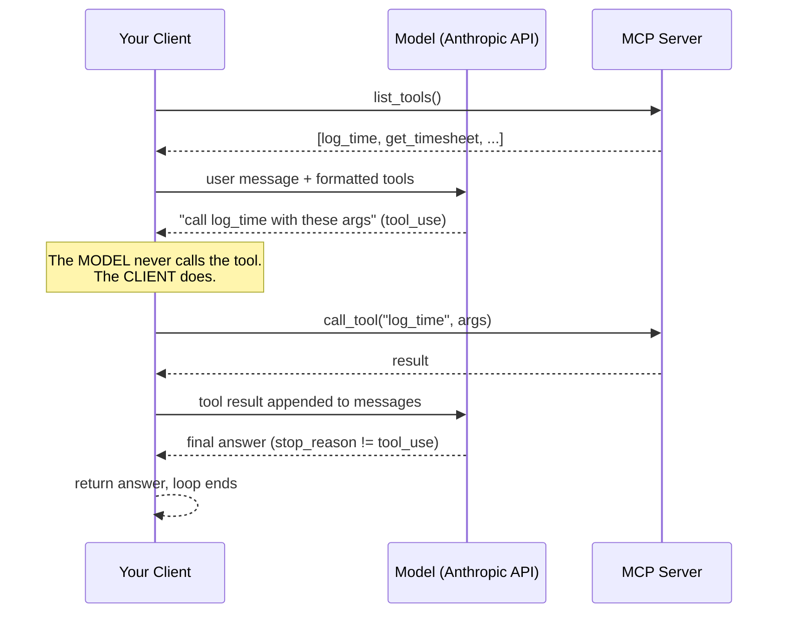

```python
from fastmcp import Client
from anthropic import Anthropic

anthropic_client = Anthropic()

async def run_agent(user_message: str):
    async with Client("main.py") as mcp_client:  # connects to the LOCAL server file
        # Discover: what tools does the server actually offer?
        mcp_tools = await mcp_client.list_tools()
        anthropic_tools = [
            {"name": t.name, "description": t.description, "input_schema": t.inputSchema}
            for t in mcp_tools
        ]

        messages = [{"role": "user", "content": user_message}]

        while True:
            response = anthropic_client.messages.create(
                model="claude-sonnet-4-6",
                messages=messages,
                tools=anthropic_tools,
            )

            if response.stop_reason != "tool_use":
                return response.content  # final answer -- exit the loop

            # The model is asking for a tool -- the CLIENT executes it, never the model itself
            for block in response.content:
                if block.type == "tool_use":
                    result = await mcp_client.call_tool(block.name, block.input)
                    messages.append({"role": "assistant", "content": response.content})
                    messages.append({
                        "role": "user",
                        "content": [{"type": "tool_result", "tool_use_id": block.id, "content": str(result)}],
                    })
```

Every piece of this maps directly onto ideas covered much earlier when agents were first built from raw Python: discover the tools, format them for the model provider, send the message with the tools attached, check whether the model asked for a tool, run it if so, append the result, and loop. **An MCP client is the exact same agentic loop — the model never calls a tool itself; it only ever says which tool it wants called, and the client is the thing that actually calls it.** MCP doesn't change that fundamental mechanic at all — it just standardizes how the tool list and the tool call get communicated between the client and whatever server is providing them.

This is also precisely what a framework's "MCP adapter" (LangChain's, for instance) is doing under the hood — wrapping this exact connect-discover-format-loop pattern into a few lines, the same way `create_agent()` wraps the raw agentic loop built earlier in the course.

---

## Where This Leaves You

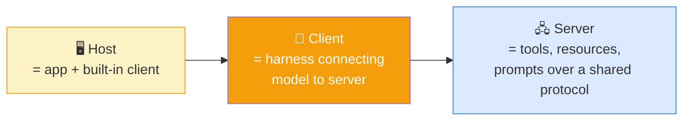

Putting a server on a real URL, understanding exactly why two lines in `main.py` have to be written a specific way, and building the client side from scratch closes the loop on the whole architecture. None of the three pieces above is mysterious once each has been built by hand at least once.

Two honest gaps remain in this version of the project, worth treating as next steps rather than flaws: the database is still a local SQLite file rather than a real, production-grade database, and every database call is synchronous — meaning two requests can't genuinely run at the same time, since each one has to fully finish before the next begins.

---

## ❓ FAQ

**If a third-party MCP server (like a Postgres server) runs on my own machine, is it really a "local" server, even though it connects to a remote database?**
Yes. "Local" describes where the *MCP server process* runs, not where the data it touches lives. A Postgres MCP server started with `npx` on a laptop is a local server, full stop — it just happens to make outbound calls to a database sitting elsewhere, exactly the way a browser on a laptop is "local" even though the websites it loads are not.

**Where do the tool functions inside something like a Postgres MCP server actually come from?**
From whoever built that server. A database vendor (or the open-source community around it) writes functions like `execute` or `list_tables` once, packages them as an MCP server, and anyone who runs that server gets those pre-built functions for free — no need to understand the underlying driver or write the query logic from scratch.

**Should I always reach for MCP, or is a plain tool sometimes the better choice?**
A plain tool is often the right call for a narrow, well-defined action — sending an email through one specific channel, for instance. MCP earns its place when a broader surface of functionality needs supporting without wanting to hand-build and maintain dozens of individual tools yourself. If the scope of what's needed is small and fixed, a tool is simpler; MCP is for breadth.

**I need one MCP setup that can reach several different databases (Postgres, Oracle, a mainframe) — what's the right architecture?**

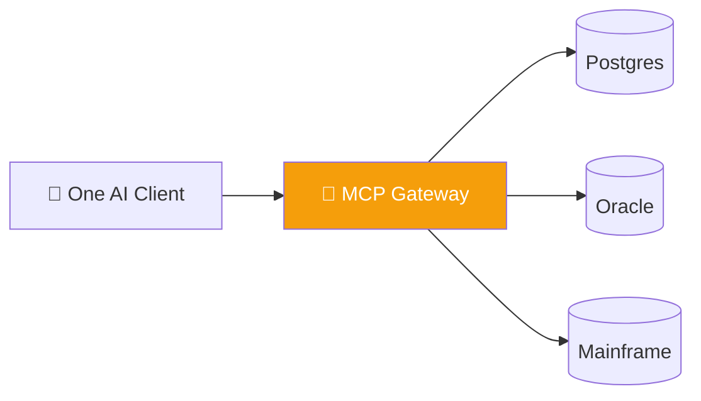

Two solid options: build one custom MCP server with all of them wired in underneath, or use an **MCP gateway** — a dedicated pattern for aggregating multiple existing MCP servers behind a single entry point, so a client only ever has to connect to one place.

**How do I stop an AI from accidentally modifying data through an MCP server connected to a production database?**
A common, simple pattern is an environment variable read at startup (e.g. `READ_ONLY=true`) that controls which tools the server even loads — if it's set, only read-style tools get registered at all, so write operations are never exposed as an option in the first place, rather than being blocked after the fact.

**What's the actual difference between `uv` and `uvx`?**
`uv` operates inside your project — installing and running things as part of it. `uvx` runs a tool in an isolated, temporary environment without touching your project at all, similar in spirit to `npx`. Reach for `uvx` when a tool just needs to run once without becoming a permanent project dependency.

**Does a hosting platform need to know or care whether my server makes calls to an AI model?**
No — and this is a common misconception. Once a server is deployed, "does it call AI?" isn't a meaningfully different question from "does it make an API call?", since a call to an LLM provider is just another API call like any other. A generic hosting platform doesn't distinguish between the two.

**How would I maintain state at different levels — a single call, a conversation thread, and the whole running application — for a custom-hosted MCP server?**
Each level needs a different mechanism: application-wide state is straightforward, since it lives for as long as the process runs. Session-level state ties to whatever session identifier a client provides. Thread-level state is the hardest of the three and generally needs deliberately tracking which thread or request a given piece of context belongs to — there's no free built-in mechanism for it, so it has to be designed in explicitly if a real application needs it.

---

*Sourced from the Agentic AI 3.0 Specialization curriculum, Krish Naik Academy, and the [time-track-mcp-server](https://github.com/mayank953ai/time-track-mcp-server) repository.*
