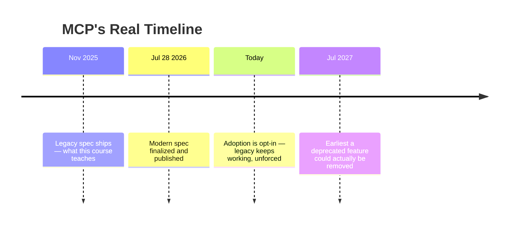
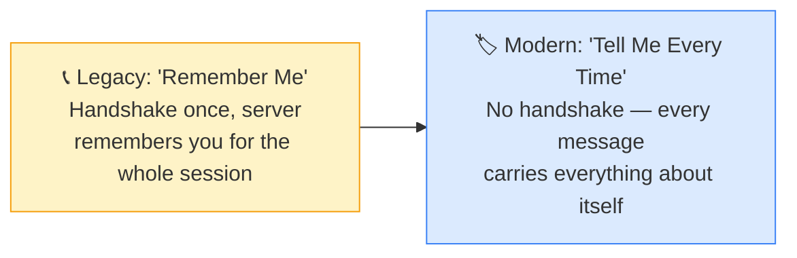
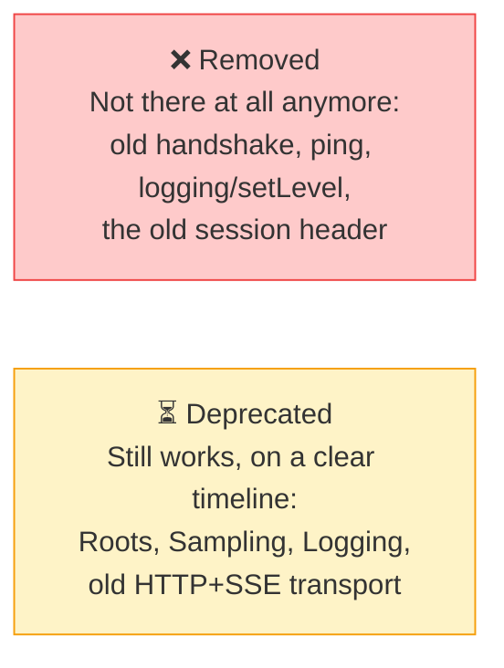
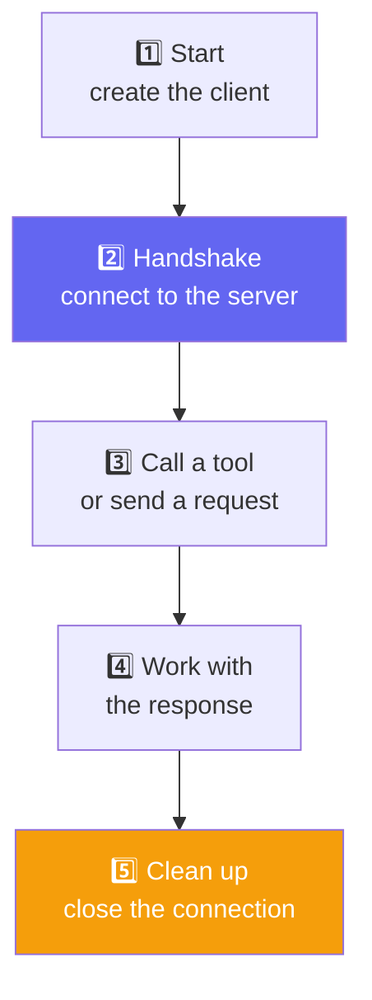
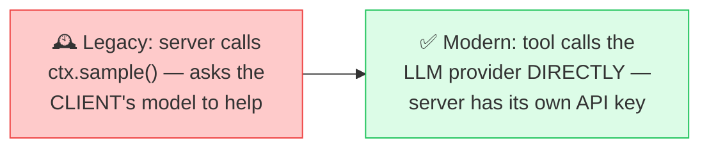
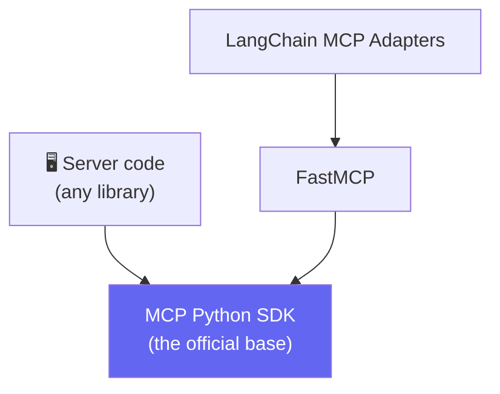
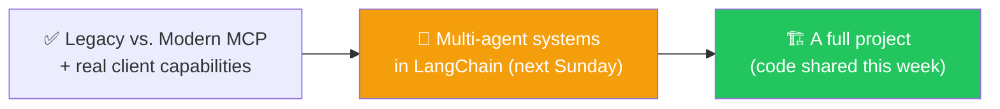

# 🔀 Class 22: Legacy vs. Modern MCP — What Actually Changed
### 📋 Agentic AI 3.0 Specialization | Krish Naik Academy

**🎙️ Mentor:** Mayank Aggarwal
**⏱️ Duration:** ~3 hours | **📅 Session:** Day 22 (20 September 2026)

---

## 📰 Quick Updates

- 🩹 Two real bugs from the previous class's homework were fixed live at the start: a hardcoded database path that silently failed once deployed to Vercel (fixed by making the DB path dynamic via an environment variable), and a reminder that the two assigned enhancements — making database calls asynchronous, and moving from a local SQLite file to a real hosted database (filess.io was demoed, giving a free 10MB hosted SQL database with ready-made connection code) — were due as homework.
- 📚 All course code, including everything from this class, continues to be published to the shared **Live Class 2026** GitHub repo, alongside the class's own reference materials.
- 🗺️ **Roadmap confirmed:** this is the last dedicated MCP class. No class next Saturday; next Sunday moves into **multi-agent systems in LangChain**, followed by a real project (code to be shared this week, with a request to actually read through it rather than only running it).
- 🎯 **Today's scope:** understand exactly what changed between the legacy MCP architecture (what this entire course has been built on) and the modern spec finalized on 28 July 2026, then build an MCP client that actually works with the current library version — including features that behave differently now.

---

## Resources for the class
- https://mcp-legacy-vs-modern.netlify.app/
- https://gofastmcp.com/getting-started/whats-new
- https://github.com/mayank953/Live-Class-2026/tree/main/Complete%20MCP

---

## ⏳ The Real Timeline (Read This Before Panicking)

The most important thing to understand before any technical detail: **everything built in this course still runs, unchanged, today.** Nothing was wasted.



Adoption of the modern spec is **opt-in** — nothing forced existing legacy servers to change on that date, and there's no blanket migration deadline, only a handful of specifically named features carrying their own twelve-month clock. Even without a deadline, real ecosystems move gradually: rewriting a working system to use new capabilities is genuine engineering work, so most real-world servers — local or hosted — are still comfortably running on the legacy architecture, and will be for a while.

---

## 🏢 The Big Shift, In One Idea

Every change that follows comes from a single underlying idea. Understanding this once makes everything else feel like consequences, not a list of arbitrary new rules.



The analogy used live: think of a co-working space. In one building, the same receptionist greets you every morning and waves you through because she recognizes your face — that's the legacy model's `Mcp-Session-Id`. In another building, everyone taps an ID badge at every single door — the entrance, the lift, the meeting room — because no one person is keeping track of who's who anymore. Slightly more tapping, but *any* door can let you through, on any day, whoever happens to be working it.

A live demo made the legacy side concrete: starting a server with `uv run uvicorn main:app`, then sending a raw `curl` request with an `initialize` payload from a second terminal, returned exactly the `Mcp-Session-Id` the legacy spec relies on — proof that the handshake really does hand back an ID the server uses to "remember" that client for the rest of the conversation.

**Why bother giving that up?** A system that has to remember a specific person can only really be handled by whoever met them first. A system that reads a badge every time can be handled by *any* door — meaning a busy application can open more servers behind the scenes without any one of them needing to have "met" the client first. This single idea — stateless, self-contained requests — is what every other change in this class traces back to.

---

## 🔀 What Changed, Concept by Concept

### Remembering You → Every Message Carries Everything

The support-call vs. support-ticket framing: calling customer support connects you to one agent who remembers the whole conversation — but if the call drops, you start over with a new agent who knows nothing. Submitting a support *ticket* instead means any agent who opens it can pick it up immediately, because everything needed is written into the ticket itself, not held in one person's memory.

That's the modern model: there's no session ID at all. The full context travels with every single request, so any server can handle it — not just the one that "answered" first. Yes, this means slightly more data travels with every call, but for most real systems that small cost is worth the freedom to scale horizontally without anyone needing to "remember" a specific client.

### Asking Mid-Task: The Restaurant Kitchen Rule

If nothing is remembered anymore, how does a server ever ask a clarifying question mid-task? The restaurant analogy: a kitchen can reasonably send a waiter back to ask "how spicy do you want it?" *while your order is already being cooked* — but it can't walk up to a random, empty table and start asking cooking questions before anyone there has ordered anything.

| Rule | In plain words |
|---|---|
| The "already cooking" rule | A server can only ask a question while actively handling something the client already requested |
| The "real question" rule | The reply must contain an actual question — never a vague, empty "something's needed" message |

A concrete example used live: a TimeTrack tool asked to log 14 hours in one day might reasonably come back with "that seems unusually high — do you actually want to log it?" — the server pausing mid-task, not appearing unprompted.

### Confirming and Continuing: The OTP Pattern

If the "receptionist" who asked the question might not be the one who's free when the answer comes back, how does anything actually complete? The same pattern as an OTP at checkout: the app asks for a code sent to your phone, you're not stuck waiting on a call — you grab the code, come back, and submit it along with your order reference. The order can complete via a completely different backend server than the one that first took it, because the "ticket" carries everything needed. Whichever assistant asked the question is free to go do something else while it waits, and whoever's free when the answer comes back can pick it up.

### The Small Stuff That Helps

- **Faster routing** — every request now carries `Mcp-Method` and `Mcp-Name` labels right in its HTTP headers, the same way a colored tag on a boarding pass lets airport staff wave a traveler toward the right lane without a full conversation. Anything managing traffic between a client and server (a load balancer, for instance) can route instantly by glancing at just those two labels.
- **Smarter caching** — a server can now specify `ttlMs` (how long an answer stays fresh, in milliseconds) and `cacheScope` (whether that cached answer is safe to share across many users, or private to just one) — the same idea as a weather app caching a city's forecast for an hour instead of re-fetching on every open.
- **Finding what broke** — built on the existing W3C tracing standard, a request can now carry a tracking context across every hop it takes through multiple systems, the same way a single tracking number follows a package through a local pickup service, a long-haul carrier, and a last-mile courier — so a failure three services deep is traceable back to exactly where it happened, rather than just "it's lost."

### Gone vs. Going Away — Two Different Things



MCP's own published policy gives anything marked "deprecated" a **minimum of twelve months** from its announcement (started July 2026) before it's even eligible for removal — that's a floor, not a countdown to breakage. One real nuance worth knowing: that twelve-month window is the *spec's* promise, not a guarantee every library honors to the day — a specific SDK's maintainers can drop a deprecated feature's actual code sooner if they choose to, which is exactly what happened with sampling in a recent FastMCP release (more on this below).

---

## 🖥️ Building a Client That Works Against the Real, Current Library

With the architecture understood, the second half of the class built an actual MCP client — using the genuinely current FastMCP version, which meant running head-first into a few features that don't behave the way the documentation (or earlier lessons) might suggest.

### The Five Steps Every Client Performs



Every client, regardless of how it's written, does exactly these five things: start the server, say hello (the handshake from the lifecycle covered earlier), ask what tools exist, use one, say goodbye. The two ways of writing this in Python — a manual `try`/`finally` block, or `async with client as client` — are just two different ways of expressing the same five steps. `async with` does the manual version automatically and **guarantees step 5 happens no matter what**, which is the whole reason it's the pattern used throughout the course: it's not a new concept to learn, it just writes "always clean up properly" in one line instead of five.

### Sampling: A Genuinely Removed Feature

Sampling is how a server borrows a *client's* connected AI model instead of holding its own API key — the server describes the message it wants completed and asks the client to run it, so a lightweight server doesn't need its own separate model subscription.



Live proof: attempting to use the older sampling-handler pattern against the current FastMCP version genuinely fails — the underlying method has been removed, not just deprecated in behavior. The fix demonstrated directly in the project's own `summarize_week` tool: rather than circling back to the client for intelligence, the tool now calls an LLM provider (Anthropic, in this case) directly, with its own key. This isn't a downgrade — it's the exact migration path the MCP spec itself recommends, so the forced rewrite happens to point exactly where things were already heading.

### Elicitation: Still There, Behind `mode="legacy"`

Elicitation — a server pausing mid-task to ask the actual user a real question — still works, but only once the client explicitly asks for the old-style connection:

```python
client = Client(
    "main.py",
    elicitation_handler=elicitation_handler,
    mode="legacy",  # restores the classic handshake this course originally taught
)

async def elicitation_handler(message, response_type, params, context):
    print(f"Server is asking: {message}")
    confirm = input("Type Y to confirm, anything else to cancel: ")
    return confirm.strip().lower() == "y"
```

Live demo, run twice: logging 4 hours triggered no question at all (under the tool's own 10-hour threshold) and returned a plain result. Logging 14 hours triggered the elicitation handler — "Server is asking: 14 hours in one day is unusually high, log it anyway?" — and the actual behavior branched correctly on the real typed response: confirming with `Y` completed the log; typing anything else returned a "cancelled, not confirmed by user" result. This is a genuine two-way exchange, with the tool's own code holding a `context` parameter specifically so it has a channel back to the client to ask through.

### Ping, Timeout, and Cancellation

**Ping** — the simplest possible check, one side asking "are you still there?" with nothing else exchanged — has also technically been removed in the strictest modern sense (since everything is stateless now, there's no persistent connection left to "ping"), but `client.ping()` still works via the legacy mode and returned a plain `True` live, confirming the server was active before a real tool call was attempted.

**Timeout and cancellation** were demonstrated with a deliberately slow tool (sleeping 5 seconds) against a client configured with a 1-second timeout — the call was cancelled exactly as expected, with a clear "tool call timeout" error rather than hanging indefinitely. Raising the timeout to comfortably exceed the tool's delay let the same call succeed normally. The underlying rule: every sent request should have a timeout; a cancellation notification stops waiting, and a progress notification can reset that clock if the server is genuinely still working.

---

## 🔗 How This Connects to LangChain's MCP Support

A detailed, worked-through exchange clarified a genuinely common point of confusion: when LangChain is the host, its **agent is the host**, and LangChain creates the underlying MCP client itself using the **LangChain MCP Adapters** package — which, underneath, is still built on FastMCP. Writing `MultiServerMCPClient` with a config dictionary of servers still goes through exactly the same initialization handshake and tool discovery already covered — LangChain just builds the harness (the model-to-tool connective layer) for the developer, the same way a hand-built client was built earlier in raw Python.



The key clarification: **any MCP server**, regardless of which library wrote it (the official MCP SDK, FastMCP, or something else entirely), ultimately rests on the same official protocol — a library like FastMCP is just an abstraction that makes writing that code easier, and everything eventually executes down to the same base. For an agent framework like LangChain, MCP is fundamentally just "a connection to a set of tools" — nothing more exotic conceptually than the tools already covered many classes ago, just sourced from a standardized protocol instead of hand-defined functions. LangChain's MCP support is currently for *consuming* existing MCP servers as tool sources, not for building new MCP servers from scratch — that remains the job of the MCP/FastMCP libraries themselves.

---

## 🗺️ What's Next



This closes out the dedicated MCP module. The very next class moves into multi-agent systems in LangChain, followed by a complete project — with an explicit ask to actually read through the shared project code line by line rather than only running it.

---

## 🔑 Key Pointers to Remember

- **Nothing you've built breaks.** Legacy MCP remains fully supported; the modern spec is opt-in, not a forced migration.
- **The one idea behind every change:** legacy remembers you via a session handshake; modern makes every message self-contained, trading a little extra data per request for the freedom to scale across many servers with none of them needing to "remember" anyone.
- **A server can only ask a question while it's already handling a request you sent** — it can never contact a client out of nowhere.
- **Sampling is genuinely gone** in current FastMCP — the fix is having a tool call its own LLM provider directly, which is also the spec's own recommended direction, not a workaround.
- **Elicitation and ping still work**, but only via `mode="legacy"` on the client — nothing about their underlying logic changed, they just need the old-style connection explicitly requested.
- **Every request should carry a timeout**; cancellation stops waiting outright, and a progress notification can reset that clock for genuinely long-running work.
- **"Deprecated" means a twelve-month floor before removal is even eligible** — it's MCP's own promise, though a specific library's maintainers can still choose to drop the code sooner.
- **LangChain's MCP Adapters build the client using FastMCP underneath** — for an agent framework, MCP is just another way of sourcing tools, not a fundamentally different concept.

---

## 💬 Live Q&A Highlights

| Question | Answer |
|---|---|
| Should I worry about mastering every previous MCP version? | No — real-world adoption of the modern spec will take time, and understanding the legacy architecture deeply is what makes the modern one make sense, not wasted effort. |
| Is sampling controlled through code, or called automatically by FastMCP as needed? | It's controlled by the tool's own code — if a tool's logic determines it needs a sampling-style completion, that's where the call (now to an LLM provider directly) happens; it isn't triggered automatically by the framework. |
| Are sampling and elicitation both genuinely MCP concepts, not framework-specific ones? | Yes — both are part of the MCP specification itself; a framework like FastMCP just provides the implementation. |
| When LangChain is the host and creates an MCP client via its adapters, does the same initialization/handshake process still apply underneath? | Yes — nothing about the underlying protocol changes; LangChain's adapter is simply building the harness and client for you, the same handshake and discovery steps still happen. |
| Is an MCP server always written directly against the base MCP library, even when a wrapper like FastMCP or LangChain's adapters is used? | Yes — every abstraction (FastMCP, LangChain MCP Adapters) ultimately executes down to the same official MCP Python SDK; the wrapper just makes the developer-facing code simpler to write. |
| Does LangChain's MCP support let me create new MCP servers, or only connect to existing ones? | Only consume existing ones as a tool source for an agent — creating servers is still the job of a library like FastMCP, not something LangChain's MCP integration is built for. |
| Will an OpenRouter API key work for the client-building exercises instead of a direct provider key? | Yes, with a small code change to point at the right endpoint/model string — the underlying pattern doesn't change. |

---

## ✅ Action Items After Class 22

- [ ] 🩹 Make your own TimeTrack project's database path dynamic (via an environment variable) if you haven't already, and confirm writes succeed after deployment
- [ ] ⏳ Complete the two homework enhancements: convert database calls to async, and move from a local SQLite file to a real hosted database (filess.io or similar)
- [ ] 🖥️ Recreate the `curl`-based initialize request against your own local server and find the returned `Mcp-Session-Id` yourself
- [ ] 🔁 Rewrite one tool that used to rely on sampling so it calls an LLM provider directly instead
- [ ] 💬 Build the elicitation demo yourself with `mode="legacy"`, and test both branches — an amount under your threshold (no question asked) and one over it (question asked, then confirm and cancel separately)
- [ ] ⏱️ Deliberately set a client timeout shorter than a slow tool's execution time, and confirm the cancellation error fires as expected
- [ ] 📖 Read (not just run) the project code that gets shared this week before the next class
- [ ] 🤝 Come back ready for **multi-agent systems in LangChain**

---

*📝 Notes compiled from the full Class 21 transcript and Mayank Aggarwal's own "MCP: What's Actually Changing" reference site — "Legacy vs. Modern MCP: What Actually Changed," Agentic AI 3.0 Specialization, Krish Naik Academy.*
